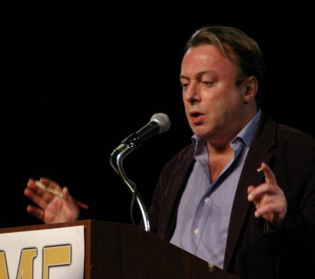

Time, in its unrelenting drive to eventually claim us all, occasionally takes one whom we really can’t afford to lose. Such was the case with Christopher Hitchens.

Mr. Hitchens had been very ill with cancer for some time. It was obvious to all that he was not long for this world, but it still saddens me greatly to lose him. He was a most eclectic mix of conservatism and liberalism, a man who truly defied categorization. A towering intellect, a ferocious wit, and someone who definitely didn’t suffer fools gladly. I didn’t agree with everything he had to say, but I have nothing but admiration for how he said it.

You fought a good fight Mr. Hitchens. The world’s a better place for it.
