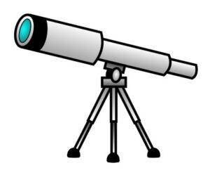

## Quick Recommendation

First of all, if you want a decent, dirt-cheap starter scope and don’t want to spend a lot of time evaluating and comparing, [check this out](http://www.amazon.com/Celestron-21024-FirstScope-Telescope/dp/B001UQ6E4Y). (I have no personal experience with this scope. I saw it recommended on another buying guide site.)

## Basic Rules

* _Don’t_ buy a telescope from a department store or from the glut of cheap junk that shows up around Christmas time. You may tell yourself “it’s just a starter scope, quality doesn’t matter”, but the frustration experienced from the poor quality (bad eyepieces, shaky mounts, etc.) can easily turn a person off of astronomy for good. Also, the advertising tends to run along the lines of “400x magnification! See the rings of Saturn! See Jupiter’s moons!”, ignoring the fact that magnification alone means nothing. (See below.)
* Magnification alone doesn’t mean anything. The best way to evaluate a scope’s capability is by aperture size (the size of the objective lens or mirror). Most scopes will deliver no more than about 50x magnification per inch of aperture. So, for example, a 60mm (2.5″) scope is going to deliver 125x at best.
* Optical quality matters. A small scope with good optics is a better choice than a large scope with bad optics. At the very least, make sure the optics aren’t plastic.
* A good scope also needs a solid mount. Many of the cheap scopes have flimsy, wobbly mounts. This makes it difficult to find and center items, and focus.

## Where to Buy

I don’t have a lot of personal experience here. I’ve only bought telescopes from two sources: (1) department stores (terrible! lesson learned!) and (2) [Orion Telescopes and Binoculars](http://www.telescope.com/). I’ve been mostly pleased with the 4.5″ Reflector I bought from Orion. Orion has published a handy buying guide here.

[Meade](http://www.meade.com/) and [Celestron](http://www.celestron.com/) also have a good reputation. I haven’t looked too closely at Celestron, but Meade seems to have better prices than Orion.

## Using Your Scope - Quick Start

To find your way around the sky, get [Stellarium](http://www.stellarium.org/). It’s simply the best astronomy software around, and free too!

You can get decent photographs without an expensive CCD camera attachment by simply holding your digital camera or cell phone up to the eyepiece.

For immediate viewing gratification, the moon is the best place to start. Keep in mind that viewing the moon while it’s three-quarters full or less will show more details in the craters.

Even with a low-powered scope, you should also be able to make out the rings of Saturn and the four brightest moons of Jupiter.

> It’s also easy to see sunspots, but if you do view the sun make absolutely sure you use a solar filter. Never view the sun directly through an unfiltered eyepiece! (And remember: the filter goes on the end of the tube, not the eyepiece.)

Have fun!
