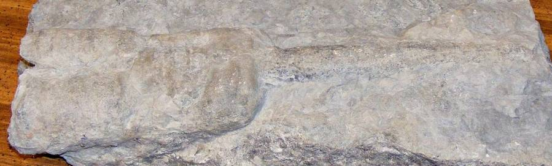
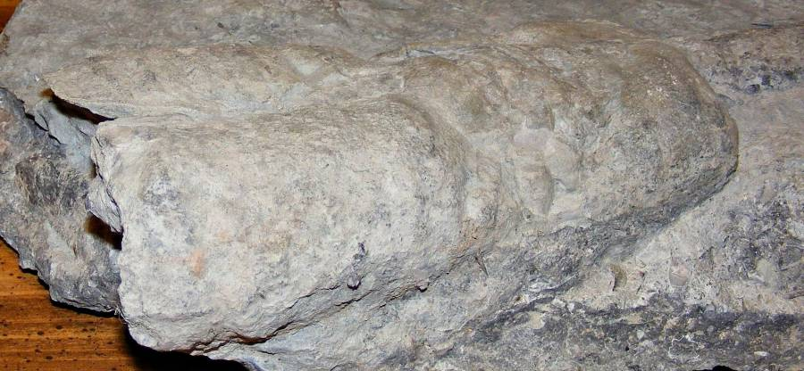
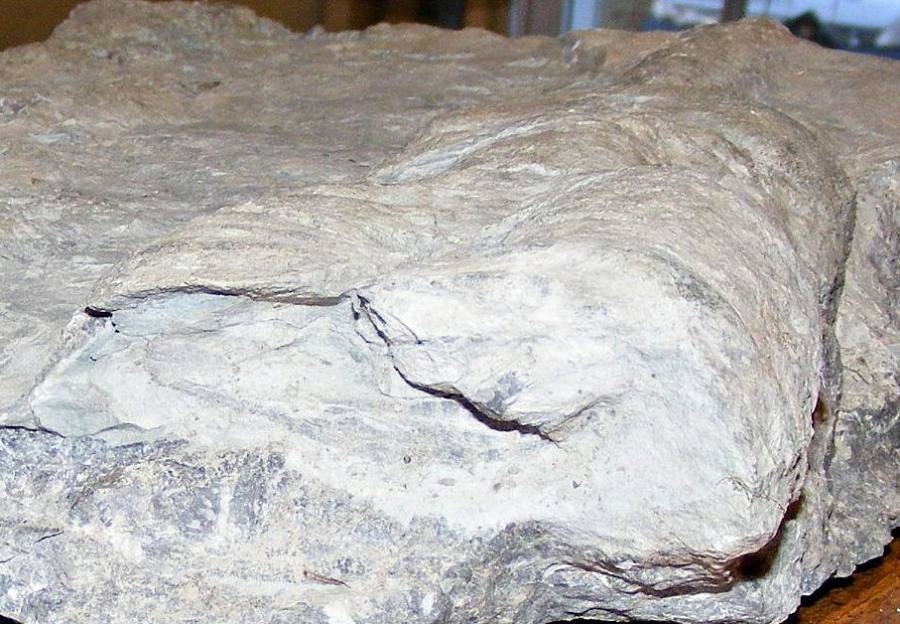
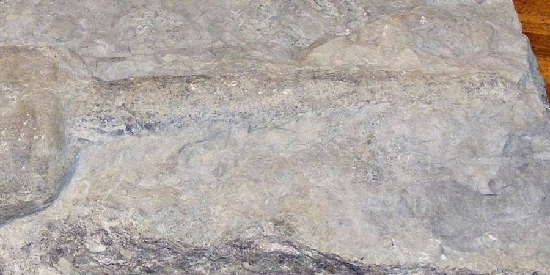

My son Chris located a very unique fossil in the Camden, Ohio area.

On initial examination, I thought that it might be several fossils, but after looking at it hands-on, I believe that it is actually a single organism. It looks like we have a distinct, rather large, [Ordovician cephalopod](https://en.wikipedia.org/wiki/Ordovician) fossil.

The larger half is the shell, which has split and/or been flattened.

The smaller half is actually an [endocast](https://en.wikipedia.org/wiki/Endocast) (internal mold), and the shell has been lost from this section.

Quite an interesting specimen!
