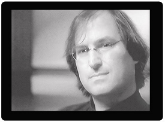

I can’t think of a public figure who instills more conflicted reaction in me than Steve Jobs. I’ve read and watched so much about Mr. Jobs that has made me feel that he was a very disagreeable individual. On the other hand, I’ve also seen much that effectively conveys his brilliance and forward thinking.

I’ve just finished watching a documentary that falls firmly into the latter category. If you want to see Steve at his charismatic best, I highly recommend that you watch this. It’s “throwaway” interview footage from 1995, filmed as part of a larger documentary series called “[Triumph of the Nerds](https://en.wikipedia.org/wiki/Triumph_of_the_Nerds)“. Only a small part of this footage was used in the series, but this original footage, thought to be lost, was recently found in its entirety and re-mastered. This was filmed while Steve was running NeXT, a year before he returned to Apple.

It’s just Steve, being interviewed by Robert Cringely, in a very stark setting. For all that has been written about Steve’s mercurial personality, the Steve you’ll see here is calm, measured, and very personable. Especially interesting is his insight into the future of software development and the growth of the web.

[Steve Jobs: The Lost Interview – official site](http://www.magpictures.com/stevejobsthelostinterview/)
