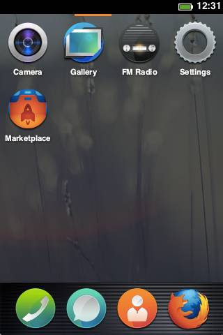

[Firefox OS](https://www.mozilla.org/en-US/firefox/os/) is a Linux-based open-source operating system for smartphones and tablet computers. It’s developed by the non-profit organization Mozilla (best known for the Firefox web browser.) Commercial availability is currently limited: Telefonica launched the first Firefox OS-based phone, the ZTE Open, in Spain on July 2, 2013.

So with the 800-pound gorillas iOS and Android in the room, why should anyone be interested?

* Community-based alternative to proprietary systems.
* Open web API’s communicate directly with the hardware.
* Develop applications using HTML 5 and JavaScript.
* Deploy through the web store, or self-host. Apps can be bundled as .zip files.

Basically, it sounds like what Android should be and what iOS never will.

If you have the Firefox browser and an HTML editor, you have a development environment. It took me about fifteen minutes to put together a simple “Hello, World” app in NetBeans (with HTML 5, JavaScript, and jQuery) and publish it in the Firefox OS simulator extension in Firefox.



Intriguing, but unfortunately it also sounds like it could be a repeat of [WebOS](https://en.wikipedia.org/wiki/WebOS), which, despite similarities, never exactly caught fire in the marketplace.
