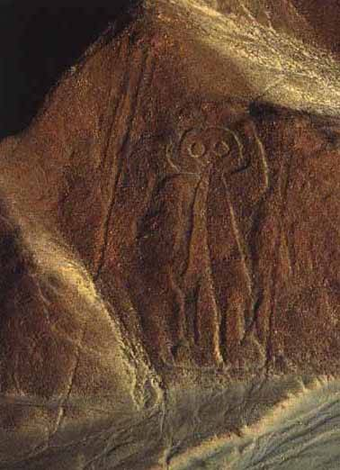

Today I attended the “Sacred Spaces and Human Sacrifice: The Nasca Lines in their Cultural and Religious Context” lecture at SunWatch in Dayton, Ohio. This is the last of the 2013 AIA/SunWatch “Myths and Mysteries in Archaeology” presentation series. The lecture was very interesting. Christina Conlee (Associate Professor of Anthropology, Texas State University at San Marcos) discussed the archaeological and cultural studies taking place in the [Nasca region](https://en.wikipedia.org/wiki/Nazca) and debunked the “space alien” theories that have surrounded the Nasca lines since the 60’s. (The Nasca lines are immense [geoglyphs](https://en.wikipedia.org/wiki/Geoglyph), and the “space alien” theories posit that they were built as beacons or messages for alien visitors, with the idea being that they only have context when viewed from the air.)

Even though the lecture was great, with lots of fascinating information, this post isn’t really about the lecture. You see, I heard an interesting comment from one of the attendees as I was preparing to leave after the lecture. Here’s what I heard:

> Well, they haven’t proved that they _weren’t_ created for aliens. That’s just one more theory and it’s no more likely than the other.

I bit my tongue and didn’t say anything, but I’ve heard variations of this before. It suggests a number of elements of fallacious thinking.

First of all, what is a theory? When most people hear the word “theory”, they tend to think of an “idea”, or a “hunch”. In the context of science, though, a theory has a very different meaning. A scientific theory isn’t just an idea. It’s backed by significant amounts of supporting evidence, and the more evidence that exists, the stronger the theory. A scientific theory is subject to constant refinement, as more evidence becomes available. If evidence doesn’t hold up, or points in a new direction, then a scientific theory must be altered significantly or even rejected.

Science doesn’t start with a theory, it starts with a question. A question is the first step in the scientific method, which is a set of techniques for studying phenomena and acquiring knowledge. The principles of the scientific method are as follows (using the Nasca lines as an example):

1. Define the question. (_Where did the Nasca lines come from? What is their purpose? Why were they created?_)
2. Gather information and resources (observe). (_Investigate the Nasca lines. Learn about Nasca culture._)
3. Form [hypothesis](https://en.wikipedia.org/wiki/Hypothesis). (_I believe that the Nasca lines were built as ritual spaces, and fit within the known cultural and religious structure of the Nasca people._)
4. Perform experiment and collect data. (_Detailed archaeological efforts, with excavations. Attempt to recreate the lines from the ground._)
5. Analyze and interpret data. Draw conclusions that serve as a starting point for new hypothesis. Supporting data is what begins to transform the hypothesis into a theory. (_1. The figures depicted in the geoglyphs are similar to artistic representations of shamans and mythical beings in Nasca pottery and textiles. Further, the ground beneath the lines is heavily compressed, suggesting that they were used as a walkway, and meant to be experienced from the ground. This supports the notion that they are a part of the Nasca religious/spiritual experience. (2) The Nasca lines can be recreated from the ground using sight lines, negating the need for “support from the air”._)
6. Publish results. (_Make the Nasca studies available to other scientists and the public._)
7. Re-test. This is the “peer review” step, where the hypothesis is critically examined. (_The persons conducting the original studies conduct more tests and other scientists re-test as well. If the same, or similar, conclusions are reached, the theory advances._)

So, with strong supporting evidence, the theory survives and thrives. With no evidence, or conflicting evidence, it withers and dies. I’m free to posit any sort of hypothesis I wish. (_e.g., “I believe that the Nasca lines were constructed by inter-dimensional beings.”_) But, with no supporting evidence, my “inter-dimensional beings” hypothesis will not survive critical inquiry.

Contrary to popular belief, the scientific community does not suppress conflicting ideas or opinions. Good science, however, is merciless in its application of logic, investigation, and review of evidence. Multiple potential explanations may co-exist, but they do not carry equal weight. Evidence is everything.

Though intended more as an indictment of the political climate, I believe the following quote is largely applicable to the problem I’m describing:

> Anti-intellectualism has been a constant thread winding its way through our political and cultural life, nurtured by the false notion that democracy means that my ignorance is just as good as your knowledge.
> 
> Isaac Asimov
