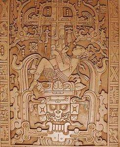

On Saturday, January 19th, it was my distinct pleasure to attend the first of the 2013 “Myths and Mysteries in Archaeology” lecture series at [SunWatch](http://www.sunwatch.org/) entitled “Amorous Astronauts, Inkblots, and a Low Opinion of Our Ancestors – The Ancient Aliens Fantasy”. The lecture was presented by [Dr. Ken Feder](https://en.wikipedia.org/wiki/Kenneth_Feder), who is a professor of Anthropology at Central Connecticut State University.

The notion of “[ancient aliens](https://en.wikipedia.org/wiki/Ancient_astronauts)“, extraterrestrial beings visiting Earth in the distant past, has been popularized in movies, [television](http://www.history.com/shows/ancient-aliens), and books. Dr. Feder methodically (and with great humor) laid out a series of rebuttals to the so-called “evidence” for these visitations. The source of much of the ancient alien theory comes from the book “[Chariots of the Gods](http://www.amazon.com/Chariots-Gods-Erich-von-Daniken/dp/0425074811)“, written by [Erich von Daniken](https://en.wikipedia.org/wiki/Erich_von_D%C3%A4niken). (It should be noted that Mr. von Daniken is not an anthropologist, historian, nor scientist of any kind. But, he does have a substantial criminal record, mostly for fraud and theft.)

The ancient aliens theory can be summarized as follows:

* Human beings resulted not from evolution, but from a combination of alien and ape genetic material. In other words, extraterrestrial aliens mated with our ancestors.
* Ancient humans left behind pictorial representations and written descriptions that can be best explained as the images and descriptions by ancient human beings of their eyewitness encounters with extraterrestrial aliens.
* The archaeological and historical records are filled with examples of great leaps in technology, impossible for human beings to have conceived without help from above.

Dr. Feder’s response to each of these are as follows:

* The notion that highly advanced beings made a lengthy and dangerous interstellar journey for the purpose of mating with ape-like Earth creatures is dubious at best. In any case it would be physically impossible, owing to the fact that creatures evolving on separate planets would be so biologically different as to make cross-breeding impossible. Dr. Feder mentioned a quote from Carl Sagan, stating that humans would have a better chance of cross-breeding with a petunia than with an alien, as humans at least share _some_ DNA with a petunia.
* The problem here is that you see what you _want_ to see, interpreting it in the context of what you understand. Ancient art does not necessarily depict real things. Dr. Feder presented a very good contemporary example: the art of Picasso. When you view Picasso’s art, do you think for a second that Picasso is presenting human beings as they really appear? It is also important to remember that even though you may not be able to interpret exactly what’s being depicted, you shouldn’t immediately jump to the least likely interpretation. While some ancient art depicts real people and animals, much of it is also ceremonial or traditional, representing spirit beings, mythological creatures, etc.
* It is insulting to imagine that our ancestors were incapable of great engineering and technological feats on their own, and needed an alien “peace corps” to assist them. The Egyptian pyramids are commonly presented as “appearing almost overnight” and being simply too complex and difficult to be built by humans alone. The reality is that the pyramids appeared for a long time in ancient history, with the older pyramids being more crude and growing more complex and well-built over time, as the trial-and-error of building them progressed. There is also a very distasteful element of racism here, as most of von Daniken’s examples come from non-European cultures. Interesting that the Greeks needed no help with the Parthenon, nor did the Romans need any assistance building their Colosseum.

Dr. Feder also discussed the depiction on the lid of the tomb of [K’inish Janaab Pacal](https://en.wikipedia.org/wiki/K'inich_Janaab'_Pakal), ruler of Palenque:

This is interpreted by von Daniken to show Pacal piloting a spaceship. In reality, the pictograph shows Pacal in death, ascending to the afterworld.

This was a great kickoff to the spring lecture series. Can’t wait for the next one!
