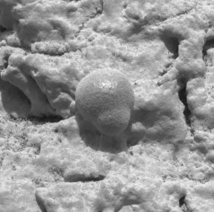

The latest data from the Curiosity rover indicates a [lack of methane](http://www.jpl.nasa.gov/news/news.php?release=2013-285) in the Martian environment. This comes as a surprise, as previous studies seemed to indicate the presence of significant amounts. This is also disappointing, because methane is a potential [biosignature](https://en.wikipedia.org/wiki/Biosignature). Hopes for the presence of methane-producing Martian microbes are now greatly reduced.

Life has not yet been detected beyond Earth. The potential for this is hugely exciting, obviously. A vast cosmos means that the presence of life outside of Earth is overwhelmingly likely, from a statistical standpoint. But, knowing that it’s likely isn’t a definitive answer.



The proximity of Mars to Earth has made it a primary target in the search for extraterrestrial life. Scientists already know that even though Mars is very dry now, it was much wetter in the past. Knowing the importance of water in sustaining life, this indicates that Mars at least has (or had) the potential for life to appear. Also, Mars has seasons, maintains a thin atmosphere, and potentially lies within our solar system’s [habitable zone](https://en.wikipedia.org/wiki/Habitable_zone). (Estimates vary.) But, all is not rosy. In addition to the lack of currently detectable methane, Mars has also lost its [magnetosphere](https://en.wikipedia.org/wiki/Magnetosphere). The absence of a magnetosphere means that Mars lacks protection from the solar wind, causing much of its atmosphere to be stripped away and the surface to be bathed in higher levels of radiation.

This has made me reflect on the notion that we may be approaching the search for life in the wrong way. There is something else that greatly improves the likelihood of life being present, and that is _time_. Like all planetary objects in our solar system, Mars has been around for a long time. Given that there was a time in Martian history when the planet was wetter and had a magnetic field (suggesting a denser atmosphere), I would think that there is at least the possibility that life arose and was subsequently wiped out. So, it might make more sense to spend less effort searching for what might be, and expend more effort looking for what _was_.

Exopaleontology refers to the study of evidence of past life outside of Earth. The [Pathfinder](https://en.wikipedia.org/wiki/Mars_Pathfinder) mission actually carried an exopaleontological scientific payload intended for the search for microbial fossils in Martian rocks. The [Phoenix](https://en.wikipedia.org/wiki/Phoenix_%28spacecraft%29) lander also searched for indications of past and present life. Although nothing was found, these represented only minimal efforts.

I believe the scientific question to be answered is not “Does extraterrestrial life exist?”, but instead “Did it ever exist?” I wonder what a Mars mission focused solely on the detection of a fossil record might find?
