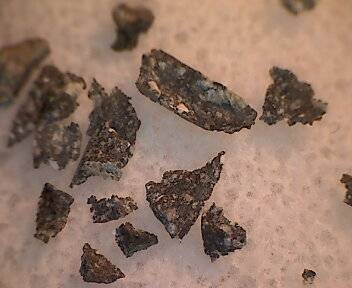
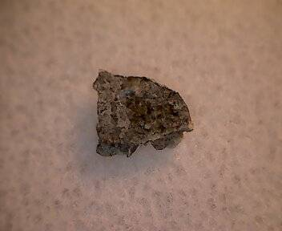

I purchased a couple of nice items from the [Hupe collection](http://members.ebay.com/ws/eBayISAPI.dll?ViewUserPage&userid=raremeteorites!).

The first is a 100mg sample of [NWA 4884](http://www.lpi.usra.edu/meteor/metbull.php?code=45808), [regolith](https://en.wikipedia.org/wiki/Regolith) [breccia](https://en.wikipedia.org/wiki/Breccia) from the Lunar basin. The total known weight of this meteorite is 42 grams.

The second is a 72mg sample of [Dhofar 019](http://www.lpi.usra.edu/meteor/metbull.php?code=6718), a Martian [Basaltic](https://en.wikipedia.org/wiki/Basalt)/[Doleritic](http://www.merriam-webster.com/dictionary/doleritic) [Shergottite](https://en.wikipedia.org/wiki/Martian_meteorite#Shergottites). The total known weight of this meteorite is 1056 grams.

I took the pictures with a [Veho VMS-001 USB microscope](http://www.veho-uk.com/main/shop_detail.aspx?article=8).

## Common Questions

* **How do you know it came from Mars (or the Moon?)** The composition of a meteorite can be compared to what various space probes and missions have told us about the composition of Mars (or the Moon). Moreover, in the case of a candidate Martian meteorite, it may have small pockets of gas trapped within it, which can be compared to the Viking (and other robotic probe) measurements of the Martian atmosphere.
* **How did it get here?** Gravitational interactions among all bodies orbiting the Sun cause perturbations that result in collisions between some of them. Early in solar system history such collisions almost certainly were much more frequent and involved much larger masses, so it is not difficult to imagine that some fairly large bodies were destroyed and dispersed in such events. Today, the interactions that ultimately deliver meteorites to us are less energetic, yet still can cause small pieces of a large body struck by a smaller object to be ejected at a rate that exceeds the escape velocity needed to overcome the gravitational force of the larger body. For Mars (with a gravitational acceleration about 0.38 that of Earth) this requires a fairly energetic collision by a small asteroid onto the Martian surface. The material so excavated could consist of rocks outcropping at the surface and/or subsurface samples from a certain depth. In the early 1980s scientists were skeptical that specimens that we now know to come from Mars actually could be accelerated enough to escape Mars gravity. Eventually, theorists reconsidered the physics of this process, and discovered that it was indeed possible to eject material by a mechanism called [spallation](http://en.wikipedia.org/wiki/Spallation). The fact that all Martian meteorites show evidence of moderate to high shock pressures is very consistent with these conclusions.

## Phil Plait

Phil Plait also gave an interesting talk about Martian meteorites on Google+:


