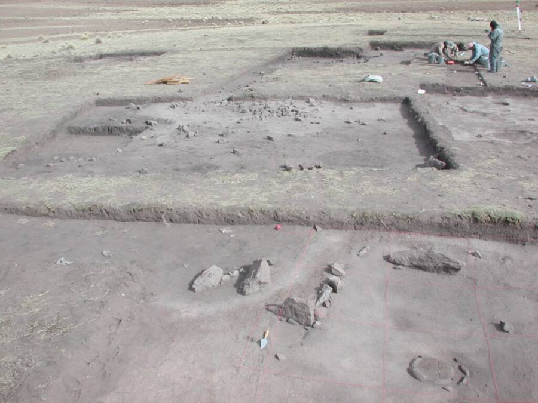
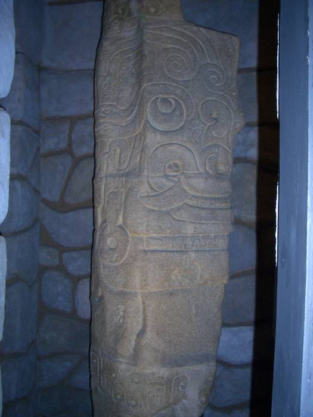
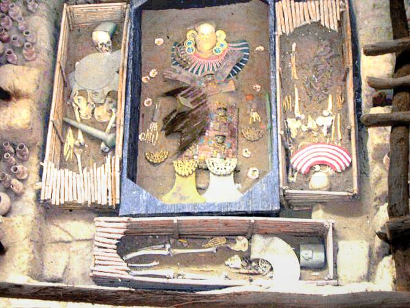
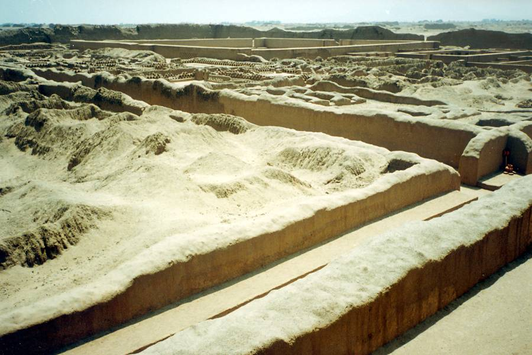

On Saturday, April 19th, I attended the last of this year’s AIA lecture series at SunWatch entitled “4000 Years of Andean Gold”. The speaker was [Dr. Mark Aldenderfer](http://www.ucmerced.edu/faculty/directory/mark-aldenderfer).

Dr. Aldenderfer is an anthropologist and archaeologist, and is a Professor of Anthropology at the University of California. He has worked extensively in the south-central Andes, and more recently in the Himalaya.

Saturday’s lecture began with a description of work done in the [Titicaca Basin](https://en.wikipedia.org/wiki/Lake_Titicaca), specifically [Jisk’a Iru Muqu](https://en.wikipedia.org/wiki/Jisk%27a_Iru_Muqu).

This is an Archaic site, c. 2000 BCE. Dr. Aldenderfer and his team excavated round pit houses here, and discovered simple, pounded-gold/bead necklaces, representing the earliest known gold artifacts in the Americas.

Next came a description of the work done at [Chavín de Huantar](https://en.wikipedia.org/wiki/Chav%C3%ADn_de_Huantar), c. 900 - 500 BCE. Dr. Aldenderfer discussed the wide influence of the Chavin culture. He described in detail the plaza and temple site, including beautiful subterranean tunnels that allowed controlled entry of sunlight and rushing water, along with the discovery of conch-shell trumpets.

At the center of the temple site, there is a sculpture of the [Lanzón](https://en.wikipedia.org/wiki/Lanz%C3%B3n), assumed to be the supreme deity of the Chavin culture.

Then came the work done at [Huaca del Sol](https://en.wikipedia.org/wiki/Huaca_del_Sol), an adobe brick temple built by the [Moche](https://en.wikipedia.org/wiki/Moche_%28culture%29), c. 1 - 600 AD.

As a part of this segment, Dr. Aldenderfer also talked about the [Lord of Sipán](https://en.wikipedia.org/wiki/Lord_of_Sip%C3%A1n), a Moche mummy site containing elaborate gold and silver artifacts.

Finally, the lecture closed with a discussion of the [Chimú](https://en.wikipedia.org/wiki/Chim%C3%BA_culture) culture, c. AD 1200, and the archaeological work done within [Chan Chan](https://en.wikipedia.org/wiki/Chan_Chan), capital city of the Chimú.

Specifically, excavations were made in ciudadelas, the collection of walled cities that collectively formed Chan Chan.

Overall, an interesting talk by an engaging speaker, and a worthy end to a fascinating series.
