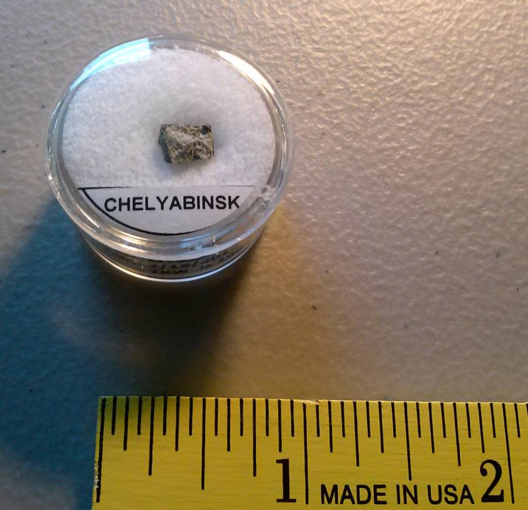
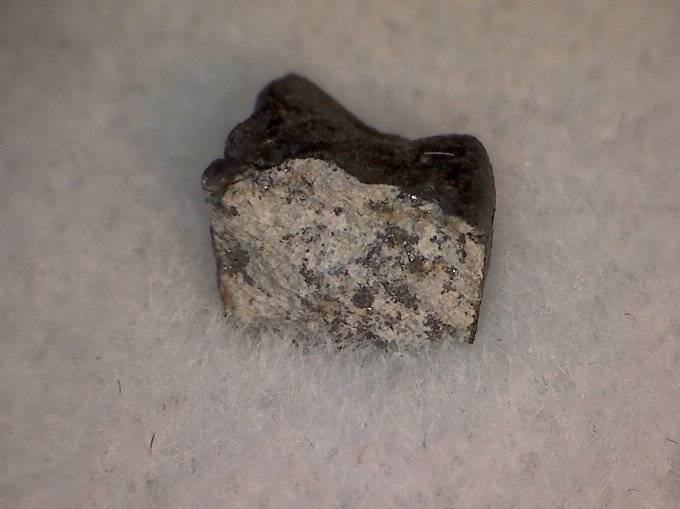
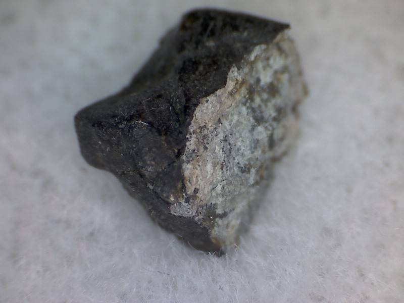

On February 15, 2013, shortly after dawn, a [superbolide meteor](https://en.wikipedia.org/wiki/Superbolide#Superbolide) descended over the [Ural mountains](https://en.wikipedia.org/wiki/Ural_Mountains), traveling at 34,000 MPH.



The meteor exploded at an altitude of 16 – 19 miles and generated a shock wave that injured over a thousand people.



Fragments of the meteor fell in and around the Russian city of [Chelyabinsk](https://en.wikipedia.org/wiki/Chelyabinsk). I was lucky enough to purchase one of these fragments from Dave Lacko of “d jar Meteorites”. (Mr. Lacko was able to purchase a sizable number from a Russian dealer.)

