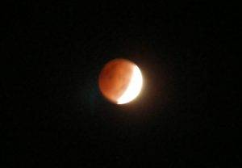
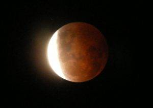

The skies cleared out in time for the lunar eclipse this morning. I managed to get a couple of decent pictures.

Here’s a shot with optical zoom on a Fuji S700 digital camera:

Here’s another shot through an Orion StarBlast 4.5″ telescope:

