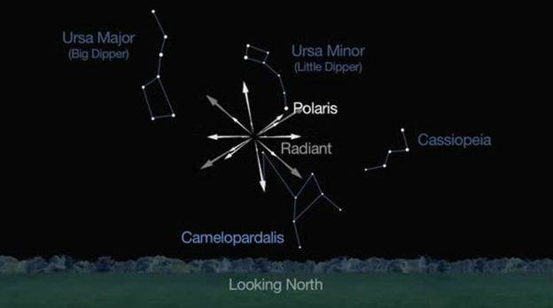

> **UPDATE, MAY 24** Sadly, the shower did not live up to expectations, producing no more than 5 - 10 meteors per hour. Not surprising, with the variable predictions, but still disappointing.

This May 23rd and 24th, weather permitting, it looks like there will be an opportunity to view a new meteor shower. Possibly a very active one.

A bit more than 10 years ago, on February 3, 2004, the [Lincoln Near-Earth Asteroid Research project](https://en.wikipedia.org/wiki/Lincoln_Near-Earth_Asteroid_Research) discovered a small comet that was eventually named [209P/LINEAR](https://en.wikipedia.org/wiki/209P/LINEAR). This comet has an orbit that takes it around the sun and all the way past Jupiter every five years.

On May 23-24, the Earth will encounter a stream of debris left behind by Comet 209P/LINEAR in the 1800’s. This is believed to be Earth’s first encounter with the 209P debris trail.

Much is unknown about this comet, and predictions about the density of the debris trail vary wildly, but this does have the potential to be a very active shower, with a [ZHR](https://en.wikipedia.org/wiki/Zenithal_Hourly_Rate) of 100 or even higher.

With so much variability in the predictions, it will probably be best to view the sky for as long as possible starting Friday evening and into Saturday morning, but the peak is generally expected to be between 2 and 4 a.m. EDT.

The radiant of the shower is the faint constellation [Camelopardalis](https://en.wikipedia.org/wiki/Camelopardalis), easy to find because it sits roughly in the center of a a triangle formed by the constellations Ursa Minor (The Little Dipper), Ursa Major (The Big Dipper), and Cassiopeia.
