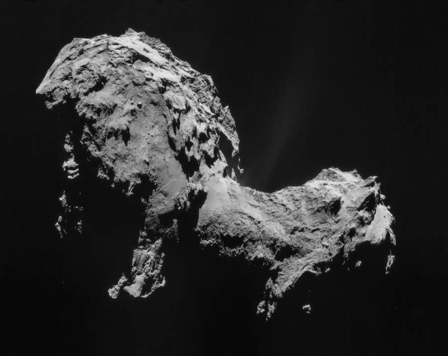
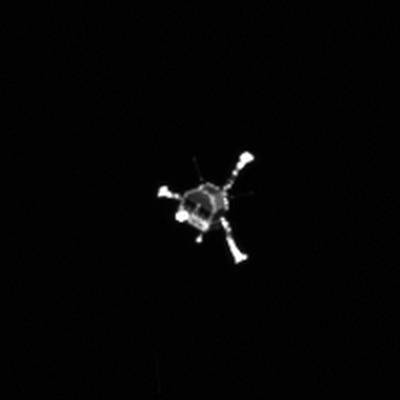
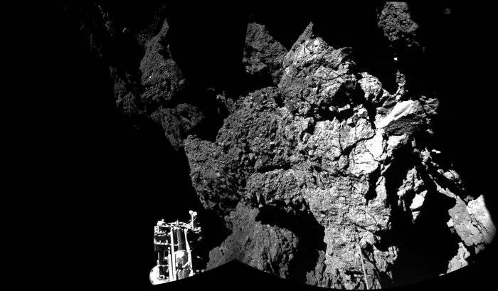

On March 2, 2004, the European Space Agency launched the [Rosetta robotic space probe](http://rosetta.esa.int/) on an [Ariane 5](https://en.wikipedia.org/wiki/Ariane_5). It reached comet [67P/Churyumov–Gerasimenko](https://en.wikipedia.org/wiki/67P/Churyumov%E2%80%93Gerasimenko) on August 6, 2014.

On November 12, 2014, the Rosetta orbiter released the Philae lander.

Philae was supposed to tether itself to the surface of the comet, but the tether harpoons did not fire. Because of the low gravity, the Philae lander bounced twice, eventually coming to rest against a cliff face. Its instrumentation was not damaged, but unfortunately its position kept it from receiving adequate sunlight for its solar panels.

With battery power running out, Philae immediately began performing as much of its science mission as possible.

> With its batteries depleted and not enough sunlight available to recharge, Philae has fallen into ‘idle mode’ for a potentially long silence. In this mode, all instruments and most systems on board are shut down.
> 
> “Prior to falling silent, the lander was able to transmit all science data gathered during the First Science Sequence,” says DLR’s Stephan Ulamec, Lander Manager, who was in the Main Control Room at ESOC tonight.
> 
> From the [Rosetta blog](http://blogs.esa.int/rosetta/)

The ESA did a wonderful job with the time they had. I thought it was a nice touch the way they anthropomorphized the orbiter and lander, having them tweet updates in the first-person. It really helped us Earth-bound folks connect. You can almost picture little Philae huddled against that dark cliff face: “So cold. So tired. Must complete my work, before time runs out…”

So now, for the history books we have the first landing and pictures from the surface of a comet. Absolutely incredible.
