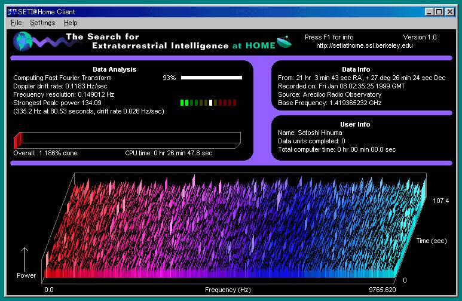
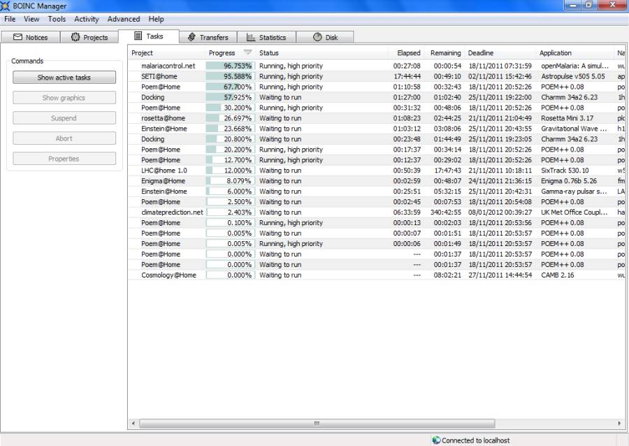

The search for extraterrestrial intelligence (“[SETI](http://www.seti.org/)“) is a blanket term used to describe a number of activities performed for the purpose of finding compelling evidence for the existence of intelligent extraterrestrial life. Of these activities, the best known is the scanning of electromagnetic radiation for signs of radio transmissions from otherworldly civilizations.

This involves analyzing massive amounts of data collected from radio telescopes like the [Arecibo Observatory](https://www.youtube.com/watch?v=YX4PZ-fW2YA) in Puerto Rico. This is a daunting task, as it requires a lot of computing horsepower.

The analysis strives to separate naturally occurring transient radio pulses from artificial ones. Natural radio sources include things like pulsars and exploding black holes.

In 1995, David Gedye proposed leveraging the combined power of a large number of Internet-connected personal computers as a “virtual supercomputer”. The idea here was to break up the large data analysis job into smaller work units and then dole those work units out to individual personal computers.

In May 1999, the [SETI@home project](http://setiathome.berkeley.edu/) was launched. On the client side, it consisted of software that would run in the background to perform the data analysis, and a screensaver that would display the progress.

I was working at Harland Financial Solutions when SETI@home was launched. I signed up, and so did a lot of my coworkers. I can still remember walking through the building and seeing the SETI@home screensaver running, seemingly everywhere.

Time passed, and enthusiasm waned. I eventually stopped running the screensaver, and most of my colleagues did too. The project crossed my mind occasionally over the years, but I didn’t bother to check its progress.

I was recently re-watching “[Contact](https://www.youtube.com/watch?v=d9C2cF3KvP8)” (still one of my favorite movies), and it made me start thinking about the project again. I decided to investigate.

As it turns out, the project is still quite active, but it is now part of a larger initiative called [Berkeley Open Infrastructure for Network Computing](https://boinc.berkeley.edu/) (“BOINC“). BOINC encompasses a [wide variety](https://boinc.berkeley.edu/projects.php) of grid computing projects, in areas like molecular biology, climatology, medicine, and astrophysics.

I saw that the BOINC client is available in my Linux repositories, so I installed and configured it. It doesn’t seem to have a screensaver component anymore, but it does have a client manager you can use to check your progress, and you can also check this by logging in with your account on the BOINC website.

As I write this post, I’ve finished processing a couple of work units, and a couple more are nearing completion. It’s fun to be doing this again! I’ve already been working on some bash and Python scripts to simplify monitoring the status of my progress.

What’s next?

I have a couple of ideas. First, I see that the SETI@home server status info is available in an XML feed from the website. I’m going to work on a responsive Bootstrap site that will consume this XML and produce a friendly display. Then, I believe I’ll investigate the feasibility of setting up a headless Raspberry Pi server that I can dedicate to analyzing data with the BOINC client.
