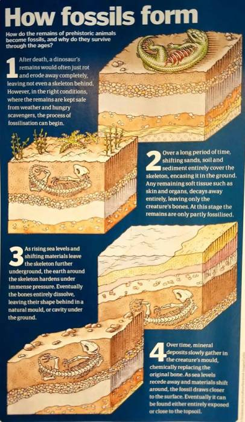
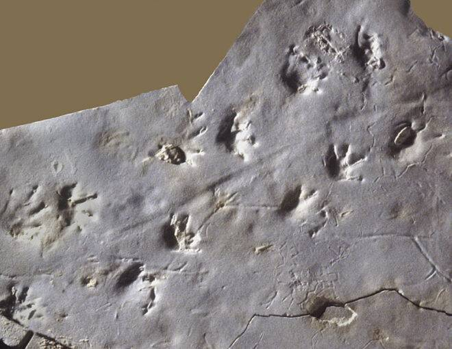
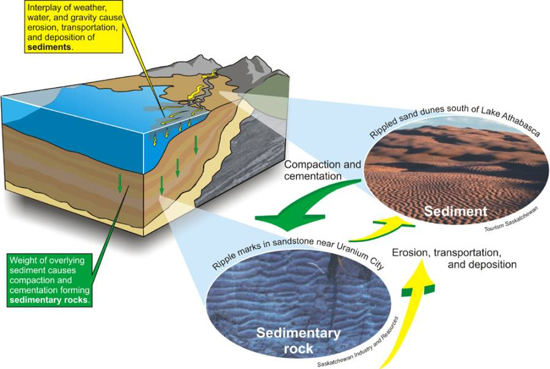
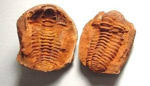
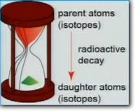

Here’s a question from a friend, which I’ve paraphrased just a bit for clarity:

> What’s a fossil? [...] I believe that we are a young world, so how do we explain dinosaurs?

Fossils are the preserved remains of once-living things from the past.

Fossils can also be evidence of living things, like tracks or burrows. (These are called **trace fossils**.)

In order for fossilization to occur, an organism must be covered by sediment quickly after death. Sediment is material that settles to the bottom of a liquid, like mud. Marine organisms fossilize more often than terrestrial animals because they are more likely to be covered by sediment before decaying, as they sink to the bottom of the body of water in which they were living.

There are several types of fossilization. Here are the most common:

* **Permineralization** occurs when mineral-bearing water permeates organic material, slowly replacing the original organic material with mineral (like calcite). This is why fossil bones are heavier than the bones in living animals: the bone has actually been turned to stone!
* **Replacement and recrystallization** is a similar process that can result in very detailed fossils.
* **Casts** and **molds** are left behind when the original organism are completely dissolved or destroyed, leaving an organism-shaped hole in the rock. If it’s just the outer shape of the organism, it’s an **external mold**. If this hole later fills with other minerals, it’s a **cast**.

The most common way to determine the absolute age of fossils is by using a technique called **radiometric dating**. The rates at which various radioactive elements decay (change into other elements) are well understood, so by dating elements within the same stratigraphic layer as the fossil, the age of the fossil is known.

If there are no radioactive elements in the same layer as the fossil, **stratigraphy** can also be used to estimate its age, by dating the layers above and below it. For example, if the layer above a fossil is dated at 50 million years, and the layer below is dated at 70 million years, then it can be extrapolated that the fossil itself is roughly 60 million years old.

Radiometric dating consistently indicates a very ancient world.
