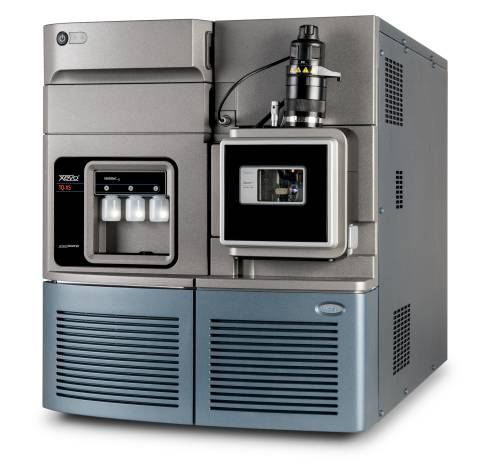
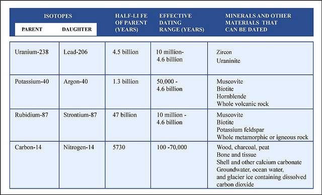

_This is information I’ve pulled from my notes, specific to dating methods. Unfortunately, I was negligent in noting my sources when I first collected these notes, so I’ll just say there’s a good chance that much of this is copied word-for-word from other sources._

## Radiometric Dating

Radiometric dating (often called radioactive dating) is a technique used to date materials, usually based on a comparison between the observed abundance of a naturally occurring radioactive isotope and its decay products, using known decay rates. It is the principal source of information about the absolute age of rocks and other geological features, including the age of the Earth itself, and can be used to date a wide range of natural and man-made materials.

> An **isotope** is any of two or more forms of a chemical element, having the same number of protons in the nucleus, or the same atomic number, but having different numbers of neutrons in the nucleus.

Together with stratigraphic principles, radiometric dating methods are used in geochronology to establish the geological time scale. Among the best-known techniques are radiocarbon dating, potassium-argon dating and uranium-lead dating. By allowing the establishment of geological timescales, it provides a significant source of information about the ages of fossils and the deduced rates of evolutionary change. Radiometric dating is also used to date archaeological materials, including ancient artifacts.

Different methods of radiometric dating vary in the timescale over which they are accurate and the materials to which they can be applied.

## Fundamentals of Radiometric Dating

### Radioactive Decay

All ordinary matter is made up of combinations of chemical elements, each with its own atomic number, indicating the number of protons in the atomic nucleus. Additionally, elements may exist in different isotopes, with each isotope of an element differing in the number of neutrons in the nucleus. A particular isotope of a particular element is called a nuclide. Some nuclides are inherently unstable. That is, at some point in time, an atom of such a nuclide will spontaneously transform into a different nuclide. This transformation may be accomplished in a number of different ways, including radioactive decay, either by emission of particles (usually electrons (beta decay), positrons or alpha particles) or by spontaneous fission, and electron capture.

While the moment in time at which a particular nucleus decays is unpredictable, a collection of atoms of a radioactive nuclide decays exponentially at a rate described by a parameter known as the half-life, usually given in units of years when discussing dating techniques. After one half-life has elapsed, one half of the atoms of the nuclide in question will have decayed into a “daughter” nuclide or decay product. In many cases, the daughter nuclide itself is radioactive, resulting in a decay chain, eventually ending with the formation of a stable (nonradioactive) daughter nuclide; each step in such a chain is characterized by a distinct half-life. In these cases, usually the half-life of interest in radiometric dating is the longest one in the chain, which is the rate-limiting factor in the ultimate transformation of the radioactive nuclide into its stable daughter. Isotopic systems that have been exploited for radiometric dating have half-lives ranging from only about 10 years (e.g., tritium) to over 100 billion years (e.g., Samarium-147).

In general, the half-life of a nuclide depends solely on its nuclear properties; it is not affected by external factors such as temperature, pressure, chemical environment, or presence of a magnetic or electric field. (For some nuclides which decay by the process of electron capture, such as Beryllium-7, Strontium-85, and Zirconium-89, the decay rate may be slightly affected by local electron density, therefore these isotopes may not be as suitable for radiometric dating.) But in general, the half-life of any nuclide is essentially a constant. Therefore, in any material containing a radioactive nuclide, the proportion of the original nuclide to its decay product(s) changes in a predictable way as the original nuclide decays over time. This predictability allows the relative abundances of related nuclides to be used as a clock to measure the time from the incorporation of the original nuclide(s) into a material to the present.

The basic equation of radiometric dating requires that neither the parent nuclide nor the daughter product can enter or leave the material after its formation. The possible confounding effects of contamination of parent and daughter isotopes have to be considered, as do the effects of any loss or gain of such isotopes since the sample was created. It is therefore essential to have as much information as possible about the material being dated and to check for possible signs of alteration. Precision is enhanced if measurements are taken on multiple samples from different locations of the rock body. Alternatively, if several different minerals can be dated from the same sample and are assumed to be formed by the same event and were in equilibrium with the reservoir when they formed, they should form an isochron. This can reduce the problem of contamination. In uranium-lead dating, the concordia diagram is used which also decreases the problem of nuclide loss. Finally, correlation between different isotopic dating methods may be required to confirm the age of a sample. For example, a study of the Amitsoq gneisses from western Greenland used five different radiometric dating methods to examine twelve samples and achieved agreement to within 30 Ma on an age of 3,640 Ma.

### Preconditions

Accurate radiometric dating generally requires that the parent has a long enough half-life that it will be present in significant amounts at the time of measurement, the half-life of the parent is accurately known, and enough of the daughter product is produced to be accurately measured and distinguished from the initial amount of the daughter present in the material. The procedures used to isolate and analyze the parent and daughter nuclides must be precise and accurate. This normally involves isotope ratio mass spectrometry.

The precision of a dating method depends in part on the half-life of the radioactive isotope involved. For instance, carbon-14 has a half-life of 5,730 years. After an organism has been dead for 60,000 years so little carbon-14 is left that accurate dating can not be established. On the other hand, the concentration of carbon-14 falls off so steeply that the age of relatively young remains can be determined precisely to within a few decades.

### Closure Temperature

If a material that selectively rejects the daughter nuclide is heated, any daughter nuclides that have been accumulated over time will be lost through diffusion, setting the isotopic “clock” to zero. The temperature at which this happens is known as the closure temperature or blocking temperature and is specific to a particular material and isotopic system. These temperatures are experimentally determined in the lab by artificially resetting sample minerals using a high-temperature furnace. As the mineral cools, the crystal structure begins to form and diffusion of isotopes is less easy. At a certain temperature, the crystal structure has formed sufficiently to prevent diffusion of isotopes. This temperature is what is known as closure temperature and represents the temperature below which the mineral is a closed system to isotopes. Thus an igneous or metamorphic rock or melt, which is slowly cooling, does not begin to exhibit measurable radioactive decay until it cools below the closure temperature. The age that can be calculated by radiometric dating is thus the time at which the rock or mineral cooled to closure temperature. Dating of different minerals and/or isotope systems (with differing closure temperatures) within the same rock can therefore enable the tracking of the thermal history of the rock in question with time, and thus the history of metamorphic events can become known in detail. This field is known as thermochronology or thermochronometry.

## Modern Dating Methods

### Radiometric Dating

Radiometric dating has been carried out since 1905 when it was invented by Ernest Rutherford as a method by which one might determine the age of the Earth. In the century since then the techniques have been greatly improved and expanded. Dating can now be performed on samples as small as a billionth of a gram using a mass spectrometer. The mass spectrometer was invented in the 1940s and began to be used in radiometric dating in the 1950s. The mass spectrometer operates by generating a beam of ionized atoms from the sample under test. The ions then travel through a magnetic field, which diverts them into different sampling sensors, known as “Faraday cups”, depending on their mass and level of ionization. On impact in the cups, the ions set up a very weak current that can be measured to determine the rate of impacts and the relative concentrations of different atoms in the beams.

### Uranium-lead dating method

The uranium-lead radiometric dating scheme has been refined to the point that the error margin in dates of rocks can be as low as less than two million years in two-and-a-half billion years. An error margin of 2–5 % has been achieved on younger Mesozoic rocks.

Uranium-lead dating is often performed on the mineral zircon (ZrSiO4), though it can be used on other materials, such as baddeleyite. Zircon and baddeleyite incorporate uranium atoms into their crystalline structure as substitutes for zirconium, but strongly reject lead. It has a very high closure temperature, is resistant to mechanical weathering and is very chemically inert. Zircon also forms multiple crystal layers during metamorphic events, which each may record an isotopic age of the event. In situ micro-beam analysis can be achieved via laser ICP-MS or SIMS techniques.

One of its great advantages is that any sample provides two clocks, one based on uranium-235’s decay to lead-207 with a half-life of about 700 million years, and one based on uranium-238’s decay to lead-206 with a half-life of about 4.5 billion years, providing a built-in crosscheck that allows accurate determination of the age of the sample even if some of the lead has been lost. This can be seen in the concordia diagram, where the samples plot along an errochron (straight line) which intersects the concordia curve at the age of the sample.

### Samarium-neodymium dating method

This involves the alpha-decay of 147Sm to 143Nd with a half life of 1.06 x 1011 years. Accuracy levels of less than twenty million years in two-and-a-half billion years are achievable.

### Potassium-argon dating method

This involves electron capture or positron decay of potassium-40 to argon-40. Potassium-40 has a half-life of 1.3 billion years, and so this method is applicable to the oldest rocks. Radioactive potassium-40 is common in micas, feldspars, and hornblendes, though the closure temperature is fairly low in these materials, about 125°C (mica) to 450°C (hornblende).

### Rubidium-strontium dating method

This is based on the beta decay of rubidium-87 to strontium-87, with a half-life of 50 billion years. This scheme is used to date old igneous and metamorphic rocks, and has also been used to date lunar samples. Closure temperatures are so high that they are not a concern. Rubidium-strontium dating is not as precise as the uranium-lead method, with errors of 30 to 50 million years for a 3-billion-year-old sample.

### Uranium-thorium dating method

A relatively short-range dating technique is based on the decay of uranium-234 into thorium-230, a substance with a half-life of about 80,000 years. It is accompanied by a sister process, in which uranium-235 decays into protactinium-231, which has a half-life of 34,300 years.

While uranium is water-soluble, thorium and protactinium are not, and so they are selectively precipitated into ocean-floor sediments, from which their ratios are measured. The scheme has a range of several hundred thousand years.

### Radiocarbon dating method

Carbon-14 is a radioactive isotope of carbon, with a half-life of 5,730 years, which is very short compared with those above. In other radiometric dating methods, the heavy parent isotopes were synthesized in the explosions of massive stars that scattered materials through the universe, to be formed into planets and other stars. The parent isotopes have been decaying since that time, and so any parent isotope with a short half-life should be extinct by now. Carbon–14 is an exception. It is continuously created through collisions of neutrons generated by cosmic rays with nitrogen in the upper atmosphere. The carbon-14 ends up as a trace component in atmospheric carbon dioxide (CO2).

> Increasing air pollution is making radiocarbon dating less accurate. Fossil fuels are so old that they contain no radioactive carbon-14. Radiocarbon dating works by measuring the fraction of carbon-14 in an object, so fossil fuel emissions in the atmosphere that are taken up by plants make an object seem to be older than it really is.

An organism acquires carbon during its lifetime. Plants acquire it through photosynthesis, and animals acquire it from consumption of plants and other animals. When an organism dies, it ceases to take in new carbon-14, and the existing isotope decays with a characteristic half-life (5730 years). The proportion of carbon-14 left when the remains of the organism are examined provides an indication of the time elapsed since its death. The carbon–14 dating limit lies around 58,000 to 62,000 years.

The rate of creation of carbon-14 appears to be roughly constant, as cross-checks of carbon–14 dating with other dating methods show it gives consistent results. However, local eruptions of volcanoes or other events that give off large amounts of carbon dioxide can reduce local concentrations of carbon–14 and give inaccurate dates. The releases of carbon dioxide into the biosphere as a consequence of industrialization have also depressed the proportion of carbon-14 by a few percent; conversely, the amount of carbon-14 was increased by above-ground nuclear bomb tests that were conducted into the early 1960s. Also, an increase in the solar wind or the Earth’s magnetic field above the current value would depress the amount of carbon-14 created in the atmosphere. These effects are corrected for by the calibration of the radiocarbon dating scale.

### Fission track dating method

This involves inspection of a polished slice of a material to determine the density of “track” markings left in it by the spontaneous fission of uranium-238 impurities. The uranium content of the sample has to be known, but that can be determined by placing a plastic film over the polished slice of the material, and bombarding it with slow neutrons. This causes induced fission of 235U, as opposed to the spontaneous fission of 238U. The fission tracks produced by this process are recorded in the plastic film. The uranium content of the material can then be calculated from the number of tracks and the neutron flux.

This scheme has application over a wide range of geologic dates. For dates up to a few million years micas, tektites (glass fragments from volcanic eruptions), and meteorites are best used. Older materials can be dated using zircon, apatite, titanite, epidote and garnet which have a variable amount of uranium content. Because the fission tracks are healed by temperatures over about 200°C the technique has limitations as well as benefits. The technique has potential applications for detailing the thermal history of a deposit.

### Chlorine-36 dating method

Large amounts of otherwise rare 36Cl were produced by irradiation of seawater during atmospheric detonations of nuclear weapons between 1952 and 1958. The residence time of 36Cl in the atmosphere is about 1 week. Thus, as an event marker of 1950s water in soil and ground water, 36Cl is also useful for dating waters less than 50 years before the present. 36Cl has seen use in other areas of the geological sciences, including dating ice and sediments.

### Optically stimulated luminescence dating method

Natural sources of radiation in the environment knock loose electrons in, say, a piece of pottery, and these electrons accumulate in defects in the material’s crystal lattice structure. Heating the object will release the captured electrons, producing a luminescence. When the sample is heated, at a certain temperature it will glow from the emission of electrons released from the defects, and this glow can be used to estimate the age of the sample to a threshold of approximately 15 percent of its true age. The date of a rock is reset when volcanic activity remelts it. The date of a piece of pottery is reset by the heat of the kiln. Typically temperatures greater than 400 degrees Celsius will reset the “clock”. This is termed thermoluminescence.

## Other Dating Methods (non-radiometric)

### Astronomical chronology

Astronomical chronology, or astronomical dating, is a technical method of dating events or artifacts that are associated with astronomical phenomena. Written records of historical events that include descriptions of astronomical phenomena have done much to clarify the chronology of the Ancient Near East; works of art which depict the configuration of the stars and planets and buildings which are oriented to the rising and setting of celestial bodies at a particular time have all been dated through astronomical calculations.

### Dendrochronology

Dendrochronology or tree-ring dating is the scientific method of dating based on the analysis of patterns of tree-rings. Dendrochronology can date the time at which tree rings were formed, in many types of wood, to the exact calendar year. This has three main areas of application: paleoecology, where it is used to determine certain aspects of past ecologies (most prominently climate); archaeology, where it is used to date old buildings, etc.; and radiocarbon dating, where it is used to calibrate radiocarbon ages.

In some areas of the world, it is possible to date wood back a few thousand years, or even many thousands. In most areas, however, wood can only be dated back several hundred years, if at all.

### Superposition

The law of superposition (or the principle of superposition) is a key axiom based on observations of natural history that is a foundational principle of sedimentary stratigraphy and so of other geology dependent natural sciences: “Sedimentary layers are deposited in a time sequence, with the oldest on the bottom and the youngest on the top.”

### Faunal Succession

The principle of faunal succession is based on the observation that sedimentary rock strata contain fossilized flora and fauna, and that these fossils succeed each other vertically in a specific, reliable order that can be identified over wide horizontal distances. A fossilized Neanderthal bone will never be found in the same stratum as a fossilized Megalosaurus, for example, because neanderthals and megalosauruses lived during different geological periods, separated by many millions of years. This allows for strata to be identified and dated by the fossils found within.

This principle, which received its name from the English geologist William Smith, is of great importance in determining the relative age of rocks and strata. The fossil content of rocks together with the law of superposition helps to determine the time sequence in which sedimentary rocks were laid down.

Theories of evolution explain the observed faunal and floral succession preserved in rocks, which is the fact of evolution. The occurrence of faunal succession was thoroughly documented by Smith in England during the first decade of the 19th century, and concurrently in France by Cuvier (with the assistance of the mineralogist Alexandre Brongniart). Archaic biological features and organisms are succeeded in the fossil record by more modern versions. For instance, paleontologists investigating the evolution of birds predicted that feathers would first be seen in primitive forms on flightless predecessor organisms such as feathered dinosaurs. This is precisely what has been discovered in the fossil record: simple feathers, incapable of supporting flight, are succeeded by increasingly large and complex feathers.

In practice, the most useful diagnostic species are those with the fastest rate of species turnover and the widest distribution; their study is termed biostratigraphy, the science of dating rocks by using the fossils contained within them. In Cenozoic strata, fossilized tests of foraminifera are often used to determine faunal succession on a refined scale, each biostratigraphic unit (biozone) being a geological stratum that is defined on the basis of its characteristic fossil taxa. An outline microfaunal zonal scheme based on both foraminifera and ostracoda was compiled by M. B. Hart (1972).
