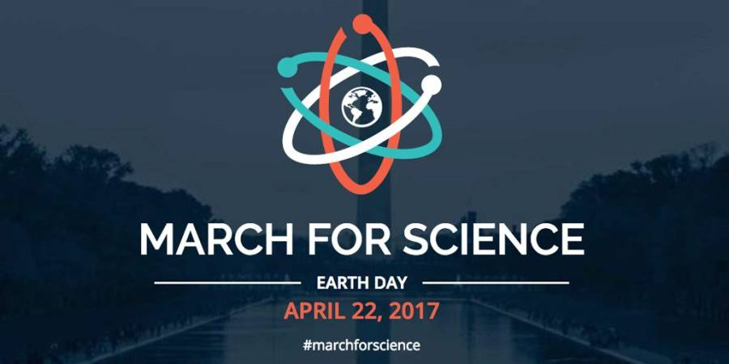

## Why Do We March?

Our current administration, and Congress, deny facts and reject reason on a broad range of scientific topics, including climate change, vaccinations, GMOs, and fake medicine.

The March for Science is a means for the American people to reject this stance and show their support for science and all it’s done for us. Science is the basis for effectively all of the luxuries we enjoy as a part of modern life. Science provides the framework and methodology for moving forward and continuing to advance our standards of living and our understanding of the natural world. A perfect path? No. But, a continuously self-correcting march toward the truth, and away from ignorance and superstition.

I’ll be joining the march in Oxford, Ohio to show my support.

### Info from the March for Science website

**Why** Science, scientists, and evidence-based policymaking are under attack. Budget cuts, censorship of researchers, disappearing datasets, and threats to dismantle government agencies harm us all, putting our health, food, air, water, climate, and jobs at risk. It is time for people who support science to take a public stand and be counted.

**What** The March for Science is the first step of a global movement to defend the vital role science plays in our health, safety, economies, and governments.

**How** We are building a broad, nonpartisan, and diverse coalition of organizations and individuals who stand up for science. We are advocating for evidence-based policymaking, science education, research funding, and inclusive and accessible science. All with your support!

**Who** People who value science. Science advocates, science educators, scientists, and concerned citizens. More than 170 partner organizations and counting. And you!

**Where** The National Mall in Washington, DC and 425+ satellite marches around the world.

**When** April 22nd, 2017. But that’s only the beginning…

Read more [here](https://www.marchforscience.com/).

## March in Oxford, Ohio

_Info from [Dustin Hornbeck](https://www.facebook.com/dustin.hornbeck), posted on the Facebook event page:_

The March for Science in Oxford, Ohio will be held on Saturday, April 22.

This is a chance to demonstrate publicly in support of science, reason, and objective facts.

We will listen to several scientists speak about the importance of science in our world and why.

We will meet in front of Armstrong Student Center 550 East Spring Street, Oxford, OH, 45056 at 11:30 to March.

We will march to the Slant Walk for the Rally to be held. The Slant Walk is on the edge of campus. Across the street from Skippers where the Gate entrance to campus is. This will begin at noon.

Parking: There are parking garages uptown, near Benton Hall, and Goggin Ice Center. There is also various parking throughout the town and free parking on the edge of town.

<https://www.cityofoxford.org/departments/police-parking/parking-transportation/parking-options>

<http://miamioh.edu/parking/parking-areas/>

<https://www.reddit.com/r/MarchForScience/>

Below is the list of scientists and others that will be speaking at the March.

* Historian/Mayor Dr. Kate Rousmaniere
* University Provost/Biologist Dr. Phyllis Callahan
* Undergraduate Student Body President Maggie Reilly
* Geologist [Dr. Jason Rech](https://miamioh.edu/cas/academics/departments/geology/about/rech/)
* Geologist [Dr. Jonathan Levy](https://miamioh.edu/cas/academics/departments/geology/about/jonathanlevy/)
* Biologist [Dr. Michelle Boone](https://miamioh.edu/cas/academics/departments/biology/about/faculty/boone/)

Also with a performance by members of the Miami Men’s Glee Club.

## Some Caveats

Let’s make a concerted effort to come away from this march with something actionable. Enjoy the company and conversation with the folks marching beside you, and learn everything you can from the speakers. Then, take what you learn, analyze it critically, and use it in local outreach and voting. Simply marching and doing nothing further suggests you might be succumbing to one or more of the following:

**Moral Outrage** When people publicly rage about perceived injustices that don’t affect them personally, we tend to assume this expression is rooted in altruism – a “disinterested and selfless concern for the well-being of others.” But new research suggests that professing such third-party concern – what social scientists refer to as “moral outrage” – is often a function of self-interest, wielded to assuage feelings of personal culpability for societal harms or reinforce (to the self and others) one’s own status as a Very Good Person.

**Self-Righteousness** A feeling or display of (usually smug) moral superiority derived from a sense that one’s beliefs, actions, or affiliations are of greater virtue than those of the average person. Self-righteous individuals are often intolerant of the opinions and behaviors of others.

**Tribalism** The state of being organized in or an advocate for a tribe or tribes. In terms of conformity, tribalism may also refer in popular cultural terms to a way of thinking or behaving in which people are loyal to their own tribe or social group.

**Virtue Signaling** The conspicuous expression of moral values by an individual done primarily with the intent of enhancing that person’s standing within a social group. The term was first used in signalling theory, to describe any behavior that could be used to signal virtue – especially piety among the political or religious faithful. Since 2015, the term has become more commonly used as a pejorative characterization by commentators to criticize what they regard as the platitudinous, empty, or superficial support of certain political views on social media; and also used within groups to criticize their own members for valuing outward appearance over substantive action.
