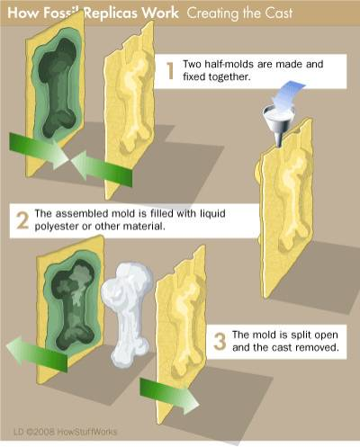
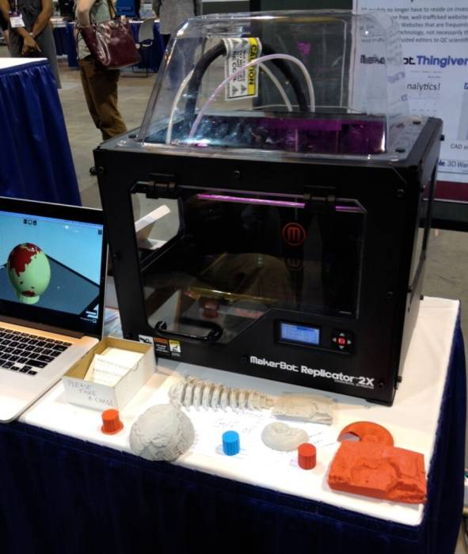
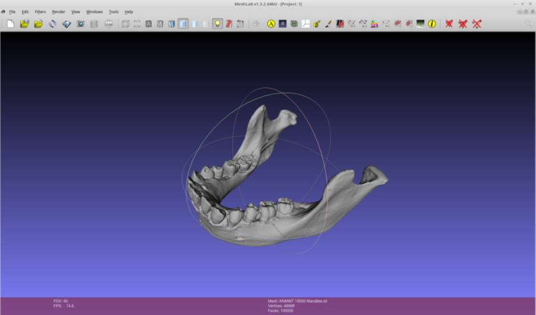
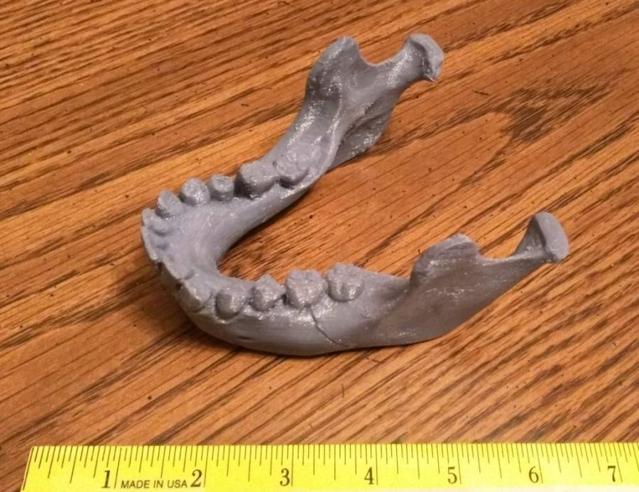

It used to be that the only way to share copies of rare and delicate fossils was through casting. It’s labor-intensive, messy, and can damage the fossils being cast.

[Recently](https://www.newscientist.com/article/mg21728996.500-3d-print-a-fossil-with-virtual-palaeontology/), though, there has been a trend to digitize fossil collections, allowing 3D printing to supplement or even take the place of traditional casting.

There are many sites providing 3D model files, typically in [STL](https://en.wikipedia.org/wiki/STL_(file_format)) format. There are general sites (fossils and many other items) like [yeggi](http://www.yeggi.com/), and there are also fossil-specific sites like [African Fossils](http://africanfossils.org/), [MorphoSource](http://morphosource.org/), and [eLucy](https://elucy.org/). African Fossils is the site I’ve been paying close attention to recently, as they’ve digitized a large part of a collection of Pleistocene hominid and other mammal fossils, along with stone tools. (The Pleistocene encompasses the most recent ice age, from 2.5 million – 11 thousand years ago.) These items come from the [Turkana Basin](https://en.wikipedia.org/wiki/Turkana_Basin) region of northern Kenya and southern Ethiopia. The site is well designed, with online 3D model viewing tools and free downloads of model files.

Curiosity got the best of me, and I decided to go through the process of getting a 3D print done. First step was to download an STL file. I chose a mandible from [Turkana Boy](https://en.wikipedia.org/wiki/Turkana_Boy), currently the most complete known skeleton of an early human, specifically a [Homo erectus](https://en.wikipedia.org/wiki/Homo_erectus), about 1.6 million years old.

After downloading the model file, I wanted to take a closer look at the digital model before getting it printed. There are plenty of free software tools available to accomplish this. I’ve been using [FreeCAD](http://www.freecadweb.org/) and [MeshLab](http://www.meshlab.net/). Here’s what it looks like in Meshlab:

Then, I reached out to Tom Mitchell at [Proto BuildBar](http://protobuildbar.com/) in Dayton, Ohio. He examined my STL file, and provided a printing time and cost estimate. The printing was done on a [MakerBot Replicator Mini](https://store.makerbot.com/printers/replicator-mini/), using [PLA](https://en.wikipedia.org/wiki/Polylactic_acid) as the printing material.

I think it looks pretty great:

