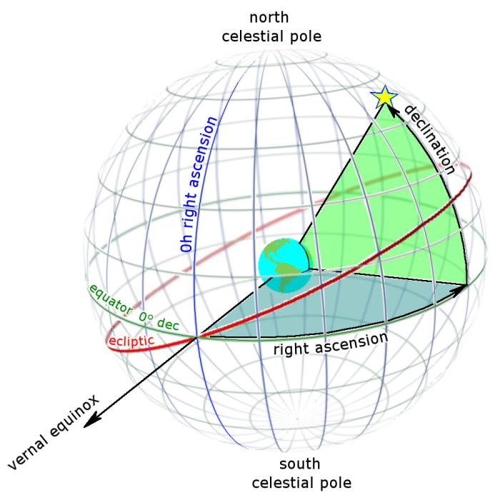

The night sky has many observable objects. Some, like stars, nebulae, star clusters, and galaxies, are “fixed”. That is, they don’t change position relative to other fixed objects. (Mostly. See “Epochs” below.) Others, like the moon, sun, planets, comets, and other solar system objects, change their relative positions each night.

## Declination and Right Ascension

The standard coordinate system for identifying the position of celestial objects is Declination and Right Ascension. These are comparable to the Latitude and Longitude geographic coordinate system used to identify locations on the surface of the Earth.

Detailed comparison:

Geographic Coordinate | Celestial Coordinate
---------|----------
**Latitude** is an angle ranging from 0° at the Equator, to 90° (North or South) at the poles. | **Declination** is similar to Latitude, except projected onto the celestial sphere.Declination ranges from 0° at the celestial equator, to 90° at the north celestial pole (the approximate position of Polaris, the “north star”), and -90° at the south celestial pole (the approximate position of the star Sigma Octanis, the “south pole star”).
**Longitude** specifies the east-west position of a point on the Earth’s surface. It is also measured in degrees, with the the 0° location (the “Prime Meridian”) being a line passing through the Royal Observatory in Greenwich, England. Longitude points to the east and west of the Prime Meridian are measured to +180° eastward and -180° westward. | **Right Ascension** is the angular distance measured eastward along the celestial equator. Instead of degrees, measurements are designated in units of hours (0 – 24), minutes (0 – 60), and seconds (0 – 60). An easy way to visualize it (in the northern hemisphere) is to imagine an arrow pointing away from Polaris. If you imagine it pointing in one of four equal directions, the Right Ascension angle would be either 0, 6, 12, or 18 hours.

For greater precision, Declination can also be broken down further into minutes and seconds.

As an example, we specify the Right Ascension and Declination of the bright star Rigel as 5h 14m 32s and −8° 12m 6s.

## Epochs

There are a few factors that cause “fixed” objects to be not-quite fixed. That is, fixed objects do change their positions over time, just very, very slowly.

**Precession** is a “wobble” in the Earth’s rotational axis which causes a change in the position of celestial objects over a 26,000 year cycle. Further, fixed objects do have their own **proper motion**, that is, they are actually moving through space. Because of their great distance, this effect is small, but does add up over time.

To account for these changes in position, celestial coordinates are specified with reference to a particular year, called an **epoch**. The currently used standard epoch is J2000, referring to January 1, 2000.

## Local Observer

Right Ascension and Declination are the standard means of specifying an object’s location on the celestial sphere, but they’re difficult for a casual observer to use to locate the object. Therefore, these coordinates are usually converted to a horizontal coordinate system specific to the observer’s location on Earth: altitude and azimuth.

**Altitude** is measured from 0° at the observer’s horizon, to 90° directly overhead. (The point directly over an observer is called the **zenith**.) **Azimuth** is measured from 0 – 360°, started at due north and measured eastward.

As an example, an object directly to the east and halfway up the sky for a given observer would have local coordinates of 45° altitude and 90° azimuth.

> Remember: altitude and azimuth are only useful for a specific terrestrial observing location.
>
> For example, if you were observing an object from New York, and it had an altitude and azimuth of 45° and 90° respectively, these coordinates would be of no value to your friend in Los Angeles. The altitude and azimuth of the object would be different for them, because of the curvature of the Earth.
