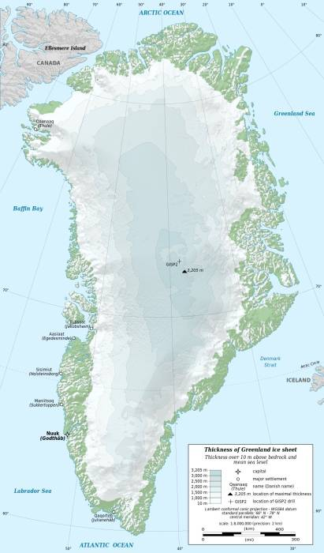

It’s well understood that melting polar ice is contributing to the rise of global sea levels. But did you know that if all the ice in the Greenland ice sheet were to melt, the sea levels around Greenland would actually _drop_?

It seems illogical, but there’s a good explanation. The Greenland ice sheet is _immense_. It’s almost 1,500 miles long in a north-south direction, and its greatest width is 680 miles. Most of it is more than 1.2 miles thick, and it’s over 1.9 miles at its thickest point. It’s so massive, it actually has its own gravitational field, powerful enough to attract water toward itself. You can think of it a bit like the tides, where the moon’s gravitational pull causes water to be pulled up beneath it.

If the sheet were to melt, the water contained within would be redistributed in the global oceans, where it would cause the average sea level to rise approximately 24 feet. The gravitational pull associated with it would be redistributed as well, though, and the water being pulled toward the ice sheet would be freed. Like a tide going out, the sea level would drop, locally to Greenland.

## More Information

Joyce, Christopher. “NASA Launching New Satellites To Measure Earth’s Lumpy Gravity.” NPR, NPR, 21 May 2018, <http://www.npr.org/sections/thetwo-way/2018/05/21/612980506/nasa-launching-new-satellites-to-measure-earths-lumpy-gravity>.

“Gravitational Attraction of Ice Sheets on the Sea.” Gravitational Attraction of Ice Sheets on the Sea – Sea Change, 2015, <http://sealevelstudy.org/sea-change-science/whats-in-a-number/attractive-ice-sheets>.

Mooney, Chris. “A Stunning Prediction of Climate Science – and Basic Physics – May Now Be Coming True.” Anchorage Daily News, Anchorage Daily News, 27 July 2016, <http://www.adn.com/arctic/2016/07/27/a-stunning-prediction-of-climate-science-and-basic-physics-may-now-be-coming-true/>.
