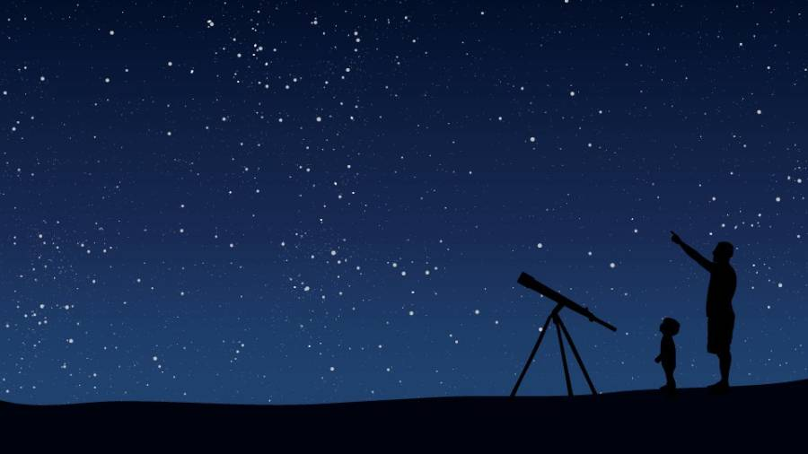

Everyone loves a beautiful night sky.

But, maybe you’d like to learn more?

## What We’ll Cover

I’ll be visiting several Dayton Metro library locations this late Spring and Summer. Come and learn about:

* The tools and challenges of observational (specifically: optical) astronomy.
  * Naked eye, binoculars, telescope.
  * I bring a telescope on-site, and I discuss how to use it. Please note: These are daytime sessions, so we won’t be doing any “live viewing”.
* How astronomy began
* Learning the night sky
  * Star maps
  * Star hopping
* Identifying objects in the night sky: constellations, asterisms, individual stars, planets, artificial satellites, deep sky objects.
* Choosing a telescope.
  * What to look for, and what to avoid.
  * Major brands: Celestron, Meade, Skywatcher, Orion.
* Expectations vs Reality
* Events, like eclipses, comets, and meteor showers.
  * I also have meteorite samples for everyone to see and touch!
* Computer software for sky-watching.
* I also talk about coordinate systems: How astronomers describe the positions of objects in the night sky. (Math is kept to a minimum!)

## Audience

The content is intended for an audience as young as 3rd grade, but should be of interest to older kids and adults as well.

> Please Note: The Dayton Metro Library events calendar lists this as “K-4”, but in reality I believe kids K – 1st grade, and maybe 2nd, will struggle a bit with this material. ALL ARE WELCOME, just be aware. Thanks!

## Schedule

Each event lasts approximately an hour.

Date / Time | Location (branch)
---------|----------
Monday, May 20th, 6pm | Trotwood
Thursday, June 6th, 6:30pm | New Lebanon
Saturday, June 8th, 2pm | Huber Heights
Saturday, June 15th, 3pm | Northwest
Thursday, June 20th, 5:30pm | West Carrollton
Saturday, June 22nd, 3:30pm | Wilmington-Stroop
Tuesday, July 9th, 7pm | Vandalia
Thursday, July 11th, 5:30pm | Electra C. Doren
Saturday, July 20th, 2pm | Miamisburg
Tuesday, July 23rd, 6:30pm | Burkhardt
Saturday, August 10th, 4pm | Kettering-Moraine 
