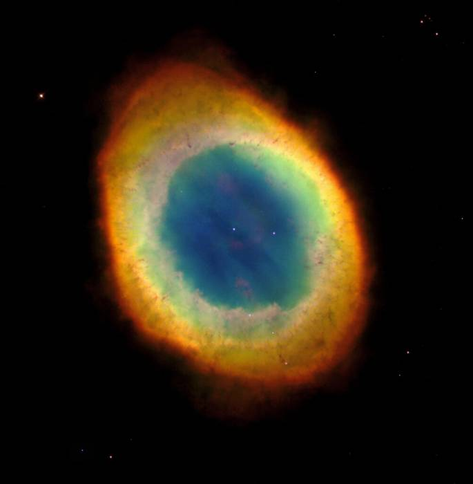
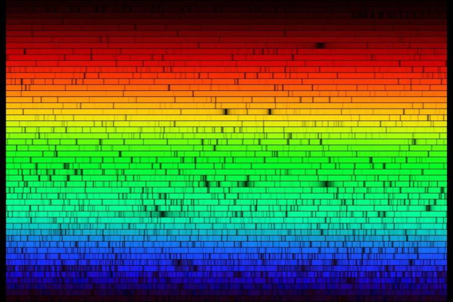

> There are a small number of meteorite samples known to originate from the moon, and Mars, and large asteroids like Vesta. But, how do we know where they came from?

## Show Me the Light

Identifying the constituent elements of remote objects starts with light. This gives us the means to know the makeup of objects in our own neighborhood (the solar system), and even distant stars and other deep space objects.

In the early 1800’s, the French philosopher Auguste Comte argued that because the stars were so far away, humanity would never know their nature and composition. But, just a few years later, scientists would begin analyzing starlight to learn these things.

Atoms of each chemical element emit and absorb light at a unique set of wavelengths associated with that element alone, effectively establishing a “fingerprint” for each element. So, for example, a colorful image of the Ring Nebula isn’t just beautiful. Those colors tell us a great deal about the makeup of the cloud: red for nitrogen, green for oxygen, blue for helium, and so on. (Electromagnetic radiation emissions can be used to determine the temperature of distant objects as well, but that’s a discussion for another day.)

## The Colour Out of Space

In 1814, the German master optician Joseph von Fraunhofer reproduced the classic experiment of separating light into its constituent colors with a prism. He then took the additional step of subjecting the resulting spectrum to high magnification, and he noticed something interesting.

He saw that the spectrum contained hundreds of fine, dark lines. (These are now called [spectral lines](https://en.wikipedia.org/wiki/Spectral_line).) The unique patterns of spectral lines allow further refinement of the source’s “fingerprint”, with each chemical element producing its own pattern. The identification of spectral lines has even allowed the discovery of new elements! This systematic study of spectra and spectral lines is called [spectroscopy](https://en.wikipedia.org/wiki/Spectroscopy).

Modern astronomical spectroscopy is done by using a [diffraction grating](https://en.wikipedia.org/wiki/Diffraction_grating) (instead of a prism) to disperse the light, which is then projected onto CCDs ([Charge Coupled Devices](https://en.wikipedia.org/wiki/Charge-coupled_device)), similar to the image sensors used in digital cameras.

But, what about objects that don’t produce their own light? Objects like planets, moons, and asteroids?

Planets and moons are visible to us here on Earth because of reflected light. In other words, the light from an active source (the sun) strikes an object, and that light is then passively reflected, with the reflected light being visible to us.

But, not all of the light is reflected. Part of it is absorbed by the object, and the part that can’t be absorbed is reflected back into space. We already learned that different chemical elements absorb and emit different wavelengths of light, so we can analyze the spectra of the reflected light, see what got absorbed/emitted, and learn the chemical composition of the body reflecting the light. Further, the strength of the emissions (called [flux](http://astronomy.swin.edu.au/cosmos/F/Flux)) provides an indication of how much of a chemical element is present.

Knowing all this, we can determine the chemical composition of any object sending light to us, whether active (like the sun, or a star) or passive (like a moon or planet) We can then perform spectral analysis of a found meteorite, and if we find a matching spectral pattern for a solar system object, we know that the meteorite originated from that object.

Spectral analysis of meteorite samples is performed with a UV-VIS-NIR spectrometer. This type of spectrometer illuminates a sample with an electromagnetic beam, and analyzes the reflection/absorption rate.
