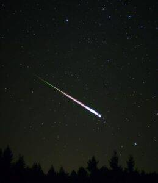
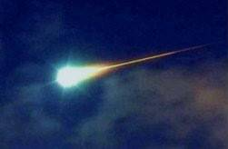
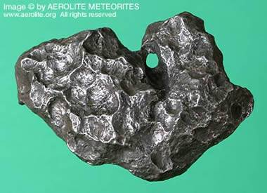

Our solar system contains lots of large, (relatively) obvious things, things like planets, asteroids, and comets. There also happens to be a lot of smaller fragmentary debris in outer space (**meteoroids**), and even smaller debris (micro-meteoroids and space dust). Most meteoroids are fragments from comets or asteroids, while some are collision impact debris ejected from larger bodies like the Moon or Mars.

Once a meteoroid, comet, or asteroid leaves the vacuum of space and enters our atmosphere, it becomes a **meteor**. Meteors occur sporadically throughout the year.

There are also certain times during the year when meteors are seen more frequently. These are called **meteor showers**. Meteor showers are caused when the Earth passes through a stream of debris left by a comet. The intensity of a meteor shower is measured by its **zenithal hourly rate** (ZHR), which is the maximum number of meteors an observer can expect to see during an hour under very dark, clear sky conditions.

Name | Date of Peak | ZHR
---------|----------|---------
Quadrantids | January 3 | 120
Lyrids | April 22| 18
Eta Aquarids | May 5 / 6 | 50
Perseids | August 12 | 150
Orionids | October 21 | 15
Leonids | November 17 | 15
Geminids | December 13 | 120

When a meteoroid, comet, or asteroid enters the Earth’s atmosphere at sufficient speed, aerodynamic heating of the object produces a streak of light from the object itself and also from the trail of glowing particles in its wake. This aerodynamic heating produces light in two ways: by skin friction on the surface of the object, and the creation of glowing plasma caused by the compression of the atmosphere in front of the object. Brighter-than-usual meteors are called, in order of increasing brightness: **fireballs**, **bolides**, and **superbolides**.

Most meteors are small, and burn up completely before reaching the ground. But, on the rare occasion when a meteor survives its journey through the atmosphere all the way to the surface of the Earth, it becomes a **meteorite**.

Most meteorites are never found. Some fall into the ocean. Others fall into forests or other places where they’re hard to find. They’re also fragile: Most are iron-rich, and disintegrate quickly.

Dry, featureless landscapes are the best places to find meteorites: Antarctica, for example, and also deserts. The weather conditions preserve them longer, and the landscape makes them easier to spot.

Meteorites are broadly divided into three major categories: **stony meteorites** that are basically rocks, mainly composed of silicate minerals; **iron meteorites**, composed mostly of metallic iron-nickel; and **stony-iron meteorites** that contain both iron and silicate minerals.

Stony meteorites are the most common meteorites, representing about 94% of finds. They are further sub-categorized as **chondrites** and **achondrites**. Chondrites are named for the small particles they contain, called **chondrules**. Chondrites are typically very old (about 4.55 billion years) and are generally thought to represent material from the asteroid belt that never coalesced into large bodies. Achondrites are less common, and do not contain chondrules. They are believed to represent crustal material from planetesimals like the asteroid Vesta. There are even rarer subgroups of achondrites thought to originate from the Moon and Mars as impact ejecta.

Iron meteorites, which are rarer than stony meteorites, represent about 5% of the meteorites found. Iron meteorites are thought to come from the cores of planetesimals that were once molten.

Stony-iron meteorites make up the remaining 1%. A sub-group of these, called **pallasites**, are thought to have originated in the boundary zone above the core regions where iron meteorites originated.

Identifying meteorites can be tricky, as many terrestrial minerals have similar characteristics. The rarity of meteorites makes it very unlikely that the unusual rock you found is really of non-terrestrial origin. To be absolutely sure, you need a professional to evaluate your find, but there are a few things you can look for:

* Meteorites often have a fusion crust, a thin, dark rind formed by the intense heating of the meteorite as it passes through the atmosphere.
* This heating also sometimes creates surface features called regmaglypts (“thumbprints”, oval depressions) and flow lines (thin lines left by rivulets of melting material).
* Most meteorites contain significant amounts of iron, and so they are attracted to a magnet.
* The presence of iron also makes a meteorite heavy, typically heavier than the terrestrial rocks around it.

