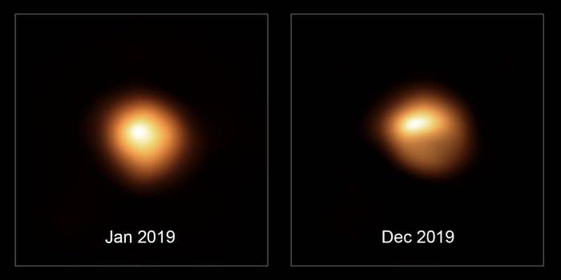

Betelgeuse is a red supergiant star, about 650 light years away. It is _enormous_; imagined at the center of our solar system, its surface would lie beyond the asteroid belt and it would engulf the orbits of Mercury, Venus, Earth, Mars, and possibly Jupiter. This size comes at a cost; it’s only 10 million years old, but it has already shed a significant fraction of its outer layers, and is well on its way to a spectacular supernova, probably within the next 100,000 years.

It is usually the tenth-brightest star in the night sky, and the second-brightest (after Rigel) in the constellation Orion. It’s a semiregular variable star, which means its apparent brightness varies in a generally predictable manner. Beginning late in 2019, this variability took an interesting turn.

## Timeline

### October 2019

Betelgeuse glows at a magnitude of about 0.5, considerably brighter than its close neighbor Aldebaran (0.9), the eye of Taurus the bull. Never brighter than about 0.2, it’s close to its brightest here.

By the end of the month, astronomers were already noticing that it was beginning a dimming cycle.

### December 2019

Now well into a dimming cycle, this time Betelgeuse had dimmed to around magnitude 1.3, the faintest its been for around _50 years_.

Through telescopes, part of Betelgeuse had darkened dramatically.

Noticeably dimmer even to the naked eye, people were really starting to pay attention, and wondered what was happening.

### February 2020

Astronomers note that the dimming seems to have stabilized, and are watching carefully to see what happens next.

Earlier predictions indicated that Betelgeuse could be going through an extended 430-day pulsation, with the expectation that it would reach its dimmest point on or about February 21. This appears to be happening.

> Since the mid-IR traces the total bolometric luminosity and is insensitive to moderate fluctuations in extinction, the lack of any significant changes in its mid-IR SED indicates that the bolometric luminosity of Betelgeuse is largely unchanged. This suggests that the recent dramatic fading observed at visual wavelengths is due mostly to local surface phenomena, such as changes in dust extinction or molecular opacity along the line of sight through the inner wind and complex atmosphere, and/or surface temperature fluctuations. **The visual fading is not connected to a major change in total energy output from the star. Thus, while Betelgeuse may explode tomorrow or any time in the next few 100,000 yr, the unprecedented current visual faintness is unlikely to be a harbinger of its impending core collapse.**
>
> 24 Feb 2020, <http://www.astronomerstelegram.org/?read=13518>

## What’s Going On?

The most exciting possibility is that Betelgeuse is preparing to go supernova. The fading could indicate that the star is entering a pre-supernova phase: dimming and collapsing before it explodes. But, being a variable star, it has regularly experienced periods of dimming and brightening in the past (though not this dramatic), so this is _probably_ just a wider range of variability than usual.

Another possibility is that Betelgeuse is simply shedding an excessive amount of its outer material into space, creating dust clouds that obscure our view. This is to be expected from a star nearing the end of its life.
