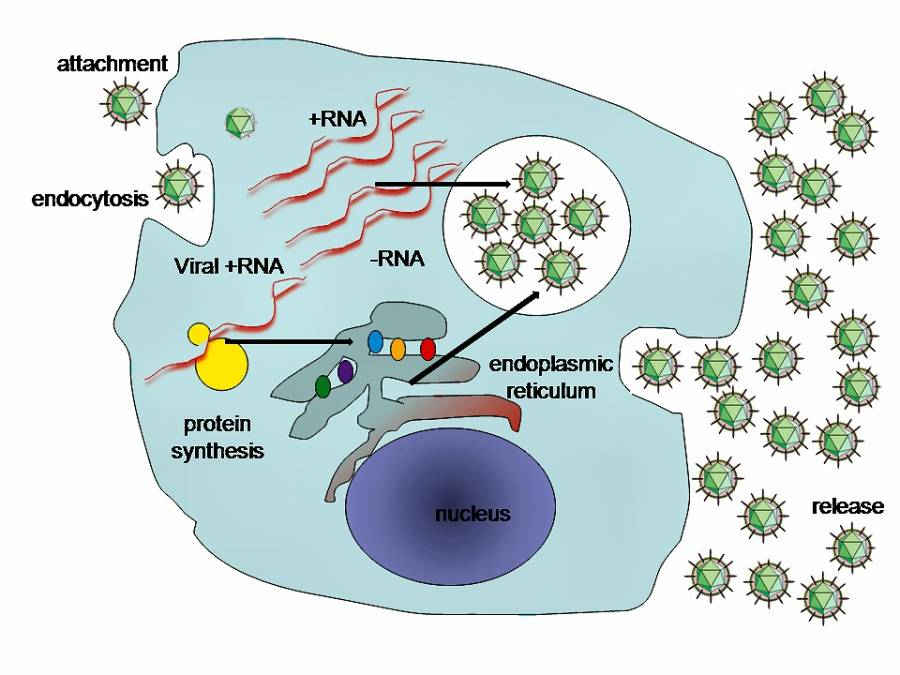

COVID-19, a type of coronavirus, has been declared a pandemic. There’s a lot of panic, and also a lot of misinformation about it, and viruses in general.

## What is a virus?

Some living things are easy for us to understand, at least superficially. Is it a plant, or an animal? If it’s an animal, is it a mammal? An insect? A reptile? As you read each of these words, it’s quite easy to picture a representative organism for each type. You’re probably picturing things like trees, dogs, ants, and snakes. Even microorganisms like bacteria probably aren’t too difficult to imagine. But, when we enter the world of the virus, these mysterious biological entities are so far outside our realm of experience, they seem almost alien.

Viruses are infectious agents that replicate only inside the living cells of an organism. They can infect all types of life, including microorganisms like bacteria and archaea (single-celled organisms similar to bacteria). They are very small, typically about one hundredth the size of most bacteria.

When they’re not inside an infected cell, viruses exist as independent particles called virions. These carry 1) the genetic material (long molecules of DNA or RNA) that encode the structure of the proteins by which the virus acts; 2) the capsid, which is a protein coat that protects the genetic material; and sometimes 3) an outside layer of lipids (fatty acids).

It is debatable whether viruses can even be considered a form of life, or simply as organic structures that interact with living organisms. They have genes, and they evolve by natural selection, but they have no cellular structure, and no metabolism (chemical reactions in living organisms that sustain life). They create copies of themselves through self-assembly, but cannot do so without a host cell.

## Life cycle and cellular response

Viruses are acellular, so they cannot reproduce through cell division. Instead, they leverage the machinery and metabolism of a host cell to produce copies of themselves, which are assembled in the cell. Viruses attach to a host cell, penetrate the cell, replicate and assemble via synthesis of viral messenger RNA, and are then released from the cell, usually by lysis, a bursting of the cell membrane that kills the cell.

Viruses are the most abundant biological entities on Earth. They infect all types of life. Specific viruses have a host range, which indicates how many kinds of hosts they can infect. Some are limited and many are species-specific. Smallpox is an example of a limited-range virus, as it infects only humans. Other viruses can infect a broad range of species, with rabies being an example.

A host organism responds to a virus through the host’s immune system. The immune system provides defense against infection, through both innate and adaptive means. Innate responses are non-specific, and do not provide long-lasting protection. Adaptive responses are instances where the host immune system learns to recognize a specific virus, and target it directly if the host is re-infected.

Vaccines provide a means of helping the immune system develop protection against a virus. They stimulate the body’s adaptive immunity, effectively training the immune system to recognize and respond to specific infections.

Viruses undergo genetic mutation, wherein their gene encoded proteins are modified. Sometimes, these mutations confer advantages to the virus, like resistance to anti-viral drugs, or cross-species transmission. Changes like these can result in pandemics (disease epidemics that have spread across large regions).

## COVID-19

SARS-CoV-2 is a new variation of coronavirus. Its previous, provisional name was COVID-19, and this name is still being widely used, so I’ll use it here. COVID-19 bears a strong genetic similarity to bat coronavirus, which is where it likely originated. It is also widespread in pangolins, and it’s thought that these might act as an intermediate source of transmission to humans. It is highly contagious, and is primarily transmitted through respiratory droplets from coughing and sneezing.

A combination of high transmission/infection rate, no adaptive immunity, and no vaccine is promoting the rapid spread of COVID-19. The mortality rate in humans has not been definitively established, but estimates place it somewhere between 1% – 3.5%, making it considerably more dangerous than influenza.

The time between exposure and symptom onset is typically five days, but may range from two to fourteen days. Symptoms are most often fever, dry cough, and shortness of breath. Complications may include pneumonia and acute respiratory distress syndrome. There is currently no vaccine or specific antiviral treatment, but research is ongoing. Efforts are aimed at managing symptoms and supportive therapy. Recommended preventive measures include handwashing, maintaining distance from other people (particularly those who are unwell), and monitoring and self-isolation for fourteen days for people who suspect they are infected.

Some things are that _not_ effective against COVID-19:

* Antibiotics.
* Garlic, sesame oil, various herbals, etc. Steer clear of the alternative medicine crowd.
* Flu vaccine. (However, it’s still a good idea to get your flu vaccine! Getting influenza and COVID-19 at the same time is dangerous!)
* Stockpiling two years worth of toilet paper.

**Update**: I originally posted that face masks were not effective. The CDC has updated this, and now recommend the wearing of face masks. These are especially important now that it’s known there are a significant number of asymptomatic carriers.

---

[Symptoms of Novel Coronavirus (2019-nCoV) | CDC](https://www.cdc.gov/coronavirus/2019-ncov/about/symptoms.html). U.S. Centers for Disease Control and Prevention (CDC).

Rothan HA, Byrareddy SN (February 2020). “[The epidemiology and pathogenesis of coronavirus disease (COVID-19) outbreak](http://www.sciencedirect.com/science/article/pii/S0896841120300469)”. Journal of Autoimmunity: 102433. doi:10.1016/j.jaut.2020.102433. PMID 32113704.
