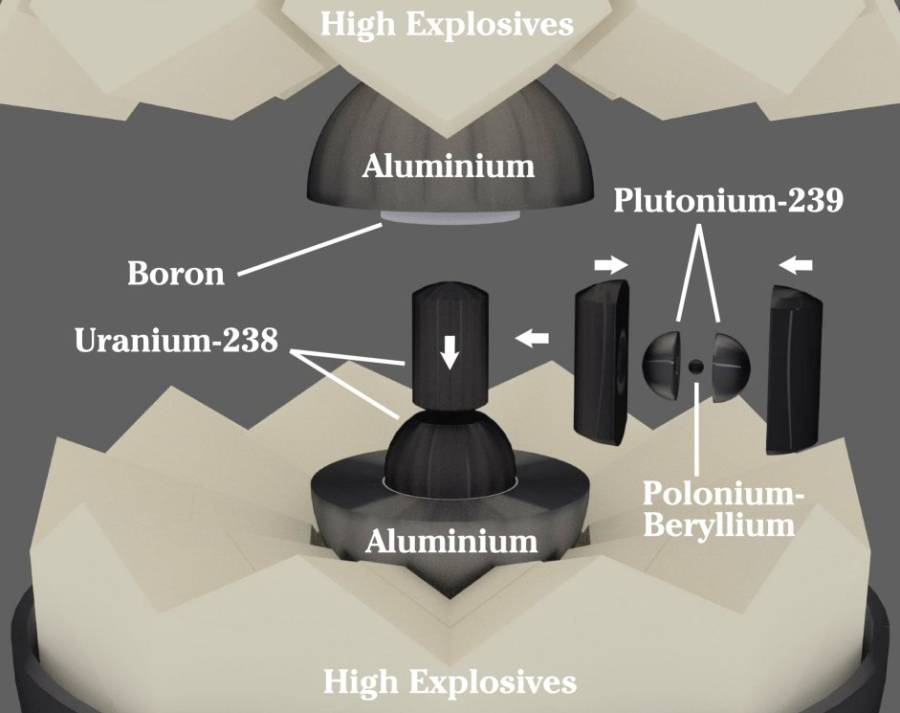
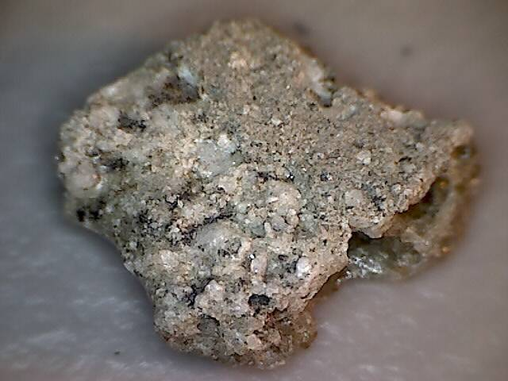
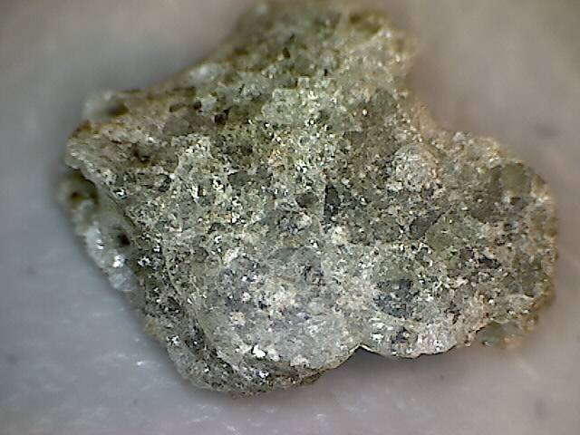

On July 16, 1945, at 5:29 a.m., our world entered the nuclear age. As part of the Manhattan project, a Plutonium-based nuclear device was detonated in the Jornada del Muerta desert in New Mexico, about 35 miles southeast of Socorro. The code name for this detonation was “Trinity”. Less than a month later, on August 6th, a similar, Uranium-based device was detonated over Hiroshima, Japan. Three days after that, another Plutonium-based device was detonated over Nagasaki, Japan. On August 12th, Japan made the decision to surrender, ending their involvement in war hostilities.

The [Trinity site](https://en.wikipedia.org/wiki/Trinity_(nuclear_test)) was chosen for several reasons. It was remote, isolated, and unpopulated. It is also very flat, and experiences little wind, minimizing the spread of nuclear fallout. The government had acquired this area in 1942, and the land was condemned and had grazing rights suspended.

The nuclear device, dubbed “the Gadget”, exploded with a force roughly equivalent to 22 kilotons of TNT. It left a crater five feet deep and thirty feet wide. At ground zero, the desert sand was sucked upward into the nuclear fireball where it melted, and then rained back to the ground, forming a bottle-green glassy material later dubbed “[Trinitite](https://en.wikipedia.org/wiki/Trinitite)“.

This material was collected by locals as souvenirs until the site was bulldozed under in 1953. One of these collectors was a man named Ralph Pray, who made multiple trips to the site in 1951, collecting a great deal of material. You can read more about his exploits [here](http://www.mine-engineer.com/mining/trinity.htm).

I recently obtained a fragment of Trinitite from the Ralph Pray collection. (Pictures below.) It’s a fascinating piece of history.

