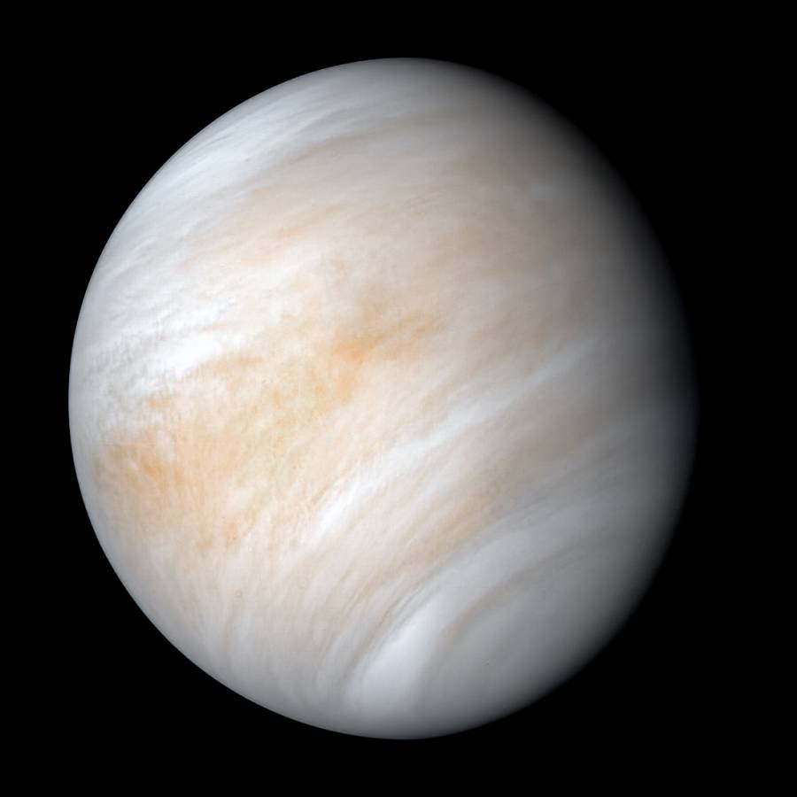
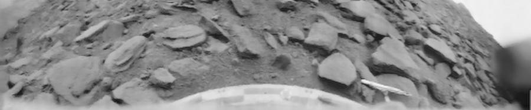

> Update on Wednesday February 3, 2021 – Looks like a new study has come to a [different conclusion](https://astronomy.com/news/2021/02/life-in-the-clouds-of-venus-maybe-not). 

Venus is not a friendly place. The second planet from the sun, it’s named after the Roman goddess of love and beauty. Shrouded in a thick layer of clouds, it reflects a lot of sunlight, and this brilliant light shining in twilight is friendly and inviting, suggesting to the uninformed a temperate climate. The reality is very different.

Similar to the Earth in size and mass, it’s sometimes referred to as the Earth’s “sister planet”. But, the differences are stark. It has the densest atmosphere of the four terrestrial planets, an atmosphere that is more than 96% carbon dioxide. The atmospheric pressure on the surface is around 92 times the sea level pressure of Earth. The mean temperature is 867 degrees Fahrenheit, the result of a runaway greenhouse effect.

Between 1975 and 1982, the Soviet Union landed several Venera spacecraft on the surface, providing unprecedented views and information about the hellish surface conditions. The thick clouds make orbital observation of the surface in visible light impossible, but orbiters utilizing other techniques like radar and ultraviolet have allowed the creation of detailed surface maps.

These harsh conditions have made the notion of life on Venus nearly inconceivable. Until recently.

In June of 2017, a team of researchers, led by Jane Greaves of Cardiff University in Wales, used the James Clerk Maxwell telescope in Hawaii to search for the signature of the molecule phosphine in the atmosphere of Venus. They didn’t expect to find it, and were actually trying to use Venus as a “baseline” for phosphine detection, a planet where the absence of phosphine was virtually guaranteed.

On Earth, phosphine is produced as a byproduct of the life processes of anaerobic bacteria, and also “anthropogenic activity” (things humans are doing). There are also chemical processes at work in the pressurized depths of the gas giant planets that allow production of significant amounts of phosphine. As a terrestrial/rocky planet with no known life, neither of these conditions are present on Venus.

To their great surprise, the scientist found a detectable amount of PH3 (phosphine) in the Venusian atmosphere. Doubting their results, another check was made using the Atacama Large Millimeter Array in Chile. These observations also suggested a substantial amount of phosphine.

Given all this, there seems to be the possibility for some kind of life to be producing phosphine by-products in the clouds of Venus. Both NASA and the European Space Agency are considering missions to investigate. Russia, too, is proposing a Venera-D mission that could lift off as early as 2025.

The notion of the phosphine on Venus being a biosignature is certainly tantalizing. But, given the extreme conditions on Venus, there could also be other unknown geochemistry at work. Either way, it will be exciting to see how it plays out.

---

“Venus.” Wikipedia, Wikimedia Foundation, 21 Sept. 2020, <https://en.wikipedia.org/wiki/Venus>

Letzter, Rafi. “Possible Hint of Life Discovered on Venus.” LiveScience, Purch, 14 Sept. 2020, <http://www.livescience.com/phosphine-signature-life-on-venus.html>.

David, Leonard. “Is There Life on Venus? These Missions Could Find It.” Scientific American, Scientific American, 23 Sept. 2020, <http://www.scientificamerican.com/article/is-there-life-on-venus-these-missions-could-find-it/>.
