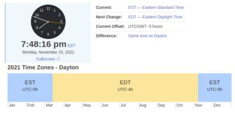

Over the past few years, I’ve been [porting the algorithms](https://github.com/jfcarr-practical-astronomy) from “[Practical Astronomy with your Calculator or Spreadsheet](https://www.amazon.com/Practical-Astronomy-your-Calculator-Spreadsheet/dp/1108436072)” to various languages.

With the lunar eclipse coming up this week (November 19th), I thought it would be fun to put this to the test, and see how accurately it can provide information about the eclipse. I’ll be using the .NET version.

## Time, Time, Time (See What’s Become of Me)

Before we dive into the technical stuff, there’s some information we need to collect about time, as it relates to our location. We need know the following:

1. Our time zone, and how it relates to universal time, and
2. Whether or not we’re currently observing daylight savings time.

Your time zone is related to the longitude of your location. If you live in the continental United States, it will be either Eastern, Central, Mountain, or Pacific.

You’ll also need to know how your time zone is related to universal time. In other words, what do you subtract from universal time to get your local time? This is called your “UT offset”.

You’ll also need to know whether you’re currently observing standard time, or daylight savings time.

The good news is, the answers to all of these questions can be quickly answered by visiting the [World Clock Time Search](https://www.timeanddate.com/worldclock/search.html). When you go to the site:

1. Enter the name of your city (or a city close to you) in the search box, and select the match.
2. On the results page, you’ll see a tab for “Time Zone”. Click that.

My results look like this:



Yours will be similar. Here’s the information you’ll need to remember:

* The offset value for your standard time (not daylight savings). For me, that’s EST, and the offset value is 5.
* Am I currently observing daylight savings? On the results line labeled “Current”, I see EST, so the answer is no.

So for me, the two values I need to remember for later are:

* UTC offset: 5
* Daylight savings? false

## Prerequisites

* You’ll need [git](https://git-scm.com/), in order to clone the source repository.
* I’ve recently ported the project to .NET 6, so make sure you have the [.NET 6 SDK](https://dotnet.microsoft.com/download/dotnet/6.0) installed.
* I’ll also be using [Visual Studio Code](https://code.visualstudio.com/), with the C# extension.

## Project Setup

Clone the repository to your machine:

```bash
git clone https://github.com/jfcarr-practical-astronomy/practical-astronomy-dotnet.git
```

The repository contains two projects: a class library containing all of the algorithms, and a unit test project. To verify that everything’s working properly, open a terminal in the newly-cloned project directory and issue the test command:

```bash
dotnet test
```

You should see output similar to this:

> Passed! - Failed: 0, Passed: 55, Skipped: 0, Total: 55, Duration: 81 ms - practical-astronomy-dotnet/PALib.Tests/bin/Debug/net6.0/PALib.Tests.dll (net6.0)

Now we’re ready to create a client to call the class library. We’ll keep it simple, and create a console application. Create a directory called PAClient, and cd into it:

```bash
mkdir PAClient
 
cd PAClient
```

We want to make sure that the console application we create uses .NET 6. We’ll use a global.json file to control that. First, create one:

```bash
dotnet new globaljson
```

Next, we need to know which .NET SDKs are installed:

```bash
dotnet --list-sdks
```

My results look like this:

> 3.1.415 [/usr/share/dotnet/sdk]
>
> 5.0.403 [/usr/share/dotnet/sdk]
>
> 6.0.100 [/usr/share/dotnet/sdk]

Yours may be different. What’s important is that you note the latest version of the .NET 6 SDK. (For me, that’s 6.0.100.)

Edit the global.json file, and update it to reflect that value. When you’re done, it will look something like this:

```json
{
  "sdk": {
    "version": "6.0.100"
  }
}
```

Now you’re ready to create the console application:

```bash
dotnet new console
```

Add a reference to the Practical Astronomy class library:

```bash
dotnet add reference ../PALib
```

Build it, to make sure your reference is good. You should see something like this:

```txt
Determining projects to restore...
Restored practical-astronomy-dotnet/PAClient/PAClient.csproj (in 174 ms).
1 of 2 projects are up-to-date for restore.
PALib -> practical-astronomy-dotnet/PALib/bin/Debug/net6.0/PALib.dll
PAClient -> practical-astronomy-dotnet/PAClient/bin/Debug/net6.0/PAClient.dll

Build succeeded.
    0 Warning(s)
    0 Error(s)
```

## Construct the Client

From the PAClient directory, open Visual Studio Code:

```bash
code .
```

After the project finishes opening, click on Program.cs in the explorer tab to open it. The boilerplate code for .NET 6 looks like this:

```csharp
// See https://aka.ms/new-console-template for more information
Console.WriteLine("Hello, World!");
```

Change the code to this:

```csharp
using PALib;
 
var eclipseInfo = new PAEclipses();
 
var occurrence = eclipseInfo.LunarEclipseOccurrence(15, 11, 2021, false, 5);
 
Console.WriteLine($"{occurrence.status}.");
Console.WriteLine($"Next eclipse is on {occurrence.eventDateMonth}/{occurrence.eventDateDay}/{occurrence.eventDateYear}.");
```

The `LunarEclipseOccurrence` method takes the following arguments: `double localDateDay, int localDateMonth, int localDateYear, bool isDaylightSaving, int zoneCorrectionHours`. Update localDateDay, localDateMonth, and localDateYear to match the current date, and use the time zone information we collected earlier for isDaylightSaving and zoneCorrectionHours.

Go ahead and run. You should see something like this:

```txt
Lunar eclipse certain.
Next eclipse is on 11/19/2021.
```

We’re getting a date of November 19th. So far so good! It would be nice, though, to get more detailed information, and we can do that. Change your code to this:

```csharp
using PALib;
 
var eclipseInfo = new PAEclipses();
 
var result = eclipseInfo.LunarEclipseCircumstances(15, 11, 2021, false, 5);
 
Console.WriteLine(
	$"Occurs on: {result.lunarEclipseCertainDateMonth}/{result.lunarEclipseCertainDateDay}/{result.lunarEclipseCertainDateYear}\n" +
	$"Penumbral phase begins: {result.utStartPenPhaseHour}:{result.utStartPenPhaseMinutes:00}\n" +
	$"Umbral phase begins: {result.utStartUmbralPhaseHour}:{result.utStartUmbralPhaseMinutes:00}\n" +
	$"Total phase begins: {result.utStartTotalPhaseHour}:{result.utStartTotalPhaseMinutes:00}\n" +
	$"Total phase ends: {result.utEndTotalPhaseHour}:{result.utEndTotalPhaseMinutes:00}\n" +
	$"Umbral phase ends: {result.utEndUmbralPhaseHour}:{result.utEndUmbralPhaseMinutes:00}\n" +
	$"Penumbral phase ends: {result.utEndPenPhaseHour}:{result.utEndPenPhaseMinutes:00}");
```

Now when you run, you should see something like this:

```txt
Occurs on: 11/19/2021
Penumbral phase begins: 6:00
Umbral phase begins: 7:18
Total phase begins: -99:-99
Mid-point of eclipse: 9:03
Total phase ends: -99:-99
Umbral phase ends: 10:47
Penumbral phase ends: 12:05
```

The library methods return values in universal time. It’s much more useful to see our results in local time, and we have date/time functions in the Practical Astronomy library to handle that as well. Change your code to this:

```csharp
using PALib;
 
var eclipseInfo = new PAEclipses();
 
var result = eclipseInfo.LunarEclipseCircumstances(15, 11, 2021, false, 5);
 
var timeConversion = new TimeConversion(
 (int)result.lunarEclipseCertainDateDay,
 (int)result.lunarEclipseCertainDateMonth,
 (int)result.lunarEclipseCertainDateYear,
 false, -5);
 
Console.WriteLine(
	$"Occurs on: {result.lunarEclipseCertainDateMonth}/{result.lunarEclipseCertainDateDay}/{result.lunarEclipseCertainDateYear}\n" +
	$"Penumbral phase begins: {timeConversion.ConvertUniversalTimeToLocalTime(result.utStartPenPhaseHour, result.utStartPenPhaseMinutes)}\n" +
	$"Umbral phase begins: {timeConversion.ConvertUniversalTimeToLocalTime(result.utStartUmbralPhaseHour, result.utStartUmbralPhaseMinutes)}\n" +
	$"Total phase begins: {timeConversion.ConvertUniversalTimeToLocalTime(result.utStartTotalPhaseHour, result.utStartTotalPhaseMinutes)}\n" +
	$"Mid-point of eclipse: {timeConversion.ConvertUniversalTimeToLocalTime(result.utMidEclipseHour, result.utMidEclipseMinutes)}\n" +
	$"Total phase ends: {timeConversion.ConvertUniversalTimeToLocalTime(result.utEndTotalPhaseHour, result.utEndTotalPhaseMinutes)}\n" +
	$"Umbral phase ends: {timeConversion.ConvertUniversalTimeToLocalTime(result.utEndUmbralPhaseHour, result.utEndUmbralPhaseMinutes)}\n" +
	$"Penumbral phase ends: {timeConversion.ConvertUniversalTimeToLocalTime(result.utEndPenPhaseHour, result.utEndPenPhaseMinutes)}");
 
class TimeConversion
{
	private int _gwDay;
	private int _gwMonth;
	private int _gwYear;
	private bool _isDaylightSavings;
	private int _zoneCorrection;
 
	PADateTime dateTimeUtil;
 
	public TimeConversion(int gwDay, int gwMonth, int gwYear, bool isDaylightSavings, int zoneCorrection)
	{
		this._gwDay = gwDay;
		this._gwMonth = gwMonth;
		this._gwYear = gwYear;
		this._isDaylightSavings = isDaylightSavings;
		this._zoneCorrection = zoneCorrection;
 
		dateTimeUtil = new PADateTime();
	}
 
	public string ConvertUniversalTimeToLocalTime(double utHours, double utMinutes)
	{
		if (utHours == -99 && utMinutes == -99)
		{
			return "N/A";
		}
 
		var result = dateTimeUtil.UniversalTimeToLocalCivilTime(
                 utHours, utMinutes, 0, this._isDaylightSavings, this._zoneCorrection, this._gwDay, this._gwMonth, this._gwYear);
 
		return $"{result.lctHours}:{result.lctMinutes:00}";
	}
}
```

Then, when you run again, you’ll see results specific to your location:

```txt
Occurs on: 11/19/2021
Penumbral phase begins: 1:00
Umbral phase begins: 2:18
Total phase begins: N/A
Mid-point of eclipse: 4:03
Total phase ends: N/A
Umbral phase ends: 5:47
Penumbral phase ends: 7:05
```

So, what are we looking at here? The LunarEclipseCircumstances method reports the following information:

* When major phases (penumbral and umbral) of the eclipse begin, and end.
* When the totality phase begins and ends.
* When maximum coverage occurs (the mid-point)

What about those N/A values? For values without valid data, a -99 is returned. This tells us that this is not a total eclipse. (The moon is never _completely_ obscured.)

Now, most importantly, how did we do? I used [Wolfram|Alpha](https://www.wolframalpha.com/) to get information about the eclipse. This is what it returned:

```txt
begin partial (umbral) | 2:14 am EST | Friday, November 19, 2021
maximum | 3:59 am EST | Friday, November 19, 2021
end partial (umbral) | 5:44 am EST | Friday, November 19, 2021
```

Looks like our results only differ by about 4 minutes. Not too shabby!

## Extra Credit: Python!

If you have Python installed, we can try that too! (Instructions assume a Linux environment)

```bash
git clone https://github.com/jfcarr-practical-astronomy/practical-astronomy-python.git
 
cd practical-astronomy-python
```

Edit a new Python script:

```bash
code eclipse-check.py
```

Paste the following code, and save it:

```python
#!/usr/bin/python3
 
import lib.pa_eclipses as PE
import lib.pa_datetime as PD
 
if __name__ == '__main__':
	status, day, month, year = PE.lunar_eclipse_occurrence(17, 11, 2021, False, 5)
 
	print(f"{status}: {month}/{day}/{year}")
 
	(day, month, year, 
	 ut_start_pen_phase_hour, ut_start_pen_phase_minutes,
	 ut_start_umbral_phase_hour, ut_start_umbral_phase_minutes,
	 ut_start_total_phase_hour, ut_start_total_phase_minutes,
	 ut_mid_eclipse_hour, ut_mid_eclipse_minutes,
	 ut_end_total_phase_hour, ut_end_total_phase_minutes,
	 ut_end_umbral_phase_hour, ut_end_umbral_phase_minutes,
	 ut_end_pen_phase_hour, ut_end_pen_phase_minutes,
	 eclipse_magnitude
	) = PE.lunar_eclipse_circumstances(17, 11, 2021, False, 5)
 
	(l_hour, l_minutes, l_seconds, l_day, l_month, l_year) = PD.universal_time_to_local_civil_time(
         ut_mid_eclipse_hour, ut_mid_eclipse_minutes, 0, False, -5, day, month, year)
 
	print(f"Mid-eclipse occurs at {ut_mid_eclipse_hour}:{ut_mid_eclipse_minutes:02} universal time ({l_hour}:{l_minutes:02} local time, on {l_month}/{l_day}/{l_year})")
```

Run it:

```bash
python3 eclipse-check.py
```

Results:

```txt
Lunar eclipse certain: 11/19/2021
Mid-eclipse occurs at 9:03 universal time (4:03 local time, on 11/19/2021)
```

## Conclusion

I hope you enjoyed the walkthrough!

The library has lots of other astronomical functions. If you found this interesting, I encourage you to explore!
