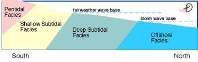

I made a trip to Tennessee a few days ago, and on my way I checked out a few new fossil-hunting locations in Kentucky.

## Clays Ferry

* Age: [Ordovician](https://en.wikipedia.org/wiki/Ordovician)
* Formations: [Clays Ferry](https://ngmdb.usgs.gov/Geolex/UnitRefs/ClaysFerryRefs_1093.html) (deep subtidal), [Fairview](https://ngmdb.usgs.gov/Geolex/UnitRefs/FairviewRefs_1590.html) (deep subtidal), [Garrard siltstone](https://mrdata.usgs.gov/geology/state/sgmc-unit.php?unit=KYOkc%3B0) (peritidal)

I found a few bryozoans and brachiopods. Nothing extraordinary. [Scenic area right beside the Kentucky river](https://maps.google.com/maps?ll=37.88102,-84.33972&q=37.88102,-84.33972&hl=en&t=m&z=12), though.

## Bybee

* Age: [Ordovician](https://en.wikipedia.org/wiki/Ordovician)
* Formation: Rowland and Saluda members of the [Drakes formation](https://ngmdb.usgs.gov/Geolex/UnitRefs/DrakesRefs_1431.html) (peritidal)

I didn’t get out of the car here. The shoulder is narrow, and traffic was heavy. It does look like a promising site, so I may visit again sometime.

## Big Hill Cut-Out

* Age: [Devonian](https://en.wikipedia.org/wiki/Devonian)
* Formation: [Borden](https://en.wikipedia.org/wiki/Borden_Formation)

My research on the site suggested the possibility of many finds, including small phosphate nodules, fish teeth, scales, small fragmented bones, and conodonts. Phosphatized invertebrate remains, including, gastropods, brachiopods, and crinoid debris are also supposedly present. I found _no_ fossils, though. But, [it is still a beautiful location](https://maps.google.com/maps?ll=37.529363,-84.212426&q=37.529363,-84.212426&hl=en&t=m&z=12), with lots of blue-green shale in the [Nada member](https://www.uky.edu/OtherOrgs/KPS/stratigraphicfauna/nadamacrofauna/nadamembermacrofauna.html)/[Verdine facies](https://www.sciencedirect.com/science/article/pii/S0070457108700645).

## Additional Information

