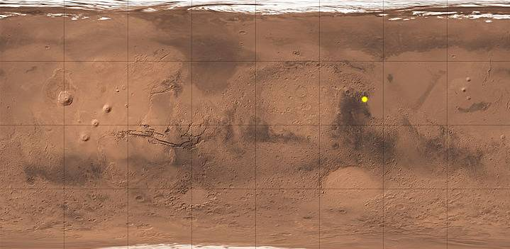
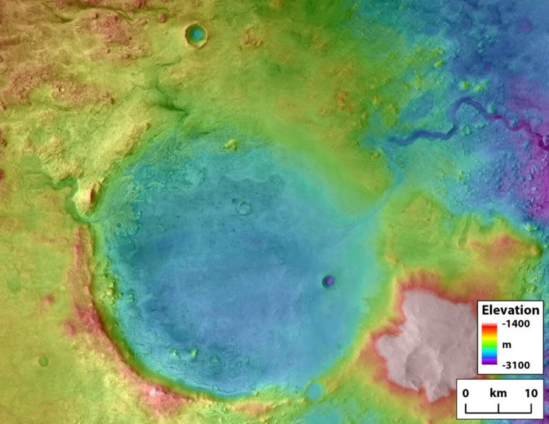
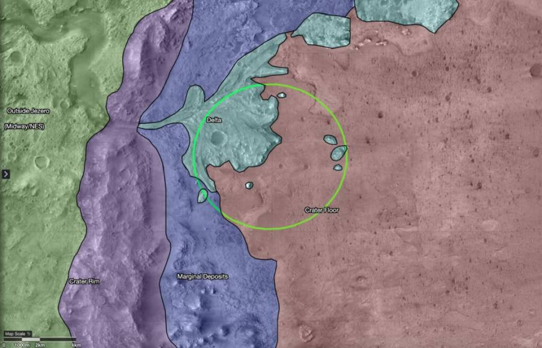

It’s unlikely that Mars currently harbors life. It has a very thin atmosphere, it’s extremely cold, and the lack of a magnetosphere means the surface is unprotected from a continuous bombardment of harsh solar radiation. But, there is significant evidence that, billions of years ago, the planet was much more habitable that it is today. Craters and valleys on the surface show evidence of ancient water, now long gone. Inside one of these craters, the Perseverance rover is getting ready to search. Not for current life, but for evidence of life from long ago, and the geological processes that might have supported it.

NASA launched the Mars 2020 mission on July 30, 2020. It successfully delivered the Perseverance rover to Mars on February 18, 2021. The rover now sits inside Jezero, a crater specifically chosen as the landing site because of some very unique characteristics.

Jezero (“yez-er-oh”) crater is located in the Syrtis Major quadrangle. It’s about 30 miles across. The crater is believed to have once been an active lake basin, 1600 feet deep. It appears to have been a watershed during two separate time periods, before the water finally dried up for good around 3.5 billion years ago. In fact, the water was once so high, it likely spilled over the crater’s walls.

The area around Jezero crater appears to be carved by rivers. There’s a river valley called the Neretva Vallis which enters the crater from the west and then exits on the east side of the crater into the Isidis Planatia.

The Neretva delta was formed by sediment being carried into the lake, and is rich in carbonates and clays, which form in the presence of water. Some of these clay deposits show polygonal cracking patterns, often formed when wet clay dries out. These river deposits are where Perseverance will be heading first.

> On Earth, deltas are fan-shaped splays of sediments where rivers gently deposit sand and silt, forming layers of sandstone and mudstone that can trap and preserve organic materials.

Jezero may have even once been home to microbial mats, similar to pond scum forming at a lake’s edge. The presence of the right kind of minerals means those mats could have been preserved, forming what scientists call stromatolites – rock and mineral structures built up by coordinated groups of simple single-celled organisms, especially cyanobacteria (formerly called blue-green algae).

Perseverance will begin the process of searching for evidence of life, but making definitive conclusions about this evidence will likely require laboratory study more sophisticated than what Perseverance can provide. Therefore, it’s mission will be two-fold: it will search for evidence on its own, but it will also cache sample for retrieval by a later mission, and return to Earth.

## Sources

Bell, Jim. “Mars Madness: Perseverance Rover Is about to Begin Its Mission.” Astronomy.com, 15 Feb. 2021, <https://astronomy.com/magazine/news/2021/02/mars-madness-perseverance-rover-is-about-to-begin-its-mission>.

Betz, Eric. “Mars Madness: A Closer Look at Jezero Crater.” Astronomy.com, 9 Feb. 2021, <https://astronomy.com/news/2021/02/mars-madness-a-closer-look-at-jezero-crater-perseverances-landing-site>.

“Jezero (Crater).” Wikipedia, Wikimedia Foundation, 22 Feb. 2021, <https://en.wikipedia.org/wiki/Jezero_(crater)>.

Klemetti, Erik. “Jezero Crater: Perseverance Rover Will Soon Explore Geology of Ancien.” Astronomy.com, 18 Feb. 2021, <https://astronomy.com/news/2021/02/jezero-crater-perseverance-rover-will-soon-explore-geology-of-ancient-crater-lake>.
