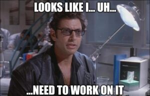

When we’re speaking, we have an overwhelming compulsion to fill ‘dead air’ with words. So, we tend to inject lots of ‘ums’ and ‘uhs’.


I noticed that YouTube automatically generates a transcript from videos. So, I saved a copy of the transcript from the [recent lunch-n-learn I did for Smart Data](https://www.youtube.com/watch?v=f7Me86wdbfo), to see how I did.

I threw together a quick parser:

```python
#!/usr/bin/python3
 
def word_check(line_to_check, word_to_check):
	current_count = 0
 
	if line_to_check.startswith(f"{word_to_check} "):
		current_count = current_count + 1
	if line_to_check.endswith(f" {word_to_check}"):
		current_count = current_count + 1
	current_count = current_count + line_to_check.count(f" {word_to_check} ")
 
	return current_count
 
if __name__ == "__main__":
	um_count = 0
	uh_count = 0
 
	with open("video_transcript.txt") as f:
		contents = f.readlines()
 
		for line in contents:
			line = line.strip()
 
			um_count = um_count + word_check(line, "um")
 
			uh_count = uh_count + word_check(line, "uh")
 
	print(f"You said 'um' {um_count} times")
	print(f"You said 'uh' {uh_count} times")
```

Then, I ran it against the transcript of my 90 minute talk. Bear in mind, I was pretty confident that I do a decent job of minding my ‘uhs’, and ‘ums’.

My results?

```txt
You said 'um' 31 times
You said 'uh' 165 times
```

Apparently, perception is not always reality. Who knew? 


