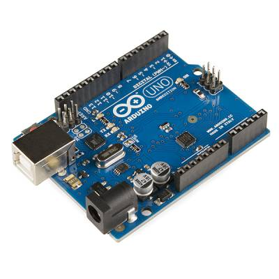
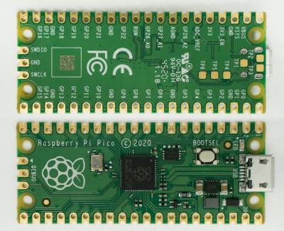

If you’re looking for a friendly path to using microcontrollers, there are plenty of boards available that offer an easy path to get started.

The most well known is Arduino, started in 2005 as a tool for students at the Interaction Design Institute Ivrea in Ivrea, Italy. Arduino boards use Atmel AVR microcontroller chips, mostly 8-bit. The most popular model is the Arduino UNO, which uses a ATmega328P AVR chip. The official programming environment for Arduino is the Arduino IDE, utilizing C/C++ with special structuring rules, with the intention of making the code easier to understand.

Another board that’s gaining popularity is the Raspberry Pi Pico. The Raspberry Pi Foundation is better known for producing a series of single-board computers (not microcontrollers) known simply as Raspberry Pi, but the Pico is intended to compete directly with Arduino. (I use the word “compete” loosely, as Arduino is actually one of the companies the foundation collaborated with to create the Pico.) The Pico board leverages a custom chip called RP2040, a 32-bit dual ARM Cortex-M0+ microcontroller circuit. The foundation also offers a friendly programming language called MicroPython which can be used for programming the board.

Both of these offerings provide a fairly pain-free way for hobbyists to work with microcontrollers. But professional embedded programmers typically don’t use environments/languages like the Arduino IDE, or MicroPython. There are professional IDEs built specifically for embedded programming, but the language is usually traditional C (and sometimes other languages, like C++, or Rust).

Traditional embedded programming can also be done using strictly CLI tools, by calling the individual compilers, linkers, and build tools directly. It’s this option that I decided to explore, and I documented my “Getting Started” steps [here](https://jfcarr.github.io/kbase/articles/programming_avr_pico_c.html).
