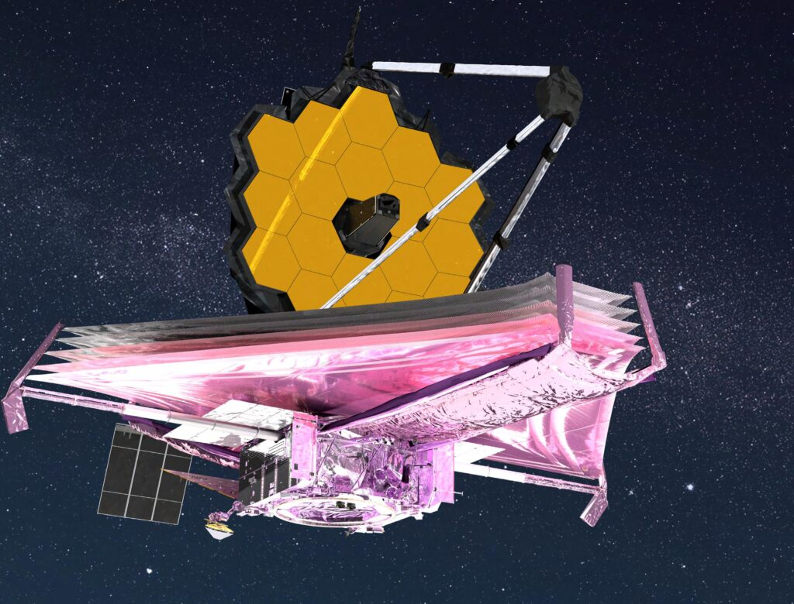

_Primary source: “JWST: NASA’s Amazing Next Generation Observatory” by Simon Steel (Senior Director of Education and Outreach, SETI Institute), designed by Jasmin Arriaga Hedges (Designer, SETI Institute)_

The JWST’s primary focus is on infrared astronomy: The capture and study of light emitted outside the realm of human vision. Even though infrared light is not visible to humans, we can still detect it as heat. This is where infrared study comes in. Many objects in space are warm, which means they’re emitting huge amounts of infrared light. There’s also large amounts of dust in space. This dust blocks visible light, but not infrared. This gives us an opportunity to peer into and through the dust.

Why bother going through the difficulty and expense of putting JWST into space in the first place? Two reasons: air and moisture. The movement of air in the atmosphere distorts our view of objects in space. Moreover, water molecules absorb infrared light, so moisture in the air can keep infrared light from reaching ground-based infrared telescopes. Putting the telescope into space places it above the atmosphere, so that its view is not obscured.

Infrared telescopes are historically trickier to maintain than visible light telescopes, because they must be kept very cold. This makes sense: an infrared telescope detects heat, and you don’t want it detecting itself! But, this means that the coolant (liquid helium) used to keep these space-based telescopes cold slowly boils away into space, giving the telescope a limited lifespan. The good news is that the JWST employs a radical redesign that extends its lifespan significantly. Most of the instruments on the JWST are passively cooled with a sun shield and radiator system. The MIRI instrument requires additional cooling, and employs a cryo-cooler with a Helium recovery system.

The “objects in space are warm” statement that I made previously needs some clarification. Objects like first-generation stars are not warm, they’re hot. Extremely hot. They are emitting ultraviolet light, not infrared. So, why design a telescope limited to capturing infrared? Because we live in an expanding universe. As the ultraviolet light travels to us from these distant stars, the space they’re traveling through is stretching. This also causes the light waves to stretch, and the further they travel, the more they stretch. So, this light starts its journey in the upper end of the spectrum (ultraviolet), but by the time it reaches us, this stretching has made its wavelength longer, moving it into the lower end of the spectrum (infrared).

The JWST is also useful for the study of exoplanets (planets orbiting other stars). Through the use of spectroscopy (the breaking up of light into its constituent colors), the atoms and gasses that make up an exoplanet’s atmosphere can be detected and studied. This can even theoretically be used to detect the presence of life, as high levels of oxygen can only be produced (as far as we know) through biological activity.

JWST has a unique design. It doesn’t use a conventional mirror, but instead has a segmented mirror consisting of 18 gold-plated beryllium hexagons. This mirror is not enclosed in a tube, as it would be in a regular telescope. Instead, it is fully exposed to the cold of space, helping to solve our thermal problem. There’s also a sun shield, protecting the mirror from the infrared heat emitted by the nearby Sun, Earth, and Moon.

## Instruments

_This information is taken directly from [here](https://www.nasa.gov/mission_pages/webb/instruments/index.html)._

* **Fine Guidance Sensor/Near InfraRed Imager and Slitless Spectrograph (FGS/NIRISS)** -- The Fine Guidance Sensor (FGS) allows Webb to point precisely, so that it can obtain high-quality images. The Near Infrared Imager and Slitless Spectrograph part of the FGS/NIRISS will be used to investigate the following science objectives: first light detection, exoplanet detection and characterization, and exoplanet transit spectroscopy. Provided by the Canadian Space Agency. (<https://jwst.nasa.gov/content/observatory/instruments/fgs.html>)
* **Mid-Infrared Instrument (MIRI)** -- The Mid-Infrared Instrument (MIRI) has both a camera and a spectrograph that sees light in the mid-infrared region of the electromagnetic spectrum, with wavelengths that are longer than our eyes see. MIRI covers the wavelength range of 5 to 28 microns. Its sensitive detectors will allow it to see the redshifted light of distant galaxies, newly forming stars, and faintly visible comets as well as objects in the Kuiper Belt. Provided by the European Consortium with the European Space Agency (ESA), and by the NASA Jet Propulsion Laboratory (JPL). (<https://jwst.nasa.gov/content/observatory/instruments/miri.html>)
* **Near-Infrared Camera (NIRCam)** -- This is Webb’s primary imager that will cover the infrared wavelength range 0.6 to 5 microns. NIRCam will detect light from: the earliest stars and galaxies in the process of formation, the population of stars in nearby galaxies, as well as young stars in the Milky Way and Kuiper Belt objects. NIRCam is equipped with coronagraphs, instruments that allow astronomers to take pictures of very faint objects around a central bright object, like stellar systems. NIRCam’s coronagraphs work by blocking a brighter object’s light, making it possible to view the dimmer object nearby – just like shielding the sun from your eyes with an upraised hand can allow you to focus on the view in front of you. With the coronagraphs, astronomers hope to determine the characteristics of planets orbiting nearby. Provided by the University of Arizona. (<https://jwst.nasa.gov/content/observatory/instruments/nircam.html>)
* **Near-Infrared Spectrograph (NIRSpec)** -- This will operate over a wavelength range of 0.6 to 5 microns. A spectrograph (also sometimes called a spectrometer) is used to disperse light from an object into a spectrum. Analyzing the spectrum of an object can tell us about its physical properties, including temperature, mass, and chemical composition. The atoms and molecules in the object actually imprint lines on its spectrum that uniquely fingerprint each chemical element present and can reveal a wealth of information about physical conditions in the object. Spectroscopy and spectrometry (the sciences of interpreting these lines) are among the sharpest tools in the shed for exploring the cosmos. Provided by ESA, with components provided by NASA/GSFC. (<https://jwst.nasa.gov/content/observatory/instruments/nirspec.html>)
