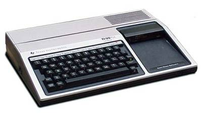

Grab your parachute pants and hair spray. We’re headed back to the 80’s!

## History

It’s 1982. A new talk show called “Late Night with David Letterman” has debuted on NBC. The Falklands War has begun. “E.T.: The Extra-Terrestrial” is released, and will become the biggest box office hit of the decade. The first compact discs will soon be produced in Germany. And I’m about to be introduced to something that will dramatically influence both my professional and personal life.

As a teenager, I didn’t have much interest in computers. But then, my good friend Mike got a [Commodore VIC-20](https://www.oldcomputers.net/vic20.html) (and later, a [Commodore 64](https://www.oldcomputers.net/c64.html)), and started showing me the cool things he was doing with it. It was fascinating! I started asking my Dad for a computer of my own.

He was hesitant, at first, since home computers of the time were quite expensive. Luckily for me, though, Commodore and Texas Instruments were engaged in a price war, and prices dropped steadily. When the price of the Texas Instruments 99/4A dropped to $150, Dad finally relented.

## The Machine and the Software

By today’s standards, the [TI-99/4A](https://www.oldcomputers.net/ti994a.html) is a laughably under-powered machine. But with a 3MHz CPU, 16K of RAM, and display resolution of 32 characters/24 lines (text) and 192×256 16 colors (graphics), it was pretty capable as compared to other machines of the era.



The TI had its own flavor of the BASIC programming language baked in: TI-BASIC. (Not to be confused with the language used in Texas Instruments programmable calculators) The language is pretty crude by today’s standards: Lines of code are numbered, and flow control is diverted by referencing the line numbers. No structured code, and certainly nothing even vaguely resembling object-orientation. I thought it was _amazing_.


Just as it is today, computer owners of the time engaged in a lot of “my machine’s better than yours” puffery. I still laugh thinking about how Mike derided me for not getting a Commodore machine, and I shot right back, telling and showing him the cool stuff I was creating. I fancied myself a “game developer”, creating lots of simple games, and even a couple of pretty complex ones (“Lunar Drop” and “Turbo Tank”). I had so much fun!

## To Now

Over the years, I’ve retained a lot of affection for the TI-99/4A. I’ve never forgotten the satisfaction of writing my first programs, and this has stayed with me to this very day. My youngest son actually bought one a few years ago, and it was really cool seeing him get it up and running, and typing a few very simple programs in.

I have a project I’ve worked on off-and-on during the last few years: The translation of a set of astronomical algorithms into [various programming languages](https://github.com/stars/jfcarr/lists/practical-astronomy). I’ve completed implementing the algorithms in Python, C#, and Rust. I’ve also started some work in C, C++, and Java. Recently, it occurred to me: I wonder how difficult it would be to translate one of the simple algorithms into TI-BASIC? I decided to find out.

## TI-BASIC

As I mentioned above, TI-BASIC is formatted as numbered lines. Here’s a simple example:

```txt
100 CALL CLEAR
110 PRINT "HELLO!"
```

When this program is run, it clears the screen, and then prints “HELLO!”.

Since you can’t write standalone functions in TI-BASIC, when you have code you want to reuse you must transfer control to that block of code, and then transfer control back when you’re done. For example, in order to reuse the PRINT command from the first example, you’d do something like this:

```txt
100 CALL CLEAR
110 GOSUB 140
120 GOSUB 140
130 END
140 PRINT "HELLO!"
150 RETURN
```

When you run this version of the program, the text “HELLO!” is printed twice.

So, what’s going on here? The GOSUB keyword transfers control to another line of code. On line 110, control is transferred to line 140, where we have our PRINT statement. The RETURN keyword on line 150 then transfers control to the line after the GOSUB (in this case, line 120). Since line 120 is another GOSUB, control is transferred to the PRINT statement again, and then transferred back. Finally, the END keyword on line 130 terminates execution of the program.

## The Algorithm

For my algorithm code, I decided to implement “Date of Easter”. Given a year, this algorithm returns the full date for the occurrence of Easter in that year.

Here’s what my C version looks like:

```c
typedef struct pa_full_date {
  int month;
  int day;
  int year;
} TFullDate;
 
TFullDate get_date_of_easter(int input_year) {
  double year = (double)input_year;
 
  double a = (int)year % 19;
  double b = floor(year / 100.0);
  double c = (int)year % 100;
  double d = floor(b / 4.0);
  double e = (int)b % 4;
  double f = floor((b + 8.0) / 25.0);
  double g = floor((b - f + 1.0) / 3.0);
  double h = (int)((19.0 * a) + b - d - g + 15.0) % 30;
  double i = floor(c / 4.0);
  double k = (int)c % 4;
  double l = (int)(32.0 + 2.0 * (e + i) - h - k) % 7;
  double m = floor((a + (11.0 * h) + (22.0 * l)) / 451.0);
  double n = floor((h + l - (7.0 * m) + 114.0) / 31.0);
  double p = (int)(h + l - (7.0 * m) + 114.0) % 31;
 
  double day = p + 1.0;
  double month = n;
 
  TFullDate return_value = {(int)month, (int)day, (int)year};
 
  return return_value;
}
```

As I started to write the TI-BASIC version, it didn’t take long for me to encounter a problem: TI-BASIC has no modulo operator! The modulo operator (% in the C code above) returns the remainder from a division operation. For example, take a look at this C statement:

```c
int remainder = 14 % 3;
```

After this statement is executed, the remainder variable contains 2, because 3 divides into 14 four times, with 2 left over.

For TI-BASIC, I wrote my own. My custom modulo subroutine in TI-BASIC looks like this:

```txt
530 REM  MODULO SUB
540 MODRESULT=MODX-INT(MODX/MODY)*MODY
550 RETURN
```

The REM statement on line 530 is a remark, serving the same purpose as a comment in other languages.

Since arguments can’t be passed to a subroutine in TI-BASIC, the MODX and MODY variables must be set before the GOSUB call. A TI-BASIC subroutine also can’t return a value, so after the GOSUB call, you simply use the MODRESULT variable directly.

Translating the rest of the code wasn’t too bad. Here’s what I ended up with:

```txt
100 INPUT "YEAR? ":YEAR     
110 GOSUB 130               
120 END                     
130 REM  DATE OF EASTER SUB 
140 MODX=YEAR               
150 MODY=19                 
160 GOSUB 530               
170 A=MODRESULT             
180 B=INT(YEAR/100)         
190 MODX=YEAR               
200 MODY=100                
210 GOSUB 530               
220 C=MODRESULT             
230 D=INT(B/4)              
240 MODX=B                  
250 MODY=4                  
260 GOSUB 530               
270 E=MODRESULT             
280 F=INT((B+8)/25)         
290 G=INT((B-F+1)/3)        
300 MODX=((19*A)+B-D-G+15)  
310 MODY=30                 
320 GOSUB 530               
330 H=MODRESULT             
340 I=INT(C/4)              
350 MODX=C                  
360 MODY=4                  
370 GOSUB 530               
380 K=MODRESULT             
390 MODX=(32+2*(E+I)-H-K)   
400 MODY=7                  
410 GOSUB 530               
420 L=MODRESULT             
430 M=INT((A+(11*H)+(22*L))/451)
440 N=INT((H+L-(7*M)+114)/31)
450 MODX=(H+L-(7*M)+114)    
460 MODY=31                 
470 GOSUB 530               
480 P=INT(MODRESULT)        
490 DAY=P+1                 
500 MONTH=N                 
510 PRINT "DATE OF EASTER FOR";YEAR;"IS";MONTH;DAY;YEAR
520 RETURN                  
530 REM  MODULO SUB         
540 MODRESULT=MODX-INT(MODX/MODY)*MODY
550 RETURN                  
```

The program uses two subroutines: the “Date of Easter” logic starting at line 130, and the modulo operation at line 530.

When the program is run, it prompts for a year, and then displays the full date for Easter in that year. Example:

```txt
.>RUN                         
YEAR? 2013                  
DATE OF EASTER FOR 2013 IS 3 31 2013

** DONE **                  
```

This was a lot of fun to write. I hadn’t written any significant TI-BASIC code for 35+ years, and it was quite a nostalgic experience working through this.

(But, I’ll also say I’m grateful I don’t have to write _all_ of my code this way anymore!)
