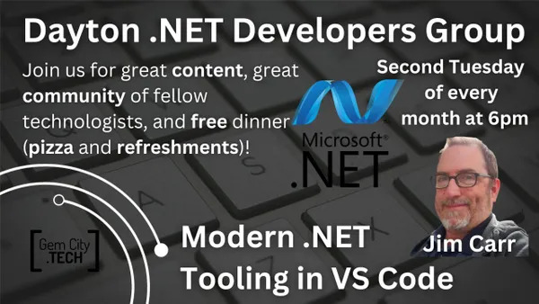

.NET / VS Code session incoming! I’ve covered this topic before, but now there are some interesting newer features in the “C# Dev Kit” extension. [Come to the Innovation Hub in Dayton on November 14th](https://www.meetup.com/gem-city-tech/events/tlfjbtyfcpbsb/), and learn all about it!

The Dayton .NET Developers group is part of GemCity TECH. There are groups covering a wide variety of technical topics and interests. [Check it out!](https://www.meetup.com/gem-city-tech/events/)
