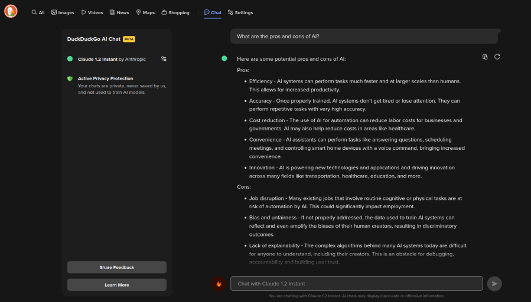

When you execute a search on [DuckDuckGo](https://start.duckduckgo.com/), you'll now see a new option at the top of the results:

Clicking “Chat” gives you a UI very similar to other AI Chatbots. (You can also send your query directly to the Chat UI by including a chat bang in your query text, e.g., `What are the pros and cons of AI? !chat`.)

When the Chat UI is displayed, you'll notice a comforting bit of text on the left-hand side:

> Active Privacy Protection Your chats are private, never saved by us, and not used to train AI models.

You can choose from two different chat models:

* [GPT-3.5 Turbo](https://en.wikipedia.org/wiki/GPT-3) from OpenAI
* [Claude 1.2 Instant](https://en.wikipedia.org/wiki/Claude_(language_model)) from Anthropic

I seem to be getting slightly better results from Claude.

## Caveats

Before you use an AI chatbot, consider the following:

* **Ethical Concerns** In order to build its [LLM](https://en.wikipedia.org/wiki/Large_language_model), an AI engine scrapes massive amounts of information from the web. There are two problems with this:
  * The quality of data sources varies a great deal. And, even when the quality is good, you're at the mercy of the AI engine's ability to contextualize it properly. It is, after all, only a large statistical model.
  * The AI engine doesn't provide credit to the original source. (This is particularly problematic in code generation, as you may be using code provided by the AI without respecting the original license of the source it was scraped from.)
* **Overcompensation** In an effort to “do the right thing”, results can [seriously misfire](https://www.theverge.com/2024/2/22/24079876/google-gemini-ai-photos-people-pause).
* **Curation** The answers you get are filtered through the lens of the AI. Unlike a web search, where you receive results from many sources and can pick-and-choose which of those you want to follow through on, asking your questions via the AI means the AI preselects the answers for you.

If you still want to make use of AI Chat, but via a delivery that's more privacy-centric, this seems to be a good choice.
