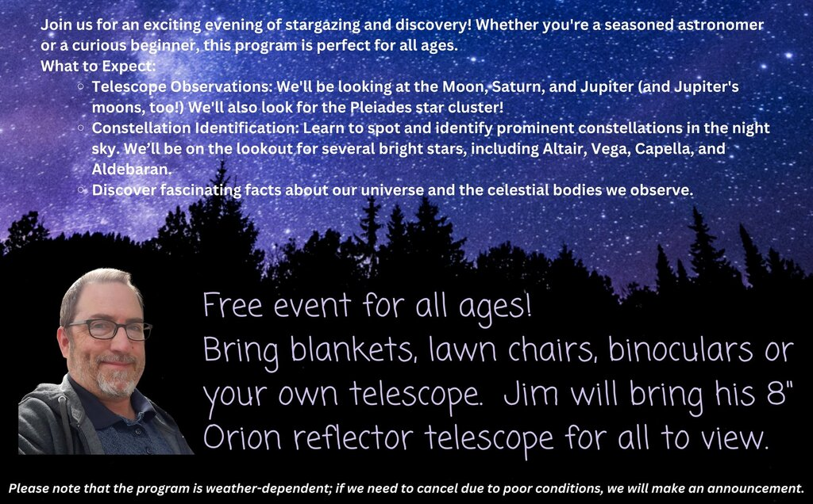
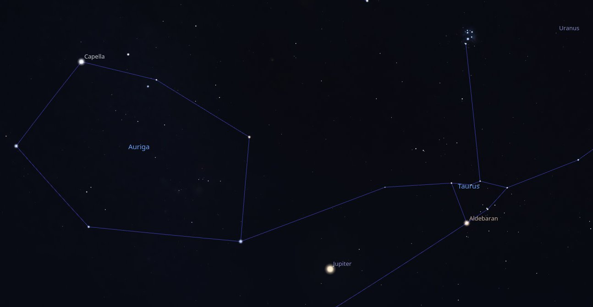
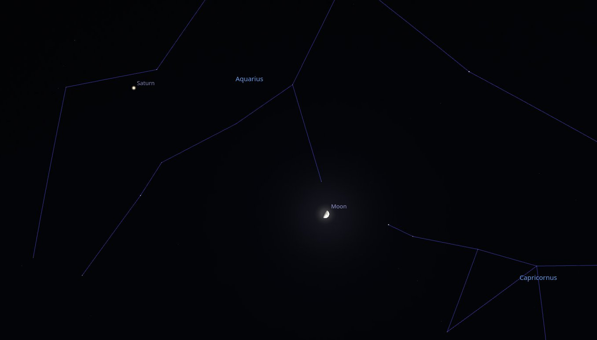
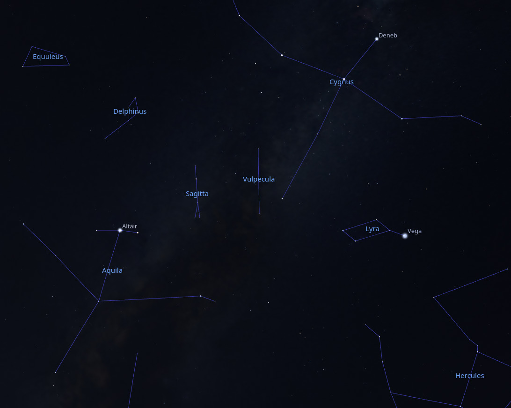
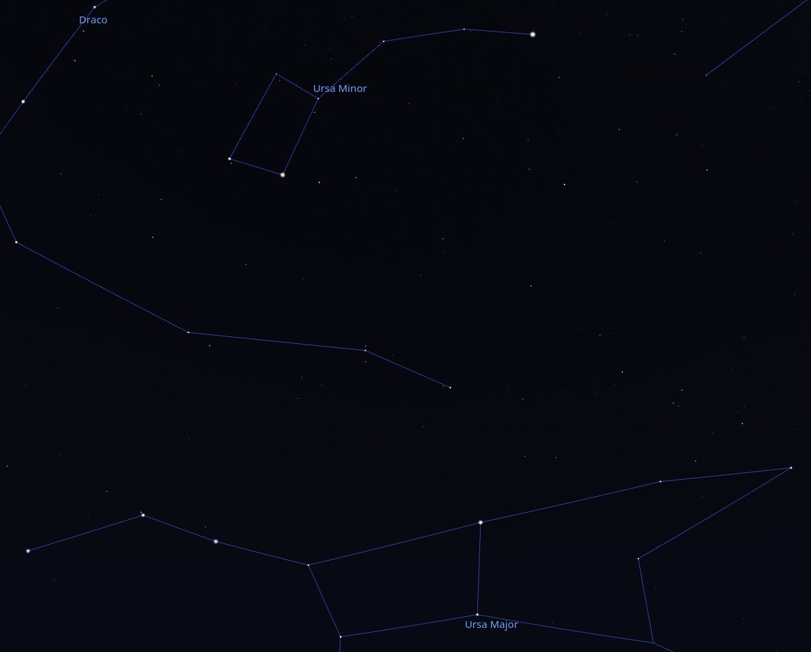
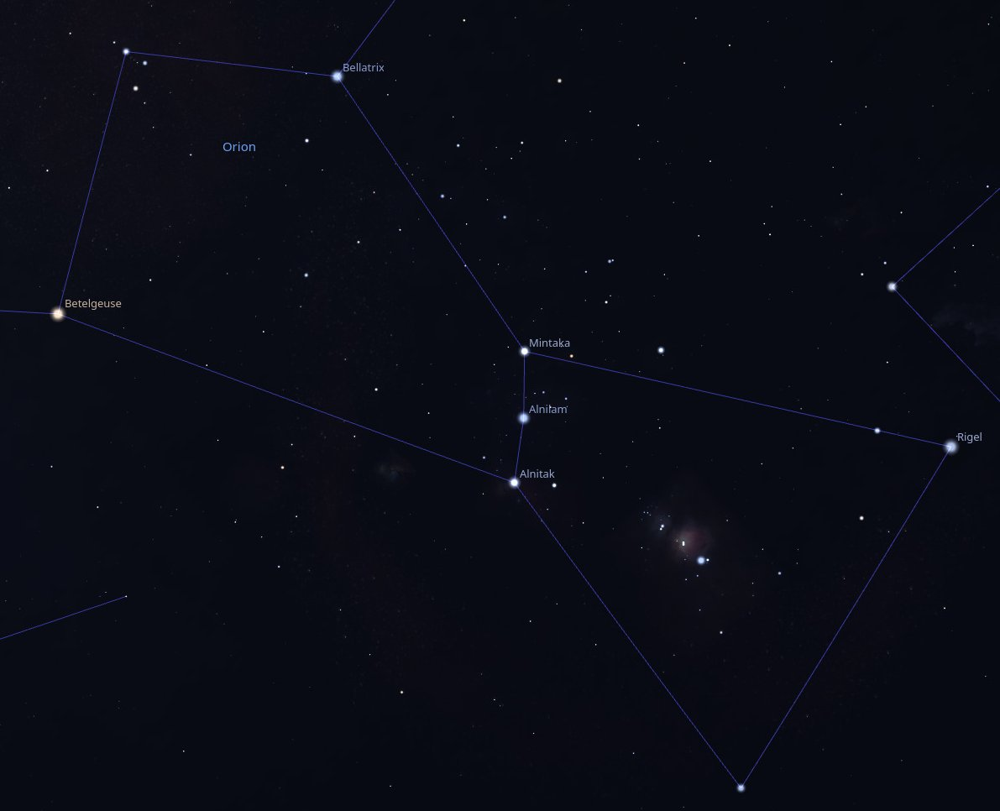
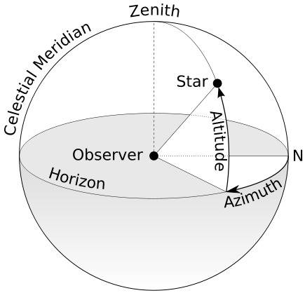

> **IMPORTANT UPDATE!** Due to the forecast of clouds and showers on Saturday evening, I regret to inform you that I must cancel. So sorry! I'm hoping that I can re-schedule next Spring.

On November 9th, 2024, I will be at the [Garber Forest near Lewisburg Ohio](https://maps.app.goo.gl/Wqxny94ZTLmi6igm6), equipped with my telescope to discuss astronomy and lead an exploration of the night sky - weather permitting, of course!

This event is organized by the [Preble County Park District](https://preblecountyparks.org/).

# What We'll Look For

## 8pm

To the North-East-East, Jupiter has just risen and is about 8 degrees above the horizon, shining with a magnitude of -2.74 between the constellations of Auriga ("the charioteer") and Taurus ("the bull").  It's pretty low in the sky for observation, so we'll come back to it later.

To the right of Jupiter is the bright star Aldebaran (the "eye" of Taurus) and directly above it (about 26 degrees above the horizon) is the Pleiades star cluster.

To the North-East, at about the same altitude as the Pleiades, is the bright star Capella, part of Auriga.

Looking to the South, a waxing Moon just over half full shines between the constellations Aquarius ("the water-carrier") and Capricornus ("the horned goat"), at about 33 degrees above the horizon.  Just up and to the left of the moon is Saturn (magnitude 0.85), in Aquarius.  Looking closely, the rings of Saturn are almost edge-on, but hopefully we'll be able to make them out.

High in the sky to the west we see the three bright stars Altair, Deneb, and Vega.  Although these stars are in separate constellations (Aquila, Lyra, and Cygnus, respectively) together they make up "The Summer Triangle", a well-known asterism.

Finally, to the North, Ursa Major ("the big dipper") sits low on the horizon and above it is Ursa Minor ("the little dipper") with Polaris (the steadfast "North Star").

## 9pm

Jupiter will now be about 19 degrees above the horizon.  Looking at it through the telescope, we should be able to make out its three brightest moons: Callisto, Europa, and Ganymede.  As we get closer to 10pm, the moon Io may become visible for us as well.

## 10pm

The constellation Orion ("the hunter") will have risen, but will still be low in the East.  It's easy to spot, with its bright stars Betelgeuse, Rigel, and Bellatrix, and the three distinct stars of Orion's belt: Mintaka, Alnilam, and Alnitak. Will it be high enough for us to see?  If so, we might also catch a glimpse of the Orion Nebula, the "sword" hanging from Orion's belt.

# More Information

## Magnitude

In astronomy, "magnitude" refers to the brightness of celestial objects, such as stars, planets, and galaxies. There are two main types of magnitude:

1. **Apparent Magnitude**: This measures how bright an object appears from Earth. The scale is logarithmic and inversely related, meaning that lower numbers indicate brighter objects. For example, a star with an apparent magnitude of 1 is brighter than a star with an apparent magnitude of 6. The scale also includes negative values for very bright objects, such as the Sun and the Moon.

2. **Absolute Magnitude**: This measures the intrinsic brightness of a celestial object, defined as how bright the object would appear if it were located at a standard distance of 10 parsecs (about 32.6 light-years) from Earth. Absolute magnitude allows astronomers to compare the true brightness of different objects without the effects of distance.

The concept of magnitude is crucial for understanding the luminosity and distance of celestial bodies, as well as for classifying stars and other astronomical phenomena.

## Constellation

A constellation is a recognized pattern of stars in the night sky that forms a specific shape or figure, often representing mythological characters, animals, or objects. Constellations serve as a way to organize and identify groups of stars, making it easier for astronomers and stargazers to navigate the sky. 

There are 88 officially recognized constellations, as defined by the International Astronomical Union (IAU). These constellations cover the entire celestial sphere and are used in various ways, including for navigation, storytelling, and as a framework for locating celestial objects. Some well-known constellations include Orion, Ursa Major, and Cassiopeia.

## Asterism

In astronomy, "asterism" refers to a recognizable pattern or group of stars that may not necessarily form a formal constellation. Asterisms can be made up of stars from one or more constellations and are often more easily recognizable or familiar to the casual observer. 

For example, the Big Dipper is an asterism that is part of the larger constellation Ursa Major. Similarly, the Summer Triangle is another well-known asterism formed by three bright stars from three different constellations: Vega (Lyra), Deneb (Cygnus), and Altair (Aquila).

Asterisms are useful for amateur astronomers and stargazers as they can serve as reference points for locating other stars and celestial objects in the night sky.

## Altitude and Azimuth

Altitude and azimuth are two coordinates used in astronomy to specify the position of an object in the sky as observed from a specific location on Earth.

1. **Altitude**: This is the angle between the object in the sky and the observer's local horizon. It is measured in degrees, ranging from 0° (the horizon) to 90° (the zenith, which is directly overhead). An object with an altitude of 0° is on the horizon, while an object with an altitude of 90° is directly above the observer.

2. **Azimuth**: This is the angle measured clockwise from a reference direction, typically true north. Azimuth is also measured in degrees, ranging from 0° to 360°. For example, an azimuth of 0° corresponds to north, 90° to east, 180° to south, and 270° to west.

Together, altitude and azimuth provide a way to pinpoint the location of celestial objects in the sky relative to an observer's position on Earth. This system is particularly useful for navigation, stargazing, and astronomical observations.

## The Moon

The Moon is Earth's only natural satellite and is the fifth largest moon in the solar system. It has a significant impact on Earth, influencing tides and stabilizing the planet's axial tilt. The Moon's surface is covered with craters, mountains, and flat plains called maria, which were formed by ancient volcanic activity. 

The Moon has a synchronous rotation, meaning it rotates on its axis in the same time it takes to orbit Earth, which is why we always see the same side from our planet. The far side of the Moon, often mistakenly called the "dark side," is not permanently dark; it just faces away from Earth.

The Moon has been a subject of human fascination for centuries, inspiring myths, art, and scientific exploration. The Apollo missions in the late 1960s and early 1970s marked the first time humans set foot on the Moon, with Apollo 11 being the most famous mission, landing Neil Armstrong and Buzz Aldrin on its surface in 1969. 

### Moon Phases

Waxing and waning refer to the phases of the moon as it orbits the Earth, specifically how the visible portion of the moon changes over time.

1. **Waxing**: This term describes the period when the moon is increasing in illumination. After the new moon phase, the moon begins to wax, meaning more of its surface becomes visible from Earth. The phases during this period include:
   - **Waxing Crescent**: A small sliver of the moon is illuminated.
   - **First Quarter**: Half of the moon is illuminated.
   - **Waxing Gibbous**: More than half of the moon is illuminated but not yet full.

2. **Waning**: This term describes the period when the moon is decreasing in illumination. After the full moon phase, the moon begins to wane, meaning less of its surface is visible. The phases during this period include:
   - **Waning Gibbous**: More than half of the moon is illuminated but decreasing.
   - **Last Quarter**: Half of the moon is illuminated, but the opposite side compared to the first quarter.
   - **Waning Crescent**: A small sliver of the moon is illuminated, leading back to the new moon phase.

These cycles occur roughly every 29.5 days, which is the time it takes for the moon to complete one full orbit around the Earth and return to the same phase.

## Planets

There are eight recognized planets in the solar system, which are divided into two categories:

* **Terrestrial planets**: Mercury, Venus, Earth, and Mars. These are rocky and have solid surfaces.
* **Gas giants**: Jupiter and Saturn, which are primarily composed of hydrogen and helium.
* **Ice giants**: Uranus and Neptune, which have a larger proportion of "ices" such as water, ammonia, and methane.

**Dwarf Planets**: These include Pluto, Eris, Haumea, Makemake, and Ceres. Dwarf planets are similar to regular planets but do not clear their orbital paths of other debris. 

### Jupiter

Jupiter is the largest planet in our solar system, known for its massive size, strong magnetic field, and distinctive features. Here are some key points about Jupiter:

1. **Size and Composition**: Jupiter is a gas giant, primarily composed of hydrogen and helium. It has a diameter of about 86,881 miles (139,822 kilometers), making it more than 11 times wider than Earth.

2. **Great Red Spot**: One of Jupiter's most famous features is the Great Red Spot, a giant storm that has been raging for at least 350 years. It is larger than Earth and is characterized by its reddish color.

3. **Moons**: Jupiter has a large number of moons, with 79 confirmed as of now. The four largest moons, known as the Galilean moons, are Io, Europa, Ganymede, and Callisto. Ganymede is the largest moon in the solar system.

4. **Rings**: Jupiter has a faint ring system composed mainly of dust particles and small rocks. The rings are not as prominent as those of Saturn.

5. **Magnetic Field**: Jupiter has the strongest magnetic field of any planet in the solar system, which is generated by the motion of metallic hydrogen in its interior.

6. **Exploration**: Several spacecraft have visited Jupiter, including the Galileo orbiter and the Juno spacecraft, which is currently studying the planet's atmosphere, magnetic field, and structure.

7. **Atmosphere**: Jupiter's atmosphere is known for its colorful bands and storms, including the aforementioned Great Red Spot. The planet's atmosphere is dynamic and experiences high-speed winds.

### Jupiter's Moons

#### Callisto

Callisto is one of the largest moons of Jupiter and is the third-largest moon in the solar system. It has a diameter of about 4,820 kilometers (2,995 miles) and is known for its heavily cratered surface, which suggests it has been geologically inactive for a long time. Callisto is composed primarily of ice and rock, and its surface features include a mix of old impact craters and some younger, less cratered regions.

One of the most interesting aspects of Callisto is its potential subsurface ocean. While there is no direct evidence of this ocean, some scientists believe that beneath its icy crust, there may be a salty ocean that could harbor conditions suitable for life.

Callisto has a very thin atmosphere, primarily composed of carbon dioxide, and it has a low level of radiation compared to other Galilean moons, making it a more favorable location for future exploration and potential human missions. It was discovered by Galileo Galilei in 1610, along with the other three largest moons of Jupiter: Io, Europa, and Ganymede.

#### Europa

Europa is one of Jupiter's largest moons and is the sixth-largest moon in the solar system. It is particularly interesting to scientists because it is believed to have a subsurface ocean beneath its icy crust, which could potentially harbor conditions suitable for life. Here are some key features of Europa:

1. **Surface and Composition**: Europa's surface is primarily composed of water ice, and it features a smooth, bright appearance with few impact craters, suggesting a relatively young surface. The cracks and ridges on its surface indicate tectonic activity.

2. **Subsurface Ocean**: Scientists believe that beneath Europa's icy shell lies a salty ocean that may be in contact with the moon's rocky mantle. This ocean could provide the necessary chemical ingredients for life.

3. **Potential for Life**: The combination of liquid water, a stable energy source (from tidal heating due to Jupiter's gravitational pull), and essential chemical elements makes Europa a prime candidate in the search for extraterrestrial life.

4. **Exploration**: Europa has been studied by several spacecraft, including the Galileo orbiter and the Hubble Space Telescope.

5. **Atmosphere**: Europa has a very thin atmosphere composed mainly of oxygen, but it is far too thin to support human life.

Europa continues to be a focus of astrobiological research and exploration due to its intriguing characteristics and the possibility of finding life beyond Earth.

> _Europa Clipper_, a space probe developed by NASA, is currently on its way to Europa and is expected to arrive in the Jupiter system in 2030.
>
> The goals of Europa Clipper are to explore Europa, investigate its habitability, and aid in the selection of a landing site for the proposed Europa Lander. This exploration is focused on understanding the three main requirements for life: liquid water, chemistry, and energy. Specifically, the objectives are to study:
>
> * Ice shell and ocean: Confirm the existence and characterize the nature of water within or beneath the ice, and study processes of surface-ice-ocean exchange.
> * Composition: Distribution and chemistry of key compounds and the links to ocean composition.
> * Geology: Characteristics and formation of surface features, including sites of recent or current activity.
>
> [source](https://en.wikipedia.org/wiki/Europa_Clipper#Objectives)

#### Ganymede

Ganymede is the largest moon of Jupiter and the largest moon in the solar system. It is one of the four Galilean moons, which were discovered by Galileo Galilei in 1610. Ganymede has a diameter of about 5,268 kilometers (3,273 miles), making it even larger than the planet Mercury, although it does not have enough mass to be classified as a planet.

Ganymede is unique among moons because it has a magnetic field, which is likely generated by a liquid iron or iron-sulfide core. The surface of Ganymede is a mix of two types of terrain: bright, icy regions and darker, heavily cratered areas. It is believed to have a subsurface ocean beneath its icy crust, which raises the possibility of conditions that could support life.

In addition to its geological features, Ganymede has a thin atmosphere composed mostly of oxygen, although it is far too thin to support human life. The moon has been studied by various spacecraft, including the Galileo orbiter and the Hubble Space Telescope.

#### Io

Io is one of the four largest moons of Jupiter. It is the most geologically active body in the solar system, with hundreds of volcanoes, some of which are still erupting. Io's surface is covered with sulfur and sulfur dioxide, giving it a colorful appearance with shades of yellow, red, and white.

The intense geological activity on Io is primarily due to the gravitational pull from Jupiter and the other Galilean moons (Europa, Ganymede, and Callisto), which creates tidal heating. This process generates enough internal heat to drive volcanic activity.

Io has a thin atmosphere composed mainly of sulfur dioxide, and its surface temperature can vary widely. The moon also has a very weak magnetic field and is known to have a significant interaction with Jupiter's magnetosphere.

### Saturn

Saturn is the sixth planet from the Sun and is known for its prominent ring system, which is the most extensive and complex in the solar system. It is a gas giant, primarily composed of hydrogen and helium, and has a diameter of about 86,881 miles (139,822 kilometers). Saturn has at least 82 moons, with Titan being the largest and one of the most interesting due to its thick atmosphere and surface lakes of liquid methane and ethane.

Saturn's rings are made up of ice particles, rocky debris, and dust, and they vary in thickness and density. The planet has a relatively low density, meaning it could float in water if there were a body of water large enough to contain it. Saturn is also known for its strong winds, which can reach speeds of over 1,100 miles per hour (1,800 kilometers per hour) in its upper atmosphere.

## Bright Stars

### Aldebaran

Aldebaran is a prominent star located in the constellation Taurus. It is often referred to as the "Eye of the Bull" and is one of the brightest stars in the night sky. Aldebaran is classified as a red giant star and is approximately 65 light-years away from Earth. It has a distinct orange hue and is part of the Hyades star cluster, although it is not physically part of the cluster itself. Aldebaran is notable for its brightness and is often used in navigation and astronomy.

### Altair

Altair is a prominent star located in the constellation Aquila, which represents an eagle. Here are some key facts about Altair:

1. **Brightness**: Altair is one of the brightest stars in the night sky and is the 12th brightest star overall. It has an apparent magnitude of about 0.76.

2. **Distance**: Altair is approximately 16.7 light-years away from Earth, making it one of the closest stars to our solar system.

3. **Spectral Type**: Altair is classified as an A7V main-sequence star, which means it is a hot, white star that is in the stable phase of its life cycle, fusing hydrogen into helium in its core.

4. **Rotation**: Altair is known for its rapid rotation, completing a full rotation approximately every 9 hours. This fast rotation causes it to have an oblate shape, meaning it is flattened at the poles and bulging at the equator.

5. **Cultural Significance**: In various cultures, Altair has been associated with different myths and stories. In Chinese astronomy, it is known as "Zhi Nu," the Weaving Girl, and is part of the famous "Cowherd and Weaving Girl" legend.

6. **Part of the Summer Triangle**: Altair is one of the three stars that form the Summer Triangle, along with Vega (in Lyra) and Deneb (in Cygnus). This asterism is prominent in the summer sky in the Northern Hemisphere.

### Bellatrix

Bellatrix, also known as Gamma Orionis, is a prominent star located in the constellation Orion. Here are some key details about Bellatrix:

1. **Brightness**: Bellatrix is one of the brightest stars in the night sky and is classified as a blue giant. It has an apparent magnitude of about 1.64, making it the third-brightest star in Orion, after Betelgeuse and Rigel.

2. **Distance**: Bellatrix is approximately 240 light-years away from Earth.

3. **Spectral Type**: It is classified as a B2 III star, indicating that it is a blue giant with a surface temperature of around 22,000 Kelvin.

4. **Characteristics**: Bellatrix is known for its rapid rotation and is significantly more massive than the Sun. It is also in a later stage of stellar evolution compared to many other stars, having exhausted the hydrogen in its core and expanded in size.

5. **Name Origin**: The name "Bellatrix" comes from the Latin word for "female warrior," which is fitting given its position in the constellation representing a hunter.

Bellatrix is often used in astronomy and stargazing due to its brightness and position in the well-known Orion constellation.

### Betelgeuse

Betelgeuse is a red supergiant star located in the constellation Orion. It is one of the largest and most luminous stars known, with a diameter estimated to be about 1,000 times that of the Sun. Betelgeuse is notable for its distinct reddish color and is often used as a reference point in the night sky.

As a supergiant, Betelgeuse is in the later stages of its stellar evolution and is expected to eventually explode as a supernova. This event could happen within the next million years, although it's difficult to predict exactly when.

In addition to its astronomical significance, Betelgeuse has captured the imagination of many cultures and is often featured in literature and popular media.

[Betelgeuse was in the news recently](../2020/betelgeuse.md).

### Capella

Capella is one of the brightest stars in the night sky and is located in the constellation Auriga. Here are some key facts about Capella:

1. **Brightness**: Capella is the sixth-brightest star in the night sky and is classified as a bright giant star.

2. **Distance**: It is approximately 42 light-years away from Earth.

3. **Binary System**: Capella is actually a binary star system, consisting of two giant stars, Capella Aa and Capella Ab, which are both yellowish in color. They are orbiting each other and are surrounded by a faint third component, Capella C, which is a much fainter red dwarf star.

4. **Spectral Type**: The primary stars (Capella Aa and Ab) are classified as G-type stars, similar to our Sun, but they are larger and more luminous.

5. **Cultural Significance**: Capella has been known since ancient times and has been referenced in various cultures and mythologies. In Latin, "Capella" means "little goat," which is a reference to its association with the goat in the constellation.

Capella is often visible in the evening sky during the winter months in the Northern Hemisphere.

### Deneb

Deneb is one of the brightest stars in the night sky and is part of the constellation Cygnus, also known as the Swan. It is located approximately 1,425 light-years away from Earth and is one of the vertices of the Summer Triangle, along with the stars Vega and Altair. Deneb is a supergiant star, classified as a spectral type A2 Ia, and is known for its significant luminosity and size. It is also notable for its role in various cultural and astronomical contexts, often associated with navigation and mythology.

### Polaris

"Polaris," also known as the North Star, is the brightest star in the constellation Ursa Minor. It is located nearly directly above the North Pole, making it a crucial point of reference for navigation in the Northern Hemisphere. Polaris is a supergiant star and is approximately 433 light-years away from Earth. 

### Rigel

Rigel is a prominent star located in the constellation Orion. It is one of the brightest stars in the night sky and is classified as a blue supergiant. Rigel is approximately 860 light-years away from Earth and has a surface temperature of around 12,000 Kelvin, which gives it its blue color. It is often used in navigation and is notable for its brightness and distinctive position in the Orion constellation.

### Vega

Vega is one of the brightest stars in the night sky and is located in the constellation Lyra. Here are some key facts about Vega:

1. **Brightness**: Vega is the fifth-brightest star in the night sky and is one of the three stars that form the Summer Triangle, along with Deneb and Altair.

2. **Distance**: It is approximately 25 light-years away from Earth.

3. **Type**: Vega is classified as an A-type main-sequence star (spectral type A0V). It is about twice as massive as the Sun and has a surface temperature of around 9,600 K, which gives it a bluish-white color.

4. **Rotation**: Vega has a rapid rotation speed, completing a rotation in about 12.5 hours, which is relatively fast compared to the Sun.

5. **Historical Significance**: Vega has been used as a reference point for the calibration of the brightness of other stars. It was also the first star other than the Sun to be photographed and has been studied extensively in various fields of astronomy.

6. **Cultural References**: Vega has been significant in various cultures and mythologies. In Chinese mythology, it is associated with the weaver girl, and in Western culture, it has been referred to as the "Harp Star."

## Deep Sky Objects

### Orion Nebula

The Orion Nebula, also known as M42, is one of the most famous and studied nebulae in the night sky. It is located in the Milky Way, approximately 1,344 light-years away from Earth in the Orion constellation. The nebula is a stellar nursery, where new stars are being born from the surrounding gas and dust.

Key features of the Orion Nebula include:

1. **Brightness**: It is one of the brightest nebulae visible to the naked eye and can be seen as a fuzzy patch in the sword of Orion.

2. **Size**: The Orion Nebula spans about 24 light-years across and contains a vast amount of gas and dust.

3. **Star Formation**: The nebula is home to a young cluster of stars known as the Trapezium, which consists of four massive stars that illuminate the surrounding gas and dust.

4. **Observation**: The Orion Nebula is a popular target for amateur astronomers and astrophotographers due to its brightness and the intricate structures within it.

5. **Scientific Importance**: It provides valuable insights into the processes of star formation and the dynamics of interstellar matter.

The Orion Nebula is a stunning example of the beauty and complexity of the universe, making it a favorite subject for both professional and amateur astronomers.

### The Pleiades

The Pleiades, also known as the Seven Sisters, is a star cluster located in the constellation Taurus. It is one of the nearest star clusters to Earth and is easily visible to the naked eye. The cluster contains several hundred stars, but the seven brightest are typically the ones referred to as the "Seven Sisters." These stars are named Alcyone, Asterope, Electra, Maia, Merope, Taygeta, and Pleione.

The Pleiades has been significant in various cultures throughout history, often associated with mythology and folklore. In astronomy, it is known for its beauty and is often used as a reference point for navigation. The cluster is also of interest to astronomers studying star formation and the evolution of stars.
