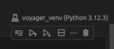
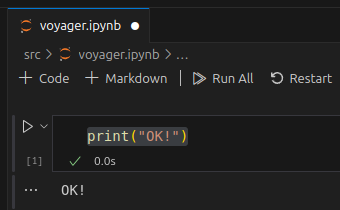
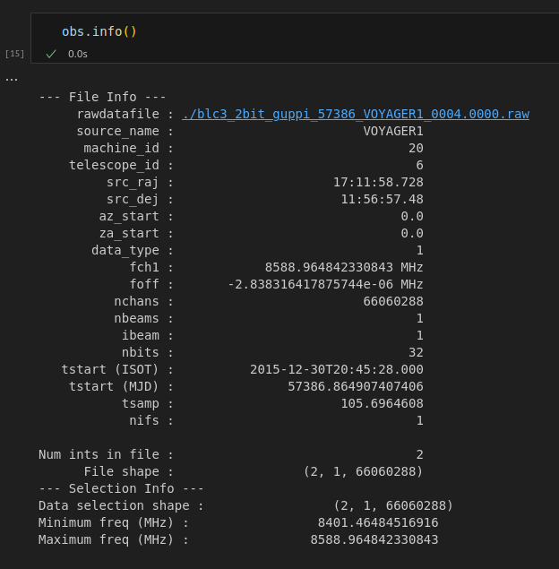
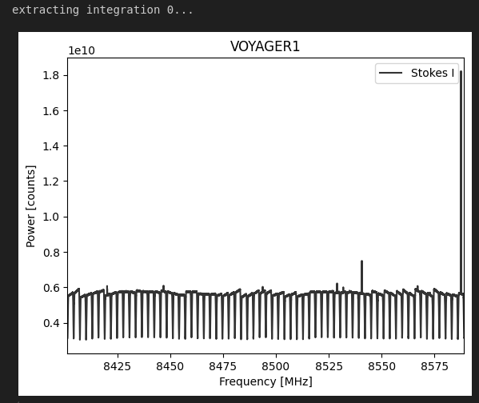
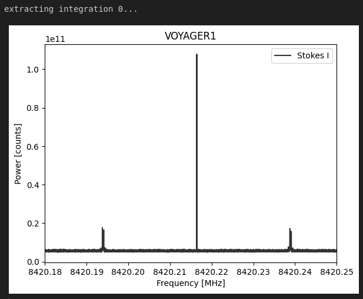

# Breakthrough Listen

[Breakthrough Listen](https://seti.berkeley.edu/listen/) is a project to search for intelligent extraterrestial communications from deep space.  The project uses radio wave observations from the [Green Bank Observatory](https://en.wikipedia.org/wiki/Green_Bank_Observatory) and the [Parkes Observatory](https://en.wikipedia.org/wiki/Parkes_Observatory), and visible light observations from the [Automated Planet Finder](https://en.wikipedia.org/wiki/Automated_Planet_Finder).  In this article, I'll be focusing on radio data collected from the Green Bank Observatory.

## Observing Strategy

The basic observing strategy for GBT data is:

* Observe a target ("star A") from the primary target list for 5 minutes.
* Observe another target ("star B") at a nearby position on the sky for 5 minutes.
* Return to star A for 5 minutes.
* Observe another target ("star C") from the secondary list for 5 minutes.
* Another 5 minutes on star A.
* 5 minutes on another secondary target ("star D")

This ABACAD cadence is repeated for all of the "A" stars in the primary target list (around 1700 in total, although not all of these are visible from the Green Bank Telescope site).

A signal would be interesting from a SETI standpoint if it's present in all three "A" (or ON primary source) observations, but absent in the "B/C/D" (or OFF primary source) observations. If someone was standing near the telescope with a cellphone switched on, we wouldn't expect this interference to come and go as we move on and off the primary target on the sky, so this is a good way of ruling out the local interference that makes up the majority of RFI.

[source](https://github.com/UCBerkeleySETI/breakthrough/tree/master/GBT#1-the-source-is-localized-on-the-sky)

## Challenges

There are multiple challenges to contend with in the search for these signals, including:

* Human technology gives off signals like the ones being searched for (radio frequency interference)
* Data volumes are too large to run brute force analysis on entire datasets.
* The sky is big: There are many targets to evaluate.

But, there's another challenge:

> How do we calibrate instruments, and test our detection methods?
>
> What we really need is a _known_ faint signal from space.  Luckily, we have one.

# Voyager 1

Voyager 1 is a space probe launched by NASA on September 5, 1977, as part of the Voyager program, aimed at exploring the outer Solar System and the interstellar space beyond the Sun's heliosphere. It was launched 16 days after its twin, Voyager 2. The probe communicates with Earth via the NASA Deep Space Network (DSN) to receive commands and send data back. NASA and JPL provide real-time information on its distance and velocity. As of August 2024, Voyager 1 is located 164.0 AU (24.5 billion km; 15.2 billion mi) from Earth, making it the most distant human-made object in existence. During its mission, Voyager 1 conducted flybys of Jupiter, Saturn, and Saturn's largest moon, Titan. NASA opted for a flyby of Titan over Pluto due to Titan's significant atmosphere. The probe gathered valuable data on the weather, magnetic fields, and rings of the two gas giants and was the first to capture detailed images of their moons.

After 38 years, Voyager 1 continues to transmit telemetry data from the far reaches of interstellar space. This provides an excellent opportunity to test the Breakthrough Listen signal processing pipeline.

# GBT Data

On December 30, 2015, the Greenbank X-band receiver (8.0-11.6 GHz) was utilized to observe the known location of Voyager 1. The BL digital signal processing system captures digitized data in a 'raw' format, which is then converted into 'filterbank' format - a straightforward binary file format described in the [SIGPROC user guide](http://sigproc.sourceforge.net/sigproc.pdf).

In this tutorial, we'll walk through the setup and creation of a Jupyter notebook to load and interpret the filterbank file.

A more detailed version of this tutorial, featuring extra scientific information, can be found [here](https://github.com/UCBerkeleySETI/breakthrough/blob/master/GBT/voyager/voyager.ipynb). My aim in recreating this tutorial is to provide additional insights into the environment setup.

# Environment

This assumes a Linux environment, but it shouldn't be difficult to adapt to others, if needed.

## Visual Studio Code and Python/Jupyter

We'll be using Jupyter notebooks, so we need an environment to run them in.  I use Visual Studio Code with the Python extension, as it provides a very easy setup:

1. Install Visual Studio Code.
2. Open Visual Studio Code and install the Python extension.

The Python extension includes comprehensive support for Jupyter notebooks.

## Python Virtual Environment

We have very specific scientific library requirements, so we'll isolate our setup in a virtual environment.

Open a terminal.

Create a virtual environment:

```bash
python3 -m venv voyager_venv
```

Switch to the environment directory and activate it:

```bash
cd voyager_venv/

source bin/activate
```

Install Python dependencies for a scientific environment:

```bash
pip install numpy

pip install scipy

pip install matplotlib

pip install astropy
```

You'll also need [Blimpy](https://pypi.org/project/blimpy/):

```bash
pip install blimpy
```

## Source Prep

Create a src/ directory to hold our notebook and associated data:

```bash
mkdir src/

cd src/
```

Download the filterbank file that includes the Voyager data:

```bash
wget https://storage.googleapis.com/gbt_fil/voyager_f1032192_t300_v2.fil
```

Open the directory in Visual Studio Code:

```bash
code .
```

# Create the Notebook

Create a new file named `voyager.ipynb`.  VS Code will initialize it as a Jupyter notebook.

On the right side of the notebook interface you'll see link named "Select Kernel".  Click it, select "Python Environments", then select the bin/python inside your virtual environment.  You'll end up with something that looks like this:



Let's make sure our Python environment is working correctly.  Inside the empty cell at the top of notebook, type this:

```python
print("OK!")
```

Then, click "Run All".  Since this is your first time executing Python code in a notebook in the environment, you may be prompted to install the ipykernel package.  If so, go ahead and click "Install".

After the kernel installs, the notebook will execute and you'll see this:



# Extract the Data

Now that we've confirmed that our Python/Jupyter setup is working correctly, we can start the process of working with the Voyager data.

We want our plots to display inline in the notebook, so change the first cell to this:

```python
%matplotlib inline
```

Add a new code block with the following imports:

```python
import pylab as plt

from blimpy import Waterfall
```

* `pylab` is a convenience module that combines matplotlib's plotting functions with numpy's numerical functions.
* `blimpy` is a Python package used for working with radio astronomy data, particularly for handling and analyzing data from radio telescopes. The `Waterfall` class is typically used to represent and manipulate waterfall plots, which are a common way to visualize time-frequency data.

Add another cell and initialize the plot size:

```python
plt.figure(figsize=(10,6))
```

Add another cell with the following:

```python
obs = Waterfall('voyager_f1032192_t300_v2.fil')
```

This loads the Voyager observation data from the filterbank file.

Add another cell and get some information from the filterbank header:

```python
obs.info()
```

The output will look something like this:



> The specifics are discussed in detail in the [SIGPROC user guide](http://sigproc.sourceforge.net/sigproc.pdf). Briefly, astronomers use a Celestial coordinate system to specify the location of objects in outer space. The `src_raj` and `src_dej` specify the [J2000](https://en.wikipedia.org/wiki/Epoch_%28astronomy%29#Julian_years_and_J2000) coordinates, in terms of Right Ascension and Declination (RA & DEC), toward which the telescope is pointing. `tstart` specifies the [Julian Date](https://en.wikipedia.org/wiki/Julian_day) of the observation, and `fch1` and `foff` specify the frequency of the first and frequency increment of each data channel respectively, in MHz.
>
> [source](https://github.com/UCBerkeleySETI/breakthrough/blob/master/GBT/voyager/voyager.ipynb)

Add another cell and plot the observation data's spectrum:

```python
obs.plot_spectrum()
```



What you're seeing is the power spectral density of the data contained in the filterbank file. There are discontinuities due to the BL digital filters, but not a lot else. Voyager is a very narrowband signal, so we can't easily see it in this plot. In order to do that, we need to zoom in. We use `f_start` and `f_stop` arguments to specify the beginning and ending frequency of the slice we want to view:

```python
obs.plot_spectrum(f_start=8420.18, f_stop=8420.25)
```



There it is: the telemetry signal from Voyager 1! What you see is the carrier (center) and two sidebands that carry the data.

# What Have We Accomplished?

In 2015, Green Bank pointed their radio telescope in the direction of a tiny spacecraft, billions of miles away, emitting a very faint signal.  They captured a broad swath of radio frequency spectrum into a raw data file.

That file was converted into `filterbank`, a more accessible format.  We then used simple software tools to reach into that data and pull out a very thin slice of it, bringing the Voyager signal into view.

# Links

You can learn more by visiting these sites:

Name | Description
---- | -----------
[Breakthrough Listen](https://seti.berkeley.edu/listen/) | The official website of the Breakthrough Listen project.
[UC Berkeley Breakthrough Listen software and tutorials](https://github.com/UCBerkeleySETI/breakthrough) | This is the GitHub repository containing Breakthrough data and code samples.  You can go directly to the Green Bank Telescope section [here](https://github.com/UCBerkeleySETI/breakthrough/tree/master/GBT).  It includes a more detailed notebook for [Voyager](https://github.com/UCBerkeleySETI/breakthrough/blob/master/GBT/voyager/voyager.ipynb).
[Green Bank Observatory](https://greenbankobservatory.org/) | Home of the Robert C. Byrd Green Bank Telescope.

## Software Libraries and Tools

Name | Description
---- | -----------
[NumPy](https://numpy.org/) | A Python library that adds support for large, multi-dimensional arrays and matrices, along with a large collection of high-level mathematical functions to operate on these arrays.
[SciPy](https://scipy.org/) | A Python library that provides fundamental algorithms for optimization, integration, interpolation, statistics and more. It extends NumPy with specialized data structures and wraps fast implementations in low-level languages.
[Matplotlib](https://matplotlib.org/) | Plotting library for the Python programming language and its numerical mathematics extension NumPy.
[AstroPy](https://www.astropy.org/) | A collection of software packages written in the Python programming language and designed for use in astronomy.
[Blimpy](https://github.com/UCBerkeleySETI/blimpy) | Python 2/3 readers for interacting with Sigproc filterbank (.fil), HDF5 (.h5) and guppi raw (.raw) files, as used in the Breakthrough Listen search for intelligent life.
