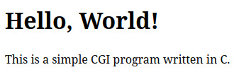
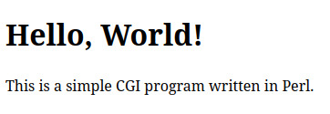
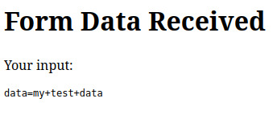

In computing, **Common Gateway Interface (CGI)** is an interface specification that enables web servers to execute an external program to process HTTP or HTTPS user requests.


The name CGI comes from the early days of the Web, where webmasters wanted to connect legacy information systems such as databases to their Web servers. The CGI program was executed by the server and provided a common "gateway" between the Web server and the legacy information system.

While it was once a dominant method for creating dynamic web content, modern web development has introduced various alternatives that often outperform CGI in terms of efficiency and scalability.

# A Brief History of CGI Programming

In the early days of the web (early 1990s) CGI was introduced as a standard protocol for web servers to interact with executable programs. This allowed web servers to generate dynamic content by executing scripts or programs in response to user requests. The first widely used web server, **NCSA HTTPd**, implemented CGI, which quickly became a cornerstone of web development.

## Language Support

Initially, CGI scripts were primarily written in C, as it was one of the most popular programming languages at the time, but many languages are supported, including:

Programming Language | Description
-------------------- | -----------
Perl | One of the most popular languages for CGI due to its text processing capabilities and ease of use.
Python | Known for its readability and simplicity, Python is widely used for CGI scripting.
PHP | While often used as a module within web servers, PHP can also be run as a CGI script.
Ruby | Ruby can be used for CGI, especially with frameworks like [Sinatra](https://sinatrarb.com/).
C/C++ | These languages can be used for high-performance CGI applications, though they require more complex setup.
Shell Scripting | Shell scripts can be executed as CGI scripts, particularly in Unix/Linux environments.
Java | Java can be used for CGI through [servlets](https://en.wikipedia.org/wiki/Jakarta_Servlet), though it's more common to use Java with web frameworks.
Tcl | Tcl is another scripting language that can be used for CGI.

The ability to create dynamic web pages revolutionized how information was shared online, leading to the development of interactive websites and web applications.

# Writing CGI

Let's explore the process of creating and utilizing some CGI programs!

We'll be using Python for our local development server (it supports CGI), but in keeping with the legacy spirit, we'll use C and Perl to create our CGI.

:::{.callout-tip}
This assumes a Linux environment, with C (gcc), Python 3, and Perl installed.
:::

## Development Server

Create a directory to hold your web page.  I'll use **www_root**:

```bash
mkdir www_root
```

:::{.callout-note}
The standard/default directory for CGI programs is **cgi-bin**.
:::

Inside **www_root**, create a **cgi-bin** directory:

```bash
cd www_root

mkdir cgi-bin
```

Start Python's development server, with CGI support:

```bash
python3 -m http.server --cgi
```

## Simple Page Render

For our first example, we'll render an entire page using a CGI program written in C.

First create the CGI source file:

```{.c filename="simple_cgi.c"}
#include <stdio.h>

int main(void) {
    // Print the HTTP header
    printf("Content-Type: text/html\n\n");

    // Print the HTML content
    printf("<html>\n");
    printf("<head><title>Simple CGI Example</title></head>\n");
    printf("<body>\n");
    printf("<h1>Hello, World!</h1>\n");
    printf("<p>This is a simple CGI program written in C.</p>\n");
    printf("</body>\n");
    printf("</html>\n");

    return 0;
}
```

Compile it and make sure it's executable, then copy the binary to your cgi-bin directory:

```bash
gcc -o simple_cgi simple_cgi.c

chmod 755 simple_cgi

cp simple_cgi /path/to/project/www_root/cgi-bin
```

Navigate to <http://127.0.0.1:8000/cgi-bin/simple_cgi> in your browser, and you'll see this:



To implement the same example in Perl, first create the Perl script in the cgi-bin directory:

```{.pl filename="simple_cgi_p.pl"}
#!/usr/bin/perl

use strict;
use warnings;
use CGI qw(:standard); # Include the CGI module, along with a standard set of commonly-used functions

# Create a new CGI object
my $cgi = CGI->new;

# Print the HTTP header
print $cgi->header('text/html');

# Print the HTML content
print $cgi->start_html('Simple CGI Example');
print $cgi->h1('Hello, World!');
print $cgi->p('This is a simple CGI program written in Perl.');
print $cgi->end_html;
```

Then, navigate to <http://127.0.0.1:8000/cgi-bin/simple_cgi_p.pl> in your browser, and you'll see this:



## A More Complex Example: Handling Form Posting

A prevalent application of CGI is to capture the data from web forms, which can be used for purposes such as email submissions and storing information in a database.

First, create the source file for the CGI:

```{.c filename="form_capture.c"}
#include <stdio.h>
#include <stdlib.h>
#include <string.h>

#define MAX_DATA_SIZE 1024

int main(void) {
    // Print the HTTP header
    printf("Content-Type: text/html\n\n");

    // Buffer to hold the input data
    char *data = getenv("CONTENT_LENGTH");
    int content_length = data ? atoi(data) : 0;

    // Check if content length is valid
    if (content_length > 0 && content_length < MAX_DATA_SIZE) {
        char input_data[MAX_DATA_SIZE];
        fread(input_data, 1, content_length, stdin);
        input_data[content_length] = '\0'; // Null-terminate the string

        // Print the HTML response
        printf("<html>\n");
        printf("<head><title>Form Data Received</title></head>\n");
        printf("<body>\n");
        printf("<h1>Form Data Received</h1>\n");
        printf("<p>Your input:</p>\n");
        printf("<pre>%s</pre>\n", input_data);
        printf("</body>\n");
        printf("</html>\n");
    } else {
        // Handle error for invalid content length
        printf("<html>\n");
        printf("<head><title>Error</title></head>\n");
        printf("<body>\n");
        printf("<h1>Error</h1>\n");
        printf("<p>Invalid input data.</p>\n");
        printf("</body>\n");
        printf("</html>\n");
    }

    return 0;
}
```

Compile it and make it executable, then copy the binary to your cgi-bin directory:

```bash
gcc -o form_capture form_capture.c

chmod 755 form_capture

cp form_capture /path/to/project/www_root/cgi-bin
```

In **www_root**, create an HTML file for the form:

```{.html filename="form.html"}
<!DOCTYPE html>
<html>
<head>
    <title>Simple Form</title>
</head>
<body>
    <h1>Submit Your Data</h1>
    <form action="/cgi-bin/form_capture" method="post">
        <label for="data">Enter some data:</label><br>
        <input type="text" id="data" name="data"><br><br>
        <input type="submit" value="Submit">
    </form>
</body>
</html>
```

Navigate to <http://127.0.0.1:8000/form.html> and enter some data:


Click "Submit", and you'll see this:



Accomplishing the same thing in Perl is a bit more straightforward.  In **cgi-bin**, create your form capture CGI script (Perl version):

```{.pl filename="form_capture_p.pl"}
#!/usr/bin/perl

use strict;
use warnings;
use CGI qw(:standard);

# Create a new CGI object
my $cgi = CGI->new;

# Print the HTTP header
print $cgi->header('text/html');

# Get the form data
my $data = $cgi->param('data');

# Print the HTML response
print $cgi->start_html('Form Data Received');
print $cgi->h1('Form Data Received');
print $cgi->p('Your input:');
print $cgi->pre($data // 'No data received');  # Display data or a message if no data
print $cgi->end_html;
```

Make the script executable:

```bash
chmod 755 form_capture_p.pl
```

Then, update the action attribute in form.html to use the Perl script instead:

```html
<form action="/cgi-bin/form_capture_p.pl" method="post">
```

Return to your browser, refresh <http://127.0.0.1:8000/form.html>, enter some data, and click "Submit".  You'll see similar results.

# The Waning Popularity of CGI

Despite its historical significance, CGI programming has seen a decline in popularity for several reasons:

* **Performance Issues**: CGI creates a new process for each request, which can lead to significant overhead and slower response times, especially under heavy load.
* **Emergence of New Technologies**: Frameworks and technologies such as **FastCGI**, **mod_perl**, and **ASP.NET** have emerged, offering better performance and more features. These alternatives allow for persistent processes, reducing the overhead associated with CGI.
* **Rise of Modern Web Frameworks**: Languages like **JavaScript** (with Node.js), **Ruby on Rails**, and **Django** have gained traction, providing developers with more powerful tools for building dynamic web applications. These frameworks often come with built-in features for routing, templating, and database interaction, making them more efficient than traditional CGI.
* **Shift to Client-Side Rendering**: The rise of single-page applications (SPAs) and client-side frameworks like **React** and **Angular** has shifted the focus from server-side scripting to client-side rendering, further diminishing the role of CGI.

# Conclusion

CGI programming laid the groundwork for dynamic web content and played a crucial role in the early days of the internet. While it has largely been replaced by more efficient and modern technologies, understanding its history and functionality provides valuable context for the evolution of web development. As we continue to innovate and improve web technologies, the lessons learned from CGI will remain relevant in shaping the future of web applications.
