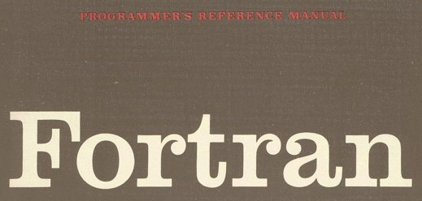

I recently caught up with an old friend who asked about the personal projects I've been involved in. I shared that I've been working on my [Practical Astronomy language ports](https://github.com/stars/jfcarr/lists/practical-astronomy) and recently completed C++, PHP, and Java. I expressed that I felt I had wrapped up that project since there weren't any other languages I was eager to port. However, I jokingly suggested that “maybe I should think about Fortran.”

I kept pondering that idea and eventually thought, “Why not?”

# History



Fortran is one of the oldest programming languages, with a first proposal being submitted by John Backus in 1953, and the first compiler delivered in 1957.

Fortran has had [many major revisions](https://en.wikipedia.org/wiki/Fortran#Evolution), including:

Version | Released | Major features
------- | -------- | --------------
Fortran II | 1958 | Procedural programming (subroutines and functions)
Fortran IV | 1962 | Removal of machine-dependent features; added boolean expressions; added logical IF statement
Fortran 66 | 1966 | Standardization
Fortran 77 | 1978 | IF / END IF blocks; DO loops; direct-access file I/O
Fortran 90 | 1991 | Free-form source input; lowercase keywords; inline comments
Fortran 95 | 1997 | FORALL and nested WHERE constructs; default initializations; removed some obsolete features
Fortran 2003 | 2004 | Object-oriented programming support; C language interoperability
Fortran 2008 | 2010 | Sub-modules; parallel execution model
Fortran 2018 | 2018 | Improved interoperability with C; additional parallel features
Fortran 2023 | 2023 | Addresses minor error corrections and omissions for Fortran 2018

# The Port

I've only just begun the Fortran version of Practical Astronomy, so I don't have a lot to share about that. But, with Fortran being a new language for me, I thought I'd share some of the challenges and idiosyncrasies I've encountered.

Coincidentally, I've kicked off this project on Easter Sunday 2025, and the first algorithm to port happens to be “date of Easter”. This algorithm takes a year value as input, and produces a full date as a result. For example, given an input year of 2025, the algorithm should give a result of 4/20/2025.

Since the result has three values, the first thing I needed to consider was how to return them: Either as a complex custom type, or as individual values (like a tuple). I decided to implement both to see how they compare in terms of complexity.

## Complex Custom Type

### Custom Type

The custom type used to hold our return value looks like this:

```fortran
type :: CivilDate
   integer :: month
   real :: day
   integer :: year
end type
```

The `type` statement indicates that we're creating a complex data structure that can encapsulate multiple data items of different types. The `CivilDate` type contains three data items: `month` and `year` are integers, and `day` is a real, since we sometimes need access to fractional parts of days.

### The Function

Using the custom type in a function is a little tricky, since Fortran functions require custom types to be returned as pointers. Here's the complete function:

```fortran
function get_date_of_easter(input_year) result(custom_obj)
   type(CivilDate), pointer :: custom_obj
   integer :: input_year
   real :: year, a, b, c, d, e, f, g, h, i, k, l, m, n, p, day, month
 
   allocate(custom_obj)
 
   year = input_year
   a = mod(year, 19.0)
   b = floor(year / 100)
   c = mod(year, 100.0)
   d = floor(b / 4)
   e = mod(b , 4.0)
   f = floor((b + 8) / 25)
   g = floor((b - f + 1) / 3)
   h = mod( ((19 * a) + b - d - g + 15) , 30.0)
   i = floor(c / 4)
   k = mod(c , 4.0)
   l = mod( (32 + 2 * (e + i) - h - k) , 7.0)
   m = floor((a + (11 * h) + (22 * l)) / 451)
   n = floor((h + l - (7 * m) + 114) / 31)
   p = mod((h + l - (7 * m) + 114) , 31.0)
 
   day = p + 1
   month = n
 
   custom_obj%month = floor(month)
   custom_obj%day = day
   custom_obj%year = input_year
end function
```

Here's what's going on in the first four lines. First, we declare a variable named `custom_obj` as a pointer to an instance of the custom `CivilDate` type:

```fortran
type(CivilDate), pointer :: custom_obj
```

Next, we declare the `input_year` parameter variable:

```fortran
integer :: input_year
```

Then, a series of variables that will be used in calculations:

```fortran
real :: year, a, b, c, d, e, f, g, h, i, k, l, m, n, p, day, month
```

Finally, we allocate space for `custom_object`, similar to how we'd use `malloc` in C:

```fortran
allocate(custom_obj)
```

The next few lines use a series of (mostly) modulo and floor operations to calculate the date values:

```fortran
year = input_year
a = mod(year, 19.0)
b = floor(year / 100)
c = mod(year, 100.0)
d = floor(b / 4)
e = mod(b , 4.0)
f = floor((b + 8) / 25)
g = floor((b - f + 1) / 3)
h = mod( ((19 * a) + b - d - g + 15) , 30.0)
i = floor(c / 4)
k = mod(c , 4.0)
l = mod( (32 + 2 * (e + i) - h - k) , 7.0)
m = floor((a + (11 * h) + (22 * l)) / 451)
n = floor((h + l - (7 * m) + 114) / 31)
p = mod((h + l - (7 * m) + 114) , 31.0)
 
day = p + 1
month = n
```

Finally, we assign the calculated date elements to the corresponding date items in our pointer object:

```fortran
custom_obj%month = floor(month)
custom_obj%day = day
custom_obj%year = input_year
```

### Calling the Function

First, we declare two variables, an integer we'll use to provide the input year, and a pointer to hold the result:

```fortran
integer :: input_year
type(CivilDate),pointer :: civil_date
```

Next, we call the function and assign the result:

```fortran
civil_date => get_date_of_easter(input_year)
```

Finally, we print our results, and then free the pointer:

```fortran
print *,civil_date%month
print *,civil_date%day
print *,civil_date%year
 
deallocate(civil_date)
```

Given an input year of 2025, here is our output:

```txt
           4
   20.0000000    
        2025
```

This is the complete subroutine that handles our test:

```fortran
subroutine test_date_of_easter(input_year)
   integer :: input_year
   type(CivilDate),pointer :: civil_date
 
   civil_date => get_date_of_easter(input_year)
 
   print *,civil_date%month
   print *,civil_date%day
   print *,civil_date%year
 
   deallocate(civil_date)
end subroutine
```

## Individual Values

If we prefer not to use a complex type, we can return individual values instead. Fortran doesn't support tuples, but it does allow you to specify arguments to a subroutine as being input or output values through the use of the intent keyword.

### The Subroutine

Here's the complete subroutine:

```fortran
subroutine get_date_of_easter(input_year, month, day, year)
   integer, intent(in) :: input_year
   integer, intent(out) :: month
   real, intent(out) :: day
   integer, intent(out) :: year
 
   real :: year1, a, b, c, d, e, f, g, h, i, k, l, m, n, p
 
   year1 = input_year
   a = mod(year1, 19.0)
   b = floor(year1 / 100)
   c = mod(year1, 100.0)
   d = floor(b / 4)
   e = mod(b , 4.0)
   f = floor((b + 8) / 25)
   g = floor((b - f + 1) / 3)
   h = mod(((19 * a) + b - d - g + 15) , 30.0)
   i = floor(c / 4)
   k = mod(c, 4.0)
   l = mod((32 + 2 * (e + i) - h - k) , 7.0)
   m = floor((a + (11 * h) + (22 * l)) / 451)
   n = floor((h + l - (7 * m) + 114) / 31)
   p = mod((h + l - (7 * m) + 114) , 31.0)
 
   day = p + 1
   month = floor(n)
   year = input_year
end subroutine
```

In the first line, we indicate that `input_year` is an input value:

```fortran
integer, intent(in) :: input_year
```

Next, we indicate that `month`, `day`, and `year` are output values (values that will be returned to calling code):

```fortran
integer, intent(out) :: month
real, intent(out) :: day
integer, intent(out) :: year
```

In the next series of lines, we declare variables that will be used for our internal calculations, and perform those calculations:

```fortran
real :: year1, a, b, c, d, e, f, g, h, i, k, l, m, n, p
 
year1 = input_year
a = mod(year1, 19.0)
b = floor(year1 / 100)
c = mod(year1, 100.0)
d = floor(b / 4)
e = mod(b , 4.0)
f = floor((b + 8) / 25)
g = floor((b - f + 1) / 3)
h = mod(((19 * a) + b - d - g + 15) , 30.0)
i = floor(c / 4)
k = mod(c, 4.0)
l = mod((32 + 2 * (e + i) - h - k) , 7.0)
m = floor((a + (11 * h) + (22 * l)) / 451)
n = floor((h + l - (7 * m) + 114) / 31)
p = mod((h + l - (7 * m) + 114) , 31.0)
```

Finally, we assign the output/return values:

```fortran
day = p + 1
month = floor(n)
year = input_year
```

### Calling the Subroutine

First, we declare a variable to hold our input value:

```fortran
! input
integer :: input_year

```
> In Fortran, lines prefixed with ! are treated as comments.

Next, the variables to hold the results:

```fortran
! outputs
integer :: month
real :: day
integer :: year
```

Then, we call the subroutine, and print the results:

```fortran
call get_date_of_easter(input_year, month, day, year)
 
print *, month
print *, day
print *, year
```

Given an input of 2025, this is our output:

```txt
           4
   20.0000000    
        2025
```

This is the complete subroutine that handles our test:

```fortran
subroutine test_date_of_easter(input_year)
   ! input
   integer :: input_year
 
   ! outputs
   integer :: month
   real :: day
   integer :: year
 
   call get_date_of_easter(input_year, month, day, year)
 
   print *, month
   print *, day
   print *, year
end subroutine
```

# My Thoughts

I think that the second option (using `intent`) is the most concise and easiest to understand, although the first option wasn't too bad once I grasped the syntax of the pointer.

Now I have to decide if I want to proceed with the rest of the Practical Astronomy port. This feels like it will be a pretty heavy lift.
