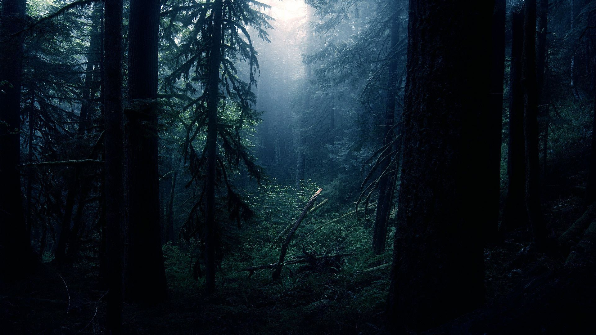

The **Dark Forest Theory** is a fascinating concept that delves into the reasons behind the apparent silence of the universe. It suggests that the cosmos is akin to a dark forest, where every civilization is a silent hunter, hiding from others to avoid potential threats.

## The Fermi Paradox

The Fermi Paradox refers to the apparent contradiction between the high probability of extraterrestrial life in the universe and the lack of evidence or contact with such civilizations. Named after physicist Enrico Fermi, the paradox raises the question: "If the universe is so vast and old, where is everybody?"

### Key Points of the Fermi Paradox

* **Vastness of the Universe**: The universe contains billions of galaxies, each with billions of stars, many of which have planets in the habitable zone where life could potentially exist.
* **Age of the Universe**: The universe is approximately 13.8 billion years old, providing ample time for intelligent life to develop and potentially become advanced enough to communicate or travel across space.
* **Drake Equation**: This equation estimates the number of active, communicative extraterrestrial civilizations in the Milky Way galaxy. While the equation suggests a high number of potential civilizations, we have yet to find any.
* **Lack of Evidence**: Despite extensive searches, such as the **SETI (Search for Extraterrestrial Intelligence)** program, we have not detected any signals or signs of intelligent life.

### Possible Explanations for the Paradox

The **Dark Forest Theory** offers a possible explanation for the Fermi Paradox.  It is one of several:

* **Rare Earth Hypothesis**: Suggests that the conditions for life are extremely rare, making Earth an exceptional case.
* **Great Filter**: Proposes that there is a stage in the evolution of life that is extremely hard to surpass, which could be behind us (e.g., the emergence of intelligent life) or ahead of us (e.g., self-destruction).
* **Technological Limitations**: Advanced civilizations may use technologies that are beyond our current understanding, making their signals undetectable.
* **Self-Destruction**: Civilizations may tend to self-destruct before they can establish contact with others, due to wars, environmental collapse, or other catastrophic events.
* **Non-Interference**: Advanced civilizations might choose not to contact us, adhering to a principle of non-interference with less developed societies.
* **Transient Civilizations**: Civilizations may be short-lived, arising and falling before they can communicate with others.

## Understanding the Dark Forest Theory

The Dark Forest Theory was popularized by the Chinese science fiction author **Liu Cixin** in his novel "The Dark Forest," which is the second book in the "Three-Body Problem" trilogy. The theory posits that:

- **Civilizations are like hunters**: In a dark forest, every civilization is a hunter trying to survive. They must remain silent to avoid detection by others who may pose a threat.
- **The universe is dangerous**: The theory suggests that any civilization that reveals its location risks being destroyed by more advanced civilizations. This creates a paradox where civilizations choose to remain quiet rather than risk annihilation.
- **Communication is risky**: Sending signals into space could attract unwanted attention, leading to a preemptive strike from a more advanced civilization.

## Implications of the Dark Forest Theory

- **Fermi Paradox**: As I mentioned above, the Dark Forest Theory offers a potential solution to the Fermi Paradox, which questions why we have not yet encountered extraterrestrial life despite the vastness of the universe. If civilizations are deliberately silent, it explains the lack of contact.
- **Humanity's Future**: As humanity continues to explore space, the theory raises ethical questions about our own communication efforts. Should we broadcast our presence, or is silence the safer option?
- **Existential Risks**: The theory highlights the existential risks associated with advanced technology. As civilizations develop, the potential for conflict increases, leading to a cycle of fear and silence.

## Critiques and Counterarguments

While the Dark Forest Theory is compelling, it is not without its critiques:

- **Optimism about Cooperation**: Some argue that civilizations may be more inclined to cooperate rather than compete. The potential for mutual benefit could encourage communication rather than silence.
- **Technological Limitations**: The theory assumes that all civilizations are technologically advanced enough to pose a threat. However, many civilizations may be at different stages of development, leading to a more complex interaction landscape.
- **The Nature of Life**: The theory is based on human assumptions about survival and competition. Other forms of life may have different motivations and behaviors that do not align with the hunter-prey dynamic.

## Conclusion

The Dark Forest Theory invites us to ponder the nature of existence and the potential for life beyond Earth. It challenges our understanding of communication, survival, and the universe itself. As we continue to explore the cosmos, the questions raised by this theory will remain relevant, urging us to consider the implications of our actions in the vast, dark forest of the universe.
